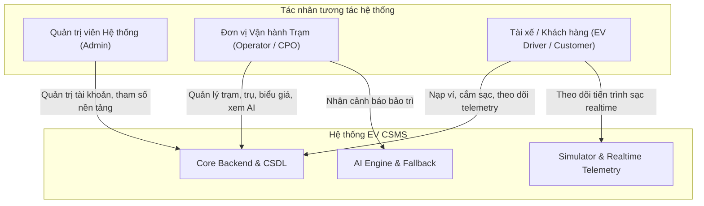
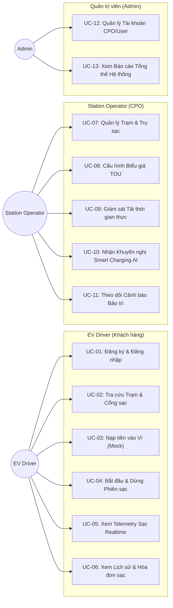
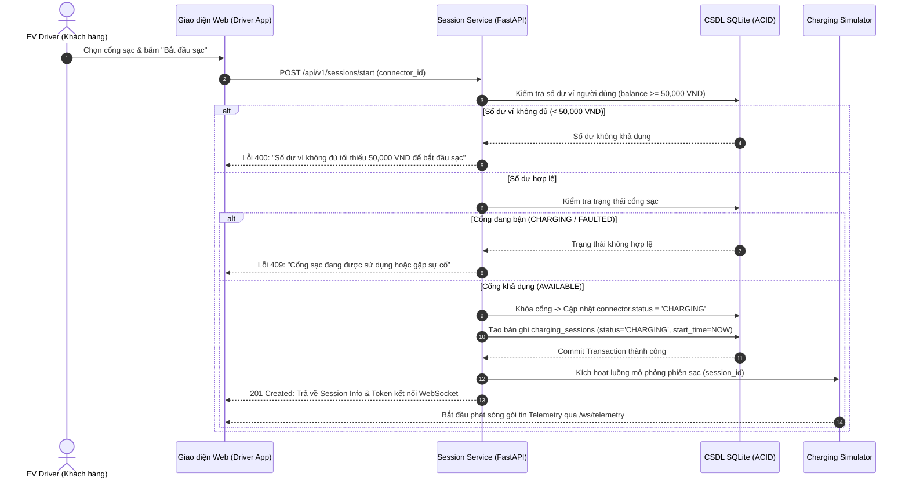
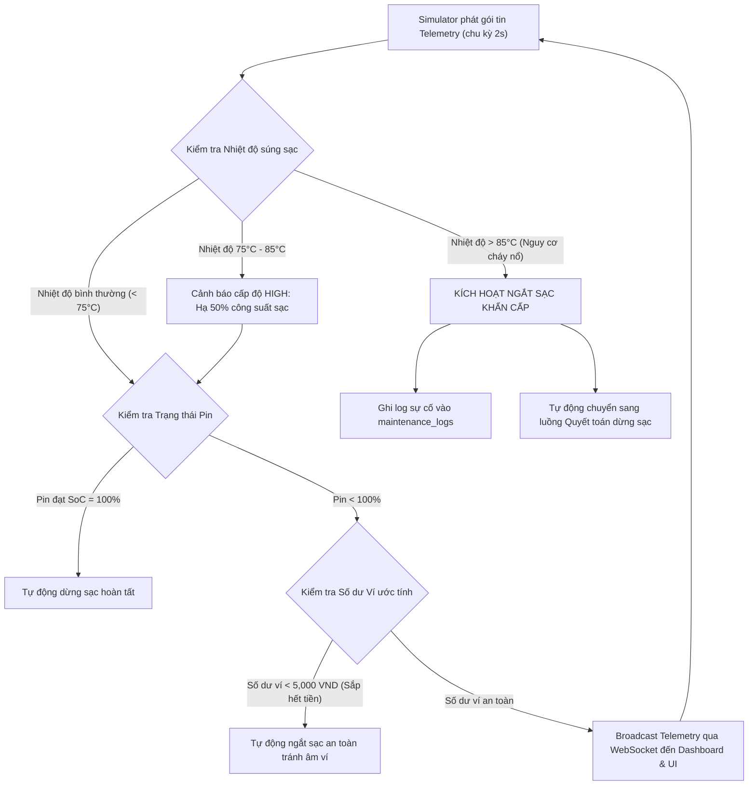
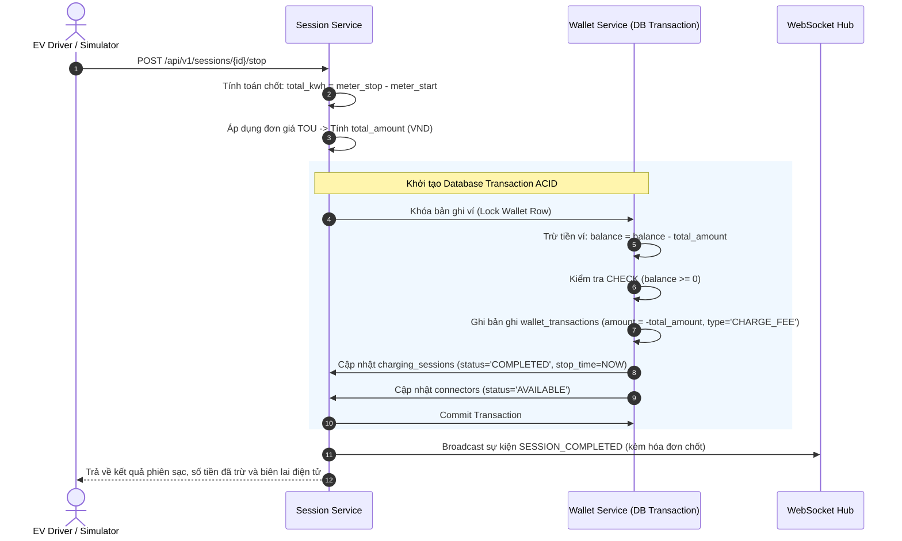

# TÀI LIỆU ĐẶC TẢ YÊU CẦU PHẦN MỀM (SRS) & SƠ ĐỒ USE CASE

## NỀN TẢNG VẬN HÀNH TRẠM SẠC XE ĐIỆN TÍCH HỢP AI (EV CSMS)

> **Mốc đánh giá:** KT1 — Báo cáo Đặc tả Yêu cầu, Phân tích Nghiệp vụ & Kiến trúc Hệ thống  
> **Dự án:** Nền tảng vận hành trạm sạc xe điện tích hợp AI (EV Charging Station Management System)  
> **Phiên bản tài liệu:** 1.0.0  
> **Ngày lập:** 2026-09-25  

---

## 1. Tổng quan Dự án & Phân kỳ Phạm vi

### 1.1. Bối cảnh & Mục tiêu

Sự bùng nổ của các phương tiện giao thông chạy điện (EV) đòi hỏi hạ tầng trạm sạc phải được quản lý tập trung, tin cậy và có khả năng thích ứng linh hoạt với phụ tải điện lưới. Hệ thống **EV CSMS** (EV Charging Station Management System) được thiết kế nhằm cung cấp giải pháp trọn gói cho đơn vị vận hành trạm sạc (CPO), người lái xe điện và cơ quan quản lý:

1. **Vận hành hạ tầng thông minh**: Quản lý đa cấp độ: Trạm sạc (Station) $\rightarrow$ Trụ sạc (EVSE / Charging Point) $\rightarrow$ Cổng/Súng sạc (Connector: CCS2, Type 2).
2. **Kinh doanh linh hoạt**: Cấu hình biểu giá sạc linh động theo thời gian sử dụng (Time-of-Use - TOU) gồm 3 khung giờ: Bình thường (Normal), Cao điểm (Peak), và Thấp điểm (Off-peak).
3. **Minh bạch tài chính**: Quản lý ví điện tử của khách hàng với ràng buộc ACID tuyệt đối không để số dư âm (`CHECK balance >= 0`).
4. **Mô phỏng sạc trực quan (Charging Simulator)**: Giả lập đường cong sạc xe điện, cập nhật trạng thái pin (SoC %), điện áp (V), dòng điện (A), nhiệt độ súng sạc và phát sóng Telemetry qua WebSocket.
5. **Trợ lý AI Cố vấn & Tự vệ Heuristic (Dual-loop Architecture)**:
   - Ứng dụng Google Gemini AI vào cố vấn điều phối tải (Smart Charging) và dự báo bảo trì kỹ thuật (Predictive Maintenance).
   - Cơ chế Fallback Heuristic vận hành độc lập, tự động kích hoạt khi mất mạng hoặc API lỗi, đảm bảo trạm sạc không bao giờ bị tê liệt.

### 1.2. Phân kỳ Phạm vi (Giai đoạn 1 MVP vs Giai đoạn 2 Mở rộng)

Nhằm đảm bảo tính khả thi cao nhất cho đợt đánh giá tiến độ KT1 và hoàn thiện sản phẩm chạy được (working software), ranh giới kỹ thuật được phân định minh bạch như sau:

| Hạng mục | Giai đoạn 1 (MVP - Hiện tại) | Giai đoạn 2 (Mở rộng tương lai) |
| --- | --- | --- |
| **Cơ sở dữ liệu** | SQLite local (`sqlite:///./ev_csms.db`) bật chế độ WAL và Foreign Key | PostgreSQL phân tán, hỗ trợ replication và TimeScaleDB |
| **Xác thực & RBAC** | JWT Access Token đơn giản, phân quyền 3 Role (`ADMIN`, `OPERATOR`, `CUSTOMER`) | OAuth2, Refresh Token rotation, SSO đăng nhập mạng xã hội |
| **Cổng thanh toán** | Nút Mock Top-up (cộng tiền vào ví tức thì qua DB Transaction) | Tích hợp cổng thanh toán thực tế (VNPay, MoMo, ZaloPay) |
| **Biểu giá điện** | TOU cơ bản với 3 khung giờ (Normal, Peak, Off-peak) | Biểu giá theo thời gian thực (Spot Price) và phụ phí đỗ xe (Idle Fee) |
| **Triển khai hạ tầng** | Chạy trực tiếp qua Uvicorn Backend và Vite Frontend | Đóng gói Docker Compose, reverse proxy Nginx và Deploy Cloud |
| **Khả năng dự phòng** | AI Fallback Heuristic cục bộ (demo tắt mạng AI vẫn chạy 100%) | Đồng bộ ngoại tuyến phần cứng phần mềm (Hardware Offline Sync) |
| **Kiểm thử** | 3–5 Unit tests trọng tâm cho giao dịch Ví tiền ACID và Fallback AI | E2E Testing toàn diện với Cypress/Playwright |

---

## 2. Phân tích 3 Nhóm Người dùng (Actors) & Ma trận Phân quyền

### 2.1. Danh sách 3 Nhóm Người dùng (Actors)

1. **Quản trị viên Hệ thống (Admin)**:
   - Chịu trách nhiệm bảo đảm an toàn và tính toàn vẹn của toàn bộ nền tảng.
   - Quản lý tài khoản người dùng: Tạo tài khoản CPO, kích hoạt/vô hiệu hóa tài khoản vi phạm.
   - Cấu hình tham số hệ thống chung, quản lý API Key Gemini AI.
   - Xem dashboard tổng hợp doanh thu và sản lượng điện trên toàn mạng lưới trạm sạc.

2. **Đơn vị Vận hành Trạm sạc (Station Operator / CPO)**:
   - Sở hữu và trực tiếp quản trị danh mục cơ sở hạ tầng trạm sạc.
   - CRUD danh sách Trạm sạc (`Station`), Trụ sạc (`ChargingPoint`), Cổng/Súng sạc (`Connector`).
   - Thiết lập và tùy chỉnh Biểu giá điện TOU 3 khung giờ (`Tariff`) áp dụng cho các trạm.
   - Giám sát trạng thái hoạt động thực tế của từng trụ sạc (`AVAILABLE`, `PREPARING`, `CHARGING`, `FAULTED`, `UNAVAILABLE`).
   - Sử dụng Trợ lý AI Advisor để nhận gợi ý điều phối công suất chống quá tải (Smart Charging) và phân tích nguy cơ sự cố (Predictive Maintenance).

3. **Khách hàng Lái xe điện (EV Driver / Customer)**:
   - Tra cứu danh sách trạm sạc, xem trạng thái cổng trống và biểu giá sạc hiện hành.
   - Quản lý ví điện tử cá nhân: Nạp tiền (Mock Top-up), tra cứu số dư và lịch sử trừ tiền.
   - Bắt đầu phiên sạc: Chọn cổng sạc, hệ thống kiểm tra điều kiện số dư tối thiểu ($\ge 50,000$ VND) và khóa cổng.
   - Theo dõi tiến trình sạc theo thời gian thực trên giao diện web (SoC %, kW, kWh, chi phí lũy kế).
   - Dừng phiên sạc chủ động, thanh toán tự động qua ví và nhận biên lai/hóa đơn điện tử.

### 2.2. Ma trận Phân quyền Tài nguyên (CRUD Matrix)

| Tài nguyên | Thao tác | Admin | Station Operator (CPO) | EV Driver (Customer) | Ghi chú |
| --- | :---: | :---: | :---: | :---: | --- |
| **Người dùng (`users`)** | C, R, U, D | Toàn quyền | Chỉ xem thông tin cá nhân | Chỉ xem thông tin cá nhân | Admin có quyền phân vai trò |
| **Ví tiền (`wallets`)** | R, U (Nạp) | Xem tất cả | Xem ví cá nhân | Xem ví & nạp tiền cá nhân | Ràng buộc `balance >= 0` |
| **Trạm sạc (`stations`)** | C, R, U, D | Toàn quyền | Toàn quyền tạo/sửa trạm của mình | Chỉ xem (Read-only) | Khách hàng tìm trạm sạc |
| **Trụ & Cổng sạc** | C, R, U, D | Toàn quyền | Toàn quyền cấu hình | Chỉ xem trạng thái cổng | `AVAILABLE`, `CHARGING`... |
| **Biểu giá (`tariffs`)** | C, R, U, D | Toàn quyền | Tạo và gán biểu giá cho trạm | Chỉ xem biểu giá hiện hành | 3 khung giờ TOU |
| **Phiên sạc (`sessions`)** | Start, Stop | Giám sát | Giám sát toàn trạm | Bắt đầu / dừng phiên của mình | Khóa độc quyền cổng sạc |
| **Mô phỏng (`simulator`)** | Trigger, View | Xem & Debug | Xem & Test trụ sạc | Tương tác màn hình sạc cá nhân | Giả lập đường cong sạc |
| **Trợ lý AI Advisor** | Request, View | Cấu hình API | Nhận khuyến nghị tải & bảo trì | Không khả dụng | Phục vụ vận hành CPO |
| **Cảnh báo bảo trì** | R, Resolve | Giám sát | Nhận thông báo & xử lý sự cố | Không khả dụng | Nhật ký `maintenance_logs` |

---

## 3. Đặc tả Yêu cầu Nghiệp vụ & Yêu cầu Chức năng (Functional Requirements - FR)

### FR-01: Quản lý Định danh & Xác thực (Authentication & RBAC)

- Hệ thống cung cấp API đăng ký (`/api/v1/auth/register`) và đăng nhập (`/api/v1/auth/login`).
- Hỗ trợ mã hóa mật khẩu bằng thuật toán an toàn `bcrypt`.
- Cung cấp JWT Bearer Token (thời hạn 24 giờ cho môi trường phát triển) kèm Payload chứa `user_id`, `username`, `role`.
- Middleware kiểm tra quyền theo vai trò (Role-based Authorization) trước khi gọi các endpoint được bảo vệ.

### FR-02: Quản lý Hạ tầng Mạng lưới Trạm sạc (Station Infrastructure)

- CPO có thể tạo, chỉnh sửa thông tin trạm sạc: Tên, địa chỉ, tọa độ địa lý (kinh độ, vĩ độ), tổng công suất điện lưới cho phép (`total_grid_capacity_kw`).
- Cho phép cấu hình Trụ sạc (EVSE) trực thuộc trạm: Mã trụ (`CP-01`), nhà sản xuất, công suất danh định (`max_power_kw`).
- Cho phép khai báo Cổng sạc (Connector) cho từng trụ: Tiêu chuẩn sạc (`CCS2`, `Type 2`), công suất tối đa và quản lý trạng thái máy tự động (`AVAILABLE`, `PREPARING`, `CHARGING`, `FAULTED`, `UNAVAILABLE`).

### FR-03: Quản lý Biểu giá Điện theo Khung giờ (TOU Tariffs)

- Hỗ trợ thiết lập biểu giá theo 3 khung giờ chuẩn EVN:
  - Giờ thấp điểm (Off-peak): thường áp dụng đêm khuya (22:00 - 04:00).
  - Giờ bình thường (Normal): khung giờ hành chính ban ngày.
  - Giờ cao điểm (Peak): khung giờ tiêu thụ điện đỉnh (09:30 - 11:30 & 17:00 - 20:00).
- Hệ thống tự động xác định mức đơn giá áp dụng dựa trên tem thời gian thực tế của phiên sạc.

### FR-04: Quản lý Ví điện tử & Nạp tiền Chống Âm (ACID Wallet)

- Mỗi người dùng khi đăng ký tài khoản tự động được gán 1 ví điện tử duy nhất với số dư ban đầu là 0 VND.
- Cung cấp chức năng nạp tiền thử nghiệm (Mock Top-up) với các mệnh giá quy định (50,000, 100,000, 200,000, 500,000 VND).
- Mọi biến động số dư phải được ghi nhận vào bảng `wallet_transactions` trong cùng một Database Transaction.
- **Ràng buộc bất khả xâm phạm**: Không cho phép số dư ví âm dưới mọi hình thức (Database Check Constraint `balance >= 0`).

### FR-05: Khởi tạo, Giám sát & Quyết toán Phiên sạc (Charging Sessions)

- **Điều kiện khởi động**: Khách hàng chỉ được bắt đầu phiên sạc khi số dư ví đạt mức tối thiểu quy định ($\ge 50,000$ VND) và cổng sạc đang ở trạng thái `AVAILABLE`.
- **Khóa cổng sạc độc quyền**: Khi phiên sạc bắt đầu, cổng sạc lập tức chuyển sang `CHARGING`. Hệ thống từ chối mọi yêu cầu sạc mới trên cổng này.
- **Quyết toán tức thì**: Khi phiên sạc dừng (do người dùng bấm dừng, pin đạt 100%, hoặc số dư ví tiệm cận 0), hệ thống:
  1. Chốt số chỉ số công tơ điện (`meter_stop_kwh`) và tính tổng điện năng (`total_kwh`).
  2. Tính tổng chi phí = $total\_kwh \times unit\_price$.
  3. Mở Database Transaction: Trừ tiền ví, ghi nhật ký giao dịch `CHARGE_FEE`, cập nhật trạng thái phiên sạc sang `COMPLETED`, và giải phóng cổng sạc về `AVAILABLE`.

### FR-06: Giả lập Telemetry Sạc thời gian thực (Charging Simulator & WebSocket)

- Module Simulator phát xung nhịp telemetry định kỳ (mặc định 2 giây/lần).
- Mỗi gói tin telemetry phát qua WebSocket kênh `/ws/telemetry` bao gồm:
  - `session_id`, `connector_id`
  - `soc_percent` (Trạng thái nạp pin: 0% - 100%)
  - `power_kw` (Công suất tức thời, giả lập đường cong sạc giảm dần khi pin > 80%)
  - `voltage` (Điện áp, ~380V - 400V đối với sạc nhanh DC)
  - `current` (Cường độ dòng điện, A)
  - `connector_temp` (Nhiệt độ đầu súng sạc, $^\circ\text{C}$)
  - `kwh_consumed` (Điện năng tích lũy)
  - `cost_so_far` (Chi phí ước tính lũy kế)
- Giao diện người dùng bắt gói tin và cập nhật biểu đồ trực quan không cần reload trang.

### FR-07: Trợ lý AI Cố vấn Vận hành (Smart Charging & Predictive Maintenance)

- **Smart Charging (Điều phối phụ tải)**:
  - Đầu vào: Tổng công suất lưới của trạm (`total_grid_capacity_kw`), danh sách các cổng đang sạc và công suất yêu cầu của từng xe.
  - Phân tích: Sử dụng Gemini AI để tính toán phân bổ công suất tối ưu, chống sập áp và tối đa hóa số xe được phục vụ.
- **Predictive Maintenance (Bảo trì dự đoán)**:
  - Đầu vào: Lịch sử nhiệt độ súng sạc, độ biến động dòng điện, tỷ lệ lỗi sạc của từng trụ.
  - Phân tích: Nhận diện nguy cơ suy hao linh kiện, rò rỉ nhiệt và khuyến nghị kế hoạch bảo dưỡng định kỳ trước khi hỏng hóc thực sự xảy ra.

### FR-08: Cơ chế Heuristic Fallback khi Ngoại tuyến (Safety Fallback)

- Khi không có kết nối Internet, Gemini API bị lỗi 5xx, hoặc hết hạn ngạch quota:
  - Hệ thống tự động chuyển sang module Heuristic Fallback cục bộ (Rule-based / Proportional Sharing).
  - Thuật toán Heuristic chia đều hoặc chia theo tỷ lệ công suất danh định cho các xe, bảo đảm tổng công suất không vượt quá 95% công suất nguồn trạm.
  - Cảnh báo bảo trì Heuristic: Nếu nhiệt độ súng sạc vượt $75^\circ\text{C}$ liên tiếp 3 chu kỳ đo $\rightarrow$ Kích hoạt cảnh báo cấp độ `HIGH` và hạ công suất sạc 50%. Nếu vượt $85^\circ\text{C}$ $\rightarrow$ Tự động ngắt sạc khẩn cấp bảo vệ an toàn.

---

## 4. Đặc tả Yêu cầu Phi chức năng (Non-Functional Requirements - NFR)

1. **NFR-01: Tính toàn vẹn dữ liệu (ACID Compliance)**:
   - Các thao tác trừ tiền ví và hoàn tiền phải nằm trong Database Transaction cô lập hoàn toàn.
   - Cơ sở dữ liệu SQLite áp dụng chế độ `PRAGMA foreign_keys = ON;` và `PRAGMA journal_mode = WAL;` để hạn chế nghẽn khóa ghi/đọc.
2. **NFR-02: Hiệu năng & Độ trễ thời gian thực**:
   - Thời gian phản hồi của các REST API truy vấn dữ liệu $< 200\text{ms}$.
   - Chu kỳ truyền nhận WebSocket Telemetry ổn định ở mức 2 giây/chu kỳ, độ trễ hiển thị giao diện $< 100\text{ms}$.
3. **NFR-03: Tính sẵn sàng & Khả năng chịu lỗi (Resilience)**:
   - Mạng lưới vận hành không bị gián đoạn khi AI ngoại tuyến nhờ cơ chế tự động Fallback Heuristic.
4. **NFR-04: Bảo mật hệ thống**:
   - Mật khẩu người dùng được băm 1 chiều bằng thư viện an toàn (Passlib/Bcrypt).
   - Tuyệt đối không lưu trữ hoặc gửi thông tin thẻ ngân hàng, mật khẩu trong telemetry hay prompt AI.
5. **NFR-05: Tính trực quan & Khả năng kiểm thử (Testability & Usability)**:
   - Cung cấp đầy đủ giao diện Simulator trực quan cho phép hội đồng chấm thi thao tác cắm sạc, đổi khung giờ, thử ngắt khẩn cấp và ngắt mạng AI để chứng minh năng lực fallback.

---

## 5. Sơ đồ Use Case Hệ thống & Đặc tả Luồng Nghiệp vụ

### 5.1. Sơ đồ Use Case Tổng quan

### 5.2. Đặc tả Luồng Bắt đầu Phiên sạc (Start Charging Session)

### 5.3. Đặc tả Luồng Giám sát Telemetry & Xử lý Quá nhiệt Khẩn cấp

### 5.4. Đặc tả Luồng Dừng Phiên sạc & Quyết toán Ví tiền (Stop & ACID Settlement)

---

## 6. Tiêu chí Nghiệm thu Mốc KT1 (Acceptance Criteria)

Tài liệu này cùng hồ sơ thiết kế cơ sở dữ liệu `docs/SDLC/KT1/02_Database_Design_ERD.md` cấu thành đầy đủ sản phẩm bàn giao kỹ thuật của Giai đoạn KT1:

1. **Rõ ràng 3 Actor**: Đầy đủ ma trận quyền hạn, phân chia trách nhiệm giữa Quản trị viên, Đơn vị vận hành CPO và Khách hàng lái xe điện.
2. **Bảo toàn dữ liệu nghiệp vụ sạc**: Định hình cơ chế khóa độc quyền cổng sạc, điều kiện khởi động ví $\ge 50,000$ VND và quyết toán cước phí không cho phép số dư âm.
3. **Mô hình AI & Fallback khả thi**: Rõ ràng đầu vào, đầu ra cho chức năng Smart Charging, Predictive Maintenance và cơ chế Fallback Heuristic hoàn toàn ngoại tuyến.
4. **Sẵn sàng chuyển tiếp sang KT2**: Làm cơ sở chuẩn mực để triển khai Backend Core, SQLAlchemy Models, Simulator Telemetry và Router REST API.
