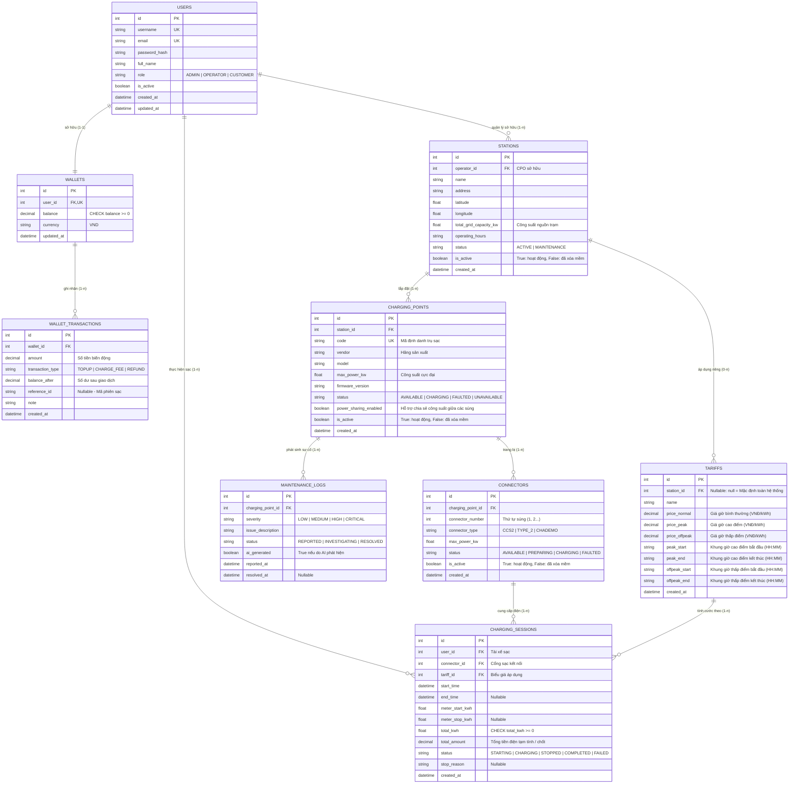

# HỒ SƠ THIẾT KẾ CƠ SỞ DỮ LIỆU & SƠ ĐỒ ERD (EV CSMS DATABASE SPECIFICATION)

> **Mốc đánh giá:** KT1 — Báo cáo Kiến trúc & Thiết kế Dữ liệu  
> **Hệ thống:** Nền tảng vận hành trạm sạc xe điện tích hợp AI (EV Charging Station Management System)  
> **Cơ sở dữ liệu hỗ trợ:** SQLite (Môi trường phát triển & Demo MVP Giai đoạn 1) / PostgreSQL (Sẵn sàng mở rộng Giai đoạn 2)  
> **Tiêu chuẩn thiết kế:** Chuẩn hóa 3NF, ràng buộc toàn vẹn ACID, tối ưu hóa truy vấn chuỗi thời gian và telemetry  

---

## 1. Tổng quan Thiết kế Mô hình Dữ liệu

Cơ sở dữ liệu của hệ thống **EV CSMS** được xây dựng xung quanh 5 phân vùng nghiệp vụ liên kết chặt chẽ:

1. **Phân vùng Định danh & Người dùng (`users`)**: Hỗ trợ 3 nhóm vai trò (Admin, Operator/CPO, Customer) với cơ chế phân quyền bảo mật.
2. **Phân vùng Tài chính & Ví tiền (`wallets`, `wallet_transactions`)**: Thiết kế bảo toàn tính toàn vẹn ACID, chặn hoàn toàn tình trạng số dư âm bằng ràng buộc `CHECK (balance >= 0)`.
3. **Phân vùng Tài sản & Hạ tầng trạm (`stations`, `charging_points`, `connectors`)**: Phản ánh mô hình phân cấp thực tế từ Trạm sạc $\rightarrow$ Trụ sạc (EVSE) $\rightarrow$ Cổng/Súng sạc (CCS2, Type 2).
4. **Phân vùng Biểu giá & Phiên sạc (`tariffs`, `charging_sessions`)**: Lưu trữ biểu giá điện 3 khung giờ (TOU) và quản lý vòng đời phiên nạp điện với ràng buộc độc quyền cổng sạc.
5. **Phân vùng Vận hành & Cảnh báo AI (`maintenance_logs`)**: Ghi nhận sự cố kỹ thuật và các cảnh báo bảo trì dự đoán sinh ra từ AI Engine.

---

## 2. Sơ đồ Thực thể - Mối quan hệ (Mermaid ERD)



---

## 3. Từ điển Dữ liệu Chi tiết (Data Dictionary)

### 3.1. Bảng `users` (Tài khoản người dùng & Phân quyền)

| Tên trường | Kiểu dữ liệu | Khóa | Ràng buộc | Mô tả nghiệp vụ |
| --- | --- | :---: | --- | --- |
| `id` | `INTEGER` | PK | `AUTOINCREMENT` | Khóa chính tự tăng |
| `username` | `VARCHAR(50)` | UK | `NOT NULL, UNIQUE` | Tên đăng nhập hệ thống |
| `email` | `VARCHAR(100)` | UK | `NOT NULL, UNIQUE` | Địa chỉ email liên hệ |
| `password_hash` | `VARCHAR(255)` | | `NOT NULL` | Mật khẩu mã hóa bcrypt |
| `full_name` | `VARCHAR(100)` | | `NOT NULL` | Họ và tên hiển thị |
| `role` | `VARCHAR(20)` | | `CHECK IN ('ADMIN', 'OPERATOR', 'CUSTOMER')` | Vai trò người dùng trong hệ thống RBAC |
| `is_active` | `BOOLEAN` | | `DEFAULT TRUE` | Trạng thái kích hoạt tài khoản |
| `created_at` | `TIMESTAMP` | | `DEFAULT CURRENT_TIMESTAMP` | Thời điểm tạo tài khoản |
| `updated_at` | `TIMESTAMP` | | `DEFAULT CURRENT_TIMESTAMP` | Thời điểm cập nhật cuối cùng |

---

### 3.2. Bảng `wallets` (Ví điện tử cá nhân)

> ⭐ **Bảo đảm ACID**: Ràng buộc `balance >= 0` ngăn chặn triệt để mọi khả năng số dư âm.

| Tên trường | Kiểu dữ liệu | Khóa | Ràng buộc | Mô tả nghiệp vụ |
| --- | --- | :---: | --- | --- |
| `id` | `INTEGER` | PK | `AUTOINCREMENT` | Khóa chính tự tăng |
| `user_id` | `INTEGER` | FK, UK | `UNIQUE, NOT NULL, REFERENCES users(id)` | Chủ sở hữu ví (1 người dùng có duy nhất 1 ví) |
| `balance` | `DECIMAL(12, 2)` | | `NOT NULL, DEFAULT 0.00, CHECK (balance >= 0)` | Số dư khả dụng hiện tại (VNĐ) |
| `currency` | `VARCHAR(10)` | | `DEFAULT 'VND'` | Đơn vị tiền tệ |
| `updated_at` | `TIMESTAMP` | | `DEFAULT CURRENT_TIMESTAMP` | Thời điểm biến động số dư gần nhất |

---

### 3.3. Bảng `wallet_transactions` (Nhật ký giao dịch ví)

| Tên trường | Kiểu dữ liệu | Khóa | Ràng buộc | Mô tả nghiệp vụ |
| --- | --- | :---: | --- | --- |
| `id` | `INTEGER` | PK | `AUTOINCREMENT` | Khóa chính tự tăng |
| `wallet_id` | `INTEGER` | FK | `NOT NULL, REFERENCES wallets(id)` | Ví thực hiện giao dịch |
| `amount` | `DECIMAL(12, 2)` | | `NOT NULL` | Số tiền giao dịch (+ khi nạp, - khi trừ cước) |
| `transaction_type` | `VARCHAR(20)` | | `CHECK IN ('TOPUP', 'CHARGE_FEE', 'REFUND')` | Loại giao dịch biến động |
| `balance_after` | `DECIMAL(12, 2)` | | `NOT NULL, CHECK (balance_after >= 0)` | Số dư ví ngay sau khi hoàn tất giao dịch |
| `reference_id` | `VARCHAR(50)` | | `NULLABLE` | Mã tham chiếu nghiệp vụ (ví dụ: `session_12`) |
| `note` | `TEXT` | | `NULLABLE` | Ghi chú diễn giải chi tiết |
| `created_at` | `TIMESTAMP` | | `DEFAULT CURRENT_TIMESTAMP` | Thời điểm phát sinh giao dịch |

---

### 3.4. Bảng `stations` (Trạm sạc xe điện)

| Tên trường | Kiểu dữ liệu | Khóa | Ràng buộc | Mô tả nghiệp vụ |
| --- | --- | :---: | --- | --- |
| `id` | `INTEGER` | PK | `AUTOINCREMENT` | Khóa chính tự tăng |
| `operator_id` | `INTEGER` | FK | `NOT NULL, REFERENCES users(id)` | Đơn vị vận hành trạm (CPO) sở hữu |
| `name` | `VARCHAR(150)` | | `NOT NULL` | Tên trạm sạc hiển thị |
| `address` | `VARCHAR(255)` | | `NOT NULL` | Địa chỉ vật lý chi tiết |
| `latitude` | `FLOAT` | | `NOT NULL` | Vĩ độ định vị GPS |
| `longitude` | `FLOAT` | | `NOT NULL` | Kinh độ định vị GPS |
| `total_grid_capacity_kw` | `FLOAT` | | `NOT NULL, CHECK (total_grid_capacity_kw > 0)` | Tổng công suất nguồn lưới cấp cho trạm (kW) |
| `operating_hours` | `VARCHAR(50)` | | `DEFAULT '24/7'` | Khung giờ mở cửa hoạt động |
| `status` | `VARCHAR(20)` | | `CHECK IN ('ACTIVE', 'MAINTENANCE')` | Trạng thái sẵn sàng vận hành của trạm |
| `is_active` | `BOOLEAN` | | `NOT NULL, DEFAULT 1` | Cờ trạng thái tồn tại logic (False = Soft Deleted) |
| `created_at` | `TIMESTAMP` | | `DEFAULT CURRENT_TIMESTAMP` | Thời điểm khởi tạo trạm |

---

### 3.5. Bảng `charging_points` (Trụ sạc - EVSE)

| Tên trường | Kiểu dữ liệu | Khóa | Ràng buộc | Mô tả nghiệp vụ |
| --- | --- | :---: | --- | --- |
| `id` | `INTEGER` | PK | `AUTOINCREMENT` | Khóa chính tự tăng |
| `station_id` | `INTEGER` | FK | `NOT NULL, REFERENCES stations(id)` | Trạm sạc chứa trụ này |
| `code` | `VARCHAR(50)` | UK | `NOT NULL, UNIQUE` | Mã định danh trụ sạc vật lý (VD: `CP-HN01-01`) |
| `vendor` | `VARCHAR(100)` | | `NOT NULL` | Nhà cung cấp thiết bị (VinFast, ABB, Siemens...) |
| `model` | `VARCHAR(100)` | | `NULLABLE` | Model thiết bị |
| `max_power_kw` | `FLOAT` | | `NOT NULL, CHECK (max_power_kw > 0)` | Công suất thiết kế tối đa của trụ sạc (kW) |
| `firmware_version` | `VARCHAR(50)` | | `DEFAULT '1.0.0'` | Phiên bản firmware điều khiển |
| `status` | `VARCHAR(20)` | | `CHECK IN ('AVAILABLE', 'CHARGING', 'FAULTED', 'UNAVAILABLE')` | Trạng thái vận hành thời gian thực |
| `power_sharing_enabled` | `BOOLEAN` | | `NOT NULL, DEFAULT 1` | Bật/tắt tính năng chia sẻ tải động giữa các súng |
| `is_active` | `BOOLEAN` | | `NOT NULL, DEFAULT 1` | Cờ trạng thái tồn tại logic (False = Soft Deleted) |
| `created_at` | `TIMESTAMP` | | `DEFAULT CURRENT_TIMESTAMP` | Thời điểm tạo bản ghi |

---

### 3.6. Bảng `connectors` (Cổng / Súng sạc)

| Tên trường | Kiểu dữ liệu | Khóa | Ràng buộc | Mô tả nghiệp vụ |
| --- | --- | :---: | --- | --- |
| `id` | `INTEGER` | PK | `AUTOINCREMENT` | Khóa chính tự tăng |
| `charging_point_id` | `INTEGER` | FK | `NOT NULL, REFERENCES charging_points(id)` | Trụ sạc sở hữu cổng này |
| `connector_number` | `INTEGER` | | `NOT NULL, CHECK (connector_number >= 1)` | Vị trí súng sạc trên trụ (Cổng 1, Cổng 2) |
| `connector_type` | `VARCHAR(20)` | | `CHECK IN ('CCS2', 'TYPE_2', 'CHADEMO')` | Chuẩn chân cắm sạc vật lý |
| `max_power_kw` | `FLOAT` | | `NOT NULL, CHECK (max_power_kw > 0)` | Công suất tối đa cổng hỗ trợ (kW) |
| `status` | `VARCHAR(20)` | | `CHECK IN ('AVAILABLE', 'PREPARING', 'CHARGING', 'FAULTED')` | Trạng thái độc quyền kết nối cổng |
| `is_active` | `BOOLEAN` | | `NOT NULL, DEFAULT 1` | Cờ trạng thái tồn tại logic (False = Soft Deleted) |
| `created_at` | `TIMESTAMP` | | `DEFAULT CURRENT_TIMESTAMP` | Thời điểm tạo cổng |

---

### 3.7. Bảng `tariffs` (Biểu giá linh hoạt TOU 3 khung giờ)

| Tên trường | Kiểu dữ liệu | Khóa | Ràng buộc | Mô tả nghiệp vụ |
| --- | --- | :---: | --- | --- |
| `id` | `INTEGER` | PK | `AUTOINCREMENT` | Khóa chính tự tăng |
| `station_id` | `INTEGER` | FK | `NULLABLE, REFERENCES stations(id)` | NULL = Biểu giá mặc định chung hệ thống |
| `name` | `VARCHAR(100)` | | `NOT NULL` | Tên biểu giá (VD: `Biểu giá điện giờ hè 2026`) |
| `price_normal` | `DECIMAL(10, 2)` | | `NOT NULL, CHECK (price_normal >= 0)` | Đơn giá giờ bình thường (VNĐ/kWh) |
| `price_peak` | `DECIMAL(10, 2)` | | `NOT NULL, CHECK (price_peak >= 0)` | Đơn giá giờ cao điểm (VNĐ/kWh) |
| `price_offpeak` | `DECIMAL(10, 2)` | | `NOT NULL, CHECK (price_offpeak >= 0)` | Đơn giá giờ thấp điểm (VNĐ/kWh) |
| `peak_start` | `VARCHAR(5)` | | `DEFAULT '09:30'` | Bắt đầu khung giờ cao điểm (`HH:MM`) |
| `peak_end` | `VARCHAR(5)` | | `DEFAULT '11:30'` | Kết thúc khung giờ cao điểm (`HH:MM`) |
| `offpeak_start` | `VARCHAR(5)` | | `DEFAULT '22:00'` | Bắt đầu khung giờ thấp điểm (`HH:MM`) |
| `offpeak_end` | `VARCHAR(5)` | | `DEFAULT '04:00'` | Kết thúc khung giờ thấp điểm (`HH:MM`) |
| `created_at` | `TIMESTAMP` | | `DEFAULT CURRENT_TIMESTAMP` | Thời điểm cấu hình biểu giá |

---

### 3.8. Bảng `charging_sessions` (Phiên sạc xe điện)

| Tên trường | Kiểu dữ liệu | Khóa | Ràng buộc | Mô tả nghiệp vụ |
| --- | --- | :---: | --- | --- |
| `id` | `INTEGER` | PK | `AUTOINCREMENT` | Khóa chính tự tăng |
| `user_id` | `INTEGER` | FK | `NOT NULL, REFERENCES users(id)` | Khách hàng thực hiện phiên sạc |
| `connector_id` | `INTEGER` | FK | `NOT NULL, REFERENCES connectors(id)` | Cổng sạc cắm nối vào xe |
| `tariff_id` | `INTEGER` | FK | `NOT NULL, REFERENCES tariffs(id)` | Biểu giá áp dụng để tính tiền |
| `start_time` | `TIMESTAMP` | | `DEFAULT CURRENT_TIMESTAMP` | Thời điểm bắt đầu phiên sạc |
| `end_time` | `TIMESTAMP` | | `NULLABLE` | Thời điểm kết thúc phiên sạc |
| `meter_start_kwh` | `FLOAT` | | `NOT NULL, DEFAULT 0.0` | Số điện công tơ ban đầu (kWh) |
| `meter_stop_kwh` | `FLOAT` | | `NULLABLE` | Số điện công tơ chốt khi dừng (kWh) |
| `total_kwh` | `FLOAT` | | `NOT NULL, DEFAULT 0.0, CHECK (total_kwh >= 0)` | Tổng điện năng đã nạp vào xe |
| `total_amount` | `DECIMAL(12, 2)` | | `NOT NULL, DEFAULT 0.00, CHECK (total_amount >= 0)` | Tổng chi phí thanh toán phiên sạc (VNĐ) |
| `status` | `VARCHAR(20)` | | `CHECK IN ('STARTING', 'CHARGING', 'STOPPED', 'COMPLETED', 'FAILED')` | Trạng thái vòng đời phiên sạc |
| `stop_reason` | `VARCHAR(50)` | | `NULLABLE` | Lý do dừng (`CUSTOMER_STOP`, `BATTERY_FULL`...) |
| `created_at` | `TIMESTAMP` | | `DEFAULT CURRENT_TIMESTAMP` | Thời điểm khởi tạo bản ghi |

---

### 3.9. Bảng `maintenance_logs` (Nhật ký bảo trì & Cảnh báo AI)

| Tên trường | Kiểu dữ liệu | Khóa | Ràng buộc | Mô tả nghiệp vụ |
| --- | --- | :---: | --- | --- |
| `id` | `INTEGER` | PK | `AUTOINCREMENT` | Khóa chính tự tăng |
| `charging_point_id` | `INTEGER` | FK | `NOT NULL, REFERENCES charging_points(id)` | Trụ sạc phát sinh sự cố |
| `severity` | `VARCHAR(20)` | | `CHECK IN ('LOW', 'MEDIUM', 'HIGH', 'CRITICAL')` | Mức độ nghiêm trọng của sự cố |
| `issue_description` | `TEXT` | | `NOT NULL` | Chi tiết cảnh báo kỹ thuật / khuyến nghị |
| `status` | `VARCHAR(20)` | | `CHECK IN ('REPORTED', 'INVESTIGATING', 'RESOLVED')` | Tiến độ xử lý sự cố |
| `ai_generated` | `BOOLEAN` | | `DEFAULT FALSE` | Đánh dấu cảnh báo do AI dự đoán phát hiện |
| `reported_at` | `TIMESTAMP` | | `DEFAULT CURRENT_TIMESTAMP` | Thời điểm ghi nhận cảnh báo |
| `resolved_at` | `TIMESTAMP` | | `NULLABLE` | Thời điểm kỹ thuật viên xử lý xong |

---

## 4. Các Quy tắc Toàn vẹn Dữ liệu Nghiệp vụ (Data Integrity Rules)

### 4.1. Quy tắc Bảo toàn Số dư Ví (No Negative Balance)

1. **Ràng buộc cứng CSDL**: Bảng `wallets` bắt buộc áp dụng ràng buộc `CHECK (balance >= 0)`. Nếu câu lệnh `UPDATE` làm số dư $< 0$, hệ thống CSDL sẽ chặn đứng và ném lỗi `IntegrityError` lập tức.
2. **Khóa dòng bi quan (Pessimistic Locking)**: Trong mã nguồn Python SQLAlchemy, giao dịch trừ tiền sử dụng `with_for_update()`. Thao tác kiểm tra số dư và trừ cước diễn ra trong cùng một transaction nguyên tử:

   ```python
   # Giao dịch trừ tiền ví nguyên tử
   wallet = db.query(Wallet).filter(Wallet.id == wallet_id).with_for_update().first()
   if wallet.balance < fee:
       raise InsufficientBalanceException("Số dư ví không đủ chi trả")
   wallet.balance -= fee
   db.commit()
   ```

### 4.2. Quy tắc Độc quyền Cổng sạc (Exclusive Connector State)

- Mỗi cổng sạc (`connectors`) chỉ phục vụ duy nhất 1 phiên sạc ở trạng thái hoạt động (`STARTING` hoặc `CHARGING`) tại một thời điểm.
- Khi một khách hàng bấm bắt đầu sạc, hệ thống thực hiện thao tác kiểm tra và cập nhật trạng thái cổng sạc theo phương thức nguyên tử (Atomic Update):

  ```sql
  UPDATE connectors 
  SET status = 'CHARGING' 
  WHERE id = :connector_id AND status = 'AVAILABLE';
  ```

  Nếu số bản ghi bị ảnh hưởng = 0, báo lỗi xung đột `409 Conflict` (Cổng đang bận).

### 4.3. Quy tắc Cô lập Dữ liệu Đa CPO (Multi-tenancy Isolation)

- CPO chỉ có quyền xem, sửa trạm sạc và trụ sạc thuộc quyền quản lý của mình thông qua khóa ngoại `stations.operator_id = current_user.id`.
- Dữ liệu giữa các CPO được cô lập hoàn toàn ở tầng truy vấn, không để lộ thông tin vận hành giữa các đối thủ kinh doanh.

---

## 5. Kịch bản DDL Khởi tạo CSDL (SQLite & PostgreSQL Compatible)

```sql
-- ========================================================
-- EV CSMS DATABASE SCHEMA (Chuẩn hóa 3NF)
-- Hỗ trợ SQLite local & sẵn sàng chuyển đổi PostgreSQL
-- ========================================================

-- 1. Bảng users
CREATE TABLE IF NOT EXISTS users (
    id INTEGER PRIMARY KEY AUTOINCREMENT,
    username VARCHAR(50) NOT NULL UNIQUE,
    email VARCHAR(100) NOT NULL UNIQUE,
    password_hash VARCHAR(255) NOT NULL,
    full_name VARCHAR(100) NOT NULL,
    role VARCHAR(20) NOT NULL CHECK (role IN ('ADMIN', 'OPERATOR', 'CUSTOMER')),
    is_active BOOLEAN NOT NULL DEFAULT 1,
    created_at TIMESTAMP NOT NULL DEFAULT CURRENT_TIMESTAMP,
    updated_at TIMESTAMP NOT NULL DEFAULT CURRENT_TIMESTAMP
);

-- 2. Bảng wallets
CREATE TABLE IF NOT EXISTS wallets (
    id INTEGER PRIMARY KEY AUTOINCREMENT,
    user_id INTEGER NOT NULL UNIQUE,
    balance DECIMAL(12, 2) NOT NULL DEFAULT 0.00 CHECK (balance >= 0),
    currency VARCHAR(10) NOT NULL DEFAULT 'VND',
    updated_at TIMESTAMP NOT NULL DEFAULT CURRENT_TIMESTAMP,
    FOREIGN KEY (user_id) REFERENCES users(id) ON DELETE CASCADE
);

-- 3. Bảng wallet_transactions
CREATE TABLE IF NOT EXISTS wallet_transactions (
    id INTEGER PRIMARY KEY AUTOINCREMENT,
    wallet_id INTEGER NOT NULL,
    amount DECIMAL(12, 2) NOT NULL,
    transaction_type VARCHAR(20) NOT NULL CHECK (transaction_type IN ('TOPUP', 'CHARGE_FEE', 'REFUND')),
    balance_after DECIMAL(12, 2) NOT NULL CHECK (balance_after >= 0),
    reference_id VARCHAR(50),
    note TEXT,
    created_at TIMESTAMP NOT NULL DEFAULT CURRENT_TIMESTAMP,
    FOREIGN KEY (wallet_id) REFERENCES wallets(id) ON DELETE CASCADE
);

-- 4. Bảng stations
CREATE TABLE IF NOT EXISTS stations (
    id INTEGER PRIMARY KEY AUTOINCREMENT,
    operator_id INTEGER NOT NULL,
    name VARCHAR(150) NOT NULL,
    address VARCHAR(255) NOT NULL,
    latitude FLOAT NOT NULL,
    longitude FLOAT NOT NULL,
    total_grid_capacity_kw FLOAT NOT NULL CHECK (total_grid_capacity_kw > 0),
    operating_hours VARCHAR(50) NOT NULL DEFAULT '24/7',
    status VARCHAR(20) NOT NULL DEFAULT 'ACTIVE' CHECK (status IN ('ACTIVE', 'MAINTENANCE')),
    is_active BOOLEAN NOT NULL DEFAULT 1,
    created_at TIMESTAMP NOT NULL DEFAULT CURRENT_TIMESTAMP,
    FOREIGN KEY (operator_id) REFERENCES users(id) ON DELETE RESTRICT
);

-- 5. Bảng charging_points (EVSE)
CREATE TABLE IF NOT EXISTS charging_points (
    id INTEGER PRIMARY KEY AUTOINCREMENT,
    station_id INTEGER NOT NULL,
    code VARCHAR(50) NOT NULL UNIQUE,
    vendor VARCHAR(100) NOT NULL,
    model VARCHAR(100),
    max_power_kw FLOAT NOT NULL CHECK (max_power_kw > 0),
    firmware_version VARCHAR(50) NOT NULL DEFAULT '1.0.0',
    status VARCHAR(20) NOT NULL DEFAULT 'AVAILABLE' CHECK (status IN ('AVAILABLE', 'CHARGING', 'FAULTED', 'UNAVAILABLE')),
    power_sharing_enabled BOOLEAN NOT NULL DEFAULT 1,
    is_active BOOLEAN NOT NULL DEFAULT 1,
    created_at TIMESTAMP NOT NULL DEFAULT CURRENT_TIMESTAMP,
    FOREIGN KEY (station_id) REFERENCES stations(id) ON DELETE CASCADE
);

-- 6. Bảng connectors
CREATE TABLE IF NOT EXISTS connectors (
    id INTEGER PRIMARY KEY AUTOINCREMENT,
    charging_point_id INTEGER NOT NULL,
    connector_number INTEGER NOT NULL CHECK (connector_number >= 1),
    connector_type VARCHAR(20) NOT NULL CHECK (connector_type IN ('CCS2', 'TYPE_2', 'CHADEMO')),
    max_power_kw FLOAT NOT NULL CHECK (max_power_kw > 0),
    status VARCHAR(20) NOT NULL DEFAULT 'AVAILABLE' CHECK (status IN ('AVAILABLE', 'PREPARING', 'CHARGING', 'FAULTED')),
    is_active BOOLEAN NOT NULL DEFAULT 1,
    created_at TIMESTAMP NOT NULL DEFAULT CURRENT_TIMESTAMP,
    FOREIGN KEY (charging_point_id) REFERENCES charging_points(id) ON DELETE CASCADE,
    UNIQUE (charging_point_id, connector_number)
);

-- 7. Bảng tariffs (TOU 3 khung giờ)
CREATE TABLE IF NOT EXISTS tariffs (
    id INTEGER PRIMARY KEY AUTOINCREMENT,
    station_id INTEGER,
    name VARCHAR(100) NOT NULL,
    price_normal DECIMAL(10, 2) NOT NULL CHECK (price_normal >= 0),
    price_peak DECIMAL(10, 2) NOT NULL CHECK (price_peak >= 0),
    price_offpeak DECIMAL(10, 2) NOT NULL CHECK (price_offpeak >= 0),
    peak_start VARCHAR(5) NOT NULL DEFAULT '09:30',
    peak_end VARCHAR(5) NOT NULL DEFAULT '11:30',
    offpeak_start VARCHAR(5) NOT NULL DEFAULT '22:00',
    offpeak_end VARCHAR(5) NOT NULL DEFAULT '04:00',
    created_at TIMESTAMP NOT NULL DEFAULT CURRENT_TIMESTAMP,
    FOREIGN KEY (station_id) REFERENCES stations(id) ON DELETE SET NULL
);

-- 8. Bảng charging_sessions
CREATE TABLE IF NOT EXISTS charging_sessions (
    id INTEGER PRIMARY KEY AUTOINCREMENT,
    user_id INTEGER NOT NULL,
    connector_id INTEGER NOT NULL,
    tariff_id INTEGER NOT NULL,
    start_time TIMESTAMP NOT NULL DEFAULT CURRENT_TIMESTAMP,
    end_time TIMESTAMP,
    meter_start_kwh FLOAT NOT NULL DEFAULT 0.0,
    meter_stop_kwh FLOAT,
    total_kwh FLOAT NOT NULL DEFAULT 0.0 CHECK (total_kwh >= 0),
    total_amount DECIMAL(12, 2) NOT NULL DEFAULT 0.00 CHECK (total_amount >= 0),
    status VARCHAR(20) NOT NULL DEFAULT 'STARTING' CHECK (status IN ('STARTING', 'CHARGING', 'STOPPED', 'COMPLETED', 'FAILED')),
    stop_reason VARCHAR(50),
    created_at TIMESTAMP NOT NULL DEFAULT CURRENT_TIMESTAMP,
    FOREIGN KEY (user_id) REFERENCES users(id) ON DELETE RESTRICT,
    FOREIGN KEY (connector_id) REFERENCES connectors(id) ON DELETE RESTRICT,
    FOREIGN KEY (tariff_id) REFERENCES tariffs(id) ON DELETE RESTRICT
);

-- 9. Bảng maintenance_logs
CREATE TABLE IF NOT EXISTS maintenance_logs (
    id INTEGER PRIMARY KEY AUTOINCREMENT,
    charging_point_id INTEGER NOT NULL,
    severity VARCHAR(20) NOT NULL CHECK (severity IN ('LOW', 'MEDIUM', 'HIGH', 'CRITICAL')),
    issue_description TEXT NOT NULL,
    status VARCHAR(20) NOT NULL DEFAULT 'REPORTED' CHECK (status IN ('REPORTED', 'INVESTIGATING', 'RESOLVED')),
    ai_generated BOOLEAN NOT NULL DEFAULT 0,
    reported_at TIMESTAMP NOT NULL DEFAULT CURRENT_TIMESTAMP,
    resolved_at TIMESTAMP,
    FOREIGN KEY (charging_point_id) REFERENCES charging_points(id) ON DELETE CASCADE
);

-- ========================================================
-- CHỈ MỤC TỐI ƯU HÓA HIỆU NĂNG TRUY VẤN (INDEXES)
-- ========================================================
CREATE INDEX IF NOT EXISTS idx_users_role ON users(role);
CREATE INDEX IF NOT EXISTS idx_wallets_user ON wallets(user_id);
CREATE INDEX IF NOT EXISTS idx_wallet_tx_wallet ON wallet_transactions(wallet_id);
CREATE INDEX IF NOT EXISTS idx_stations_operator ON stations(operator_id);
CREATE INDEX IF NOT EXISTS idx_charging_points_station ON charging_points(station_id);
CREATE INDEX IF NOT EXISTS idx_connectors_cp ON connectors(charging_point_id);
CREATE INDEX IF NOT EXISTS idx_sessions_user ON charging_sessions(user_id);
CREATE INDEX IF NOT EXISTS idx_sessions_connector ON charging_sessions(connector_id);
CREATE INDEX IF NOT EXISTS idx_sessions_status ON charging_sessions(status);
CREATE INDEX IF NOT EXISTS idx_maintenance_cp ON maintenance_logs(charging_point_id);
```
