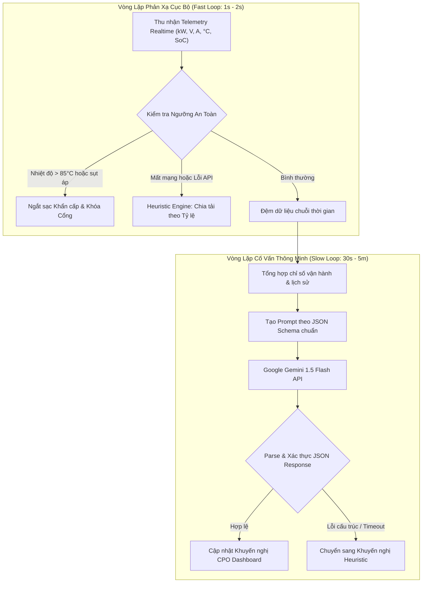

# KIẾN TRÚC TÍCH HỢP AI & THUẬT TOÁN DỰ PHÒNG HEURISTIC

## NỀN TẢNG VẬN HÀNH TRẠM SẠC XE ĐIỆN (EV CSMS)

> **Mốc đánh giá:** KT1 — Báo cáo Đặc tả Yêu cầu, Phân tích Nghiệp vụ & Kiến trúc Hệ thống  
> **Dự án:** EV Charging Station Management System  
> **Tài liệu:** Hồ sơ thiết kế AI Engine & Kỹ thuật Prompt  
> **Phiên bản:** 1.0.0  

---

## 1. Tổng quan Kiến trúc Tích hợp AI (Dual-Loop Architecture)

Hệ thống **EV CSMS** ứng dụng mô hình vòng lặp kép (Dual-loop) nhằm phân định rõ ràng giữa **Tầng phản xạ bảo vệ tức thì (Fast Loop - Heuristic Safety)** và **Tầng tư duy phân tích chiến lược (Slow Loop - Gemini AI Advisor)**.



### Nguyên tắc Vàng trong Tích hợp AI của Dự án

1. **AI chỉ mang tính Cố vấn (Advisory Only)**: AI không bao giờ can thiệp trực tiếp vào việc đóng ngắt rơ-le phần cứng ngoài ý muốn hay tự ý ghi đè số dư ví tiền. Mọi quyết định điều khiển vật lý phải thông qua các hàm nghiệp vụ được bảo vệ bởi rào chắn an toàn (Guardrails).
2. **Không phụ thuộc 100% vào Cloud (Offline Resilience)**: Nếu kết nối Internet bị ngắt, API hết hạn ngạch (Quota 429), hoặc dịch vụ Gemini gặp sự cố 5xx, trạm sạc vẫn hoạt động ổn định nhờ thuật toán Fallback Heuristic cục bộ.
3. **Bảo mật dữ liệu (Privacy by Design)**: Tuyệt đối không gửi thông tin định danh cá nhân (PII), mật khẩu hay số dư ví của khách hàng vào câu lệnh Prompt gửi lên đám mây.

---

## 2. Đặc tả 3 Chức năng AI Cốt lõi

### 2.1. Chức năng 1: Điều phối Công suất Thông minh (Smart Charging)

- **Mục tiêu**: Tối ưu hóa việc phân bổ công suất sạc giữa các xe đang cắm sạc tại trạm, bảo đảm tổng công suất tiêu thụ không bao giờ vượt quá ngưỡng công suất trạm ký hợp đồng với điện lực lưới (`total_grid_capacity_kw`).
- **Đầu vào (Context Data)**:
  + Công suất nguồn trạm tối đa: $P_{\text{grid\_max}}$ (kW).
  + Hệ số an toàn điện lưới: Thường lấy $90\% - 95\%$.
  + Danh sách phiên sạc đang hoạt động: Mã cổng, công suất yêu cầu của xe ($P_{\text{req}}$), SoC hiện tại (%), thời gian bắt đầu cắm sạc.
- **Kỹ thuật Prompting**: Zero-shot/Few-shot kết hợp Structured Outputs (JSON Schema).
- **Prompt mẫu**:

```text
Bạn là chuyên gia điều phối năng lượng điện lưới cho hệ thống trạm sạc xe điện EV CSMS.
Trạm sạc hiện tại có giới hạn công suất nguồn lưới tối đa là: {grid_capacity_kw} kW.
Hệ số an toàn tối đa cho phép: 95% (tương đương {safe_capacity_kw} kW).

Danh sách các cổng đang sạc:
{active_sessions_json}

Quy tắc điều phối:
1. Ưu tiên xe có SoC < 50% được sạc với công suất cao hơn.
2. Xe có SoC > 80% cần hạ công suất xuống mức an toàn để bảo vệ pin.
3. Tổng công suất phân bổ cho tất cả các cổng KHÔNG ĐƯỢC vượt quá {safe_capacity_kw} kW.

Hãy phản hồi DUY NHẤT một chuỗi JSON hợp lệ theo cấu trúc sau (không kèm giải thích bên ngoài):
{
  "total_allocated_kw": float,
  "utilization_percent": float,
  "allocations": [
    {
      "connector_id": int,
      "allocated_kw": float,
      "priority": "HIGH" | "MEDIUM" | "LOW",
      "reason": "chuỗi lý do ngắn gọn"
    }
  ],
  "advisory_notes": "chuỗi nhận xét điều phối tổng thể"
}
```

---

### 2.2. Chức năng 2: Dự báo Bảo trì Kỹ thuật (Predictive Maintenance)

- **Mục tiêu**: Phát hiện sớm dấu hiệu thoái hóa linh kiện, tiếp xúc kém ở đầu súng sạc, hoặc rò rỉ nhiệt trước khi xảy ra cháy nổ hoặc hư hại thiết bị.
- **Đầu vào (Telemetry Metrics)**:
  + Lịch sử nhiệt độ súng sạc ($T_{\text{connector}}$) trong 10 chu kỳ đo gần nhất.
  + Tỷ lệ sụt áp: $\Delta V = V_{\text{target}} - V_{\text{measured}}$.
  + Tần suất phát sinh mã lỗi (Fault Code counter).
- **Prompt mẫu**:

```text
Bạn là kỹ sư trưởng chẩn đoán thiết bị trạm sạc xe điện DC siêu nhanh.
Dưới đây là chuỗi số liệu đo đếm (Telemetry) gần nhất của trụ sạc mã hiệu: {charger_code}:
{telemetry_metrics_json}

Ngưỡng an toàn vật lý quy chuẩn:
- Nhiệt độ bình thường: < 70°C.
- Cảnh báo ấm: 70°C - 75°C.
- Nguy cơ quá nhiệt: 75°C - 85°C.
- Ngắt khẩn cấp tức thì: > 85°C.

Hãy phân tích quy luật nhiệt độ, độ ổn định điện áp và đưa ra đánh giá tình trạng kỹ thuật.
Hãy phản hồi DUY NHẤT định dạng JSON:
{
  "charger_code": "{charger_code}",
  "health_score": int (thang điểm 0 - 100),
  "risk_level": "NORMAL" | "LOW" | "MEDIUM" | "HIGH" | "CRITICAL",
  "thermal_trend": "STABLE" | "RISING_FAST" | "COOLING",
  "anomaly_detected": boolean,
  "recommended_action": "chuỗi khuyến nghị hành động cho kỹ thuật viên",
  "estimated_days_to_service": int
}
```

---

### 2.3. Chức năng 3: Gợi ý Biểu giá Doanh thu (Dynamic Pricing / Tariff Advisor)

- **Mục tiêu**: Hỗ trợ CPO phân tích thống kê số lượng phiên sạc theo từng khung giờ trong ngày/tuần, từ đó khuyến nghị biểu giá sạc tối ưu nhằm dịch chuyển phụ tải (Peak-shaving) và tối đa hóa biên lợi nhuận.
- **Đầu vào**:
  + Tỷ lệ lấp đầy cổng sạc theo giờ.
  + Tổng sản lượng kWh tiêu thụ trong giờ Cao điểm vs Thấp điểm.
  + Biểu giá mua điện từ EVN và biểu giá bán hiện hành của trạm.

---

## 3. Thuật toán Dự phòng Cục bộ (Heuristic Fallback Engine)

Khi cờ ngoại tuyến được bật (Network disconnected, Gemini trả về status 429 Quota Exceeded, hoặc timeout quá 5 giây), hệ thống **ngay lập tức chuyển hướng sang thuật toán Heuristic** mà không làm gián đoạn bất kỳ phiên sạc nào.

### 3.1. Thuật toán Chia Tải Heuristic (Proportional Load Sharing)

Công thức chia công suất dựa trên công suất định mức và mức nạp pin hiện tại của các xe:

$$P_{\text{limit}} = P_{\text{grid\_max}} \times 0.95$$

1. **Trường hợp $\sum P_{\text{req}} \le P_{\text{limit}}$**:
   Mọi xe đều được cấp công suất tối đa theo yêu cầu:
   $$P_{\text{alloc}}[i] = P_{\text{req}}[i]$$

2. **Trường hợp $\sum P_{\text{req}} > P_{\text{limit}}$ (Quá tải nguồn trạm)**:
   Hệ thống tính trọng số ưu tiên $w_i$ cho từng cổng dựa trên SoC hiện thời:
   + Nếu $\text{SoC}_i < 50\%$: $w_i = 1.2$ (ưu tiên cao)
   + Nếu $50\% \le \text{SoC}_i \le 80\%$: $w_i = 1.0$ (bình thường)
   + Nếu $\text{SoC}_i > 80\%$: $w_i = 0.6$ (chuẩn bị đầy, giảm công suất)

   Công suất cấp cho mỗi xe được tính theo tỷ trọng trọng số:
   $$P_{\text{alloc}}[i] = \min\left(P_{\text{req}}[i], P_{\text{limit}} \times \frac{w_i \cdot P_{\text{req}}[i]}{\sum_{j} (w_j \cdot P_{\text{req}}[j])}\right)$$

### 3.2. Thuật toán Cảnh báo Bảo trì Heuristic (Rule-based Safety)

Quy tắc kiểm tra ngưỡng cứng tuần tự:

```python
def evaluate_charger_safety(telemetry: dict) -> dict:
    temp = telemetry.get("connector_temp", 25.0)
    voltage_drop = telemetry.get("voltage_drop_percent", 0.0)

    if temp > 85.0:
        return {
            "risk_level": "CRITICAL",
            "action": "EMERGENCY_STOP",
            "reason": f"Nhiệt độ đầu súng quá nhiệt nguy hiểm ({temp}°C > 85°C)",
        }
    elif temp > 75.0 or voltage_drop > 10.0:
        return {
            "risk_level": "HIGH",
            "action": "THROTTLE_50_PERCENT",
            "reason": f"Nhiệt độ cảnh báo ({temp}°C) hoặc sụt áp cao ({voltage_drop}%)",
        }
    elif temp > 65.0:
        return {
            "risk_level": "MEDIUM",
            "action": "MONITOR_CLOSELY",
            "reason": "Nhiệt độ ấm bất thường cần theo dõi",
        }
    else:
        return {
            "risk_level": "NORMAL",
            "action": "NONE",
            "reason": "Thông số vận hành ổn định trong định mức an toàn",
        }
```

---

## 4. Kịch bản Demo Hội đồng: "Cúp Mạng AI — Hệ thống Vẫn Chạy 100%"

Để phục vụ kiểm tra và đánh giá tại buổi bảo vệ đồ án:

1. Giao diện Web hiển thị trạng thái kết nối AI: **"🟢 AI Online (Gemini 1.5 Flash)"**.
2. Người dùng/Hội đồng nhấn nút giả lập **"Ngắt kết nối AI (Disconnect AI)"** trên màn hình Simulator.
3. Trạng thái lập tức đổi sang: **"🟠 AI Offline — Heuristic Fallback Active"**.
4. Các phiên sạc tiếp tục chạy mượt mà, công suất vẫn được tự động chia tải thông minh và cảnh báo nhiệt độ vẫn hiển thị đầy đủ, chứng minh tính tin cậy tuyệt đối của hệ thống.
