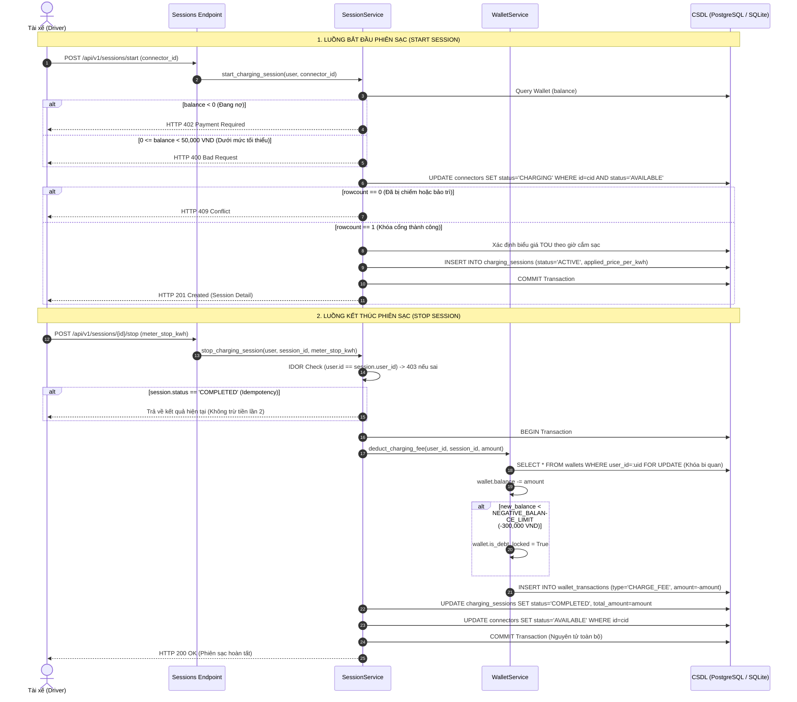

# THIẾT KẾ GIAO DỊCH VÍ ĐIỆN TỬ VÀ PHIÊN SẠC ACID (MỐC KT2)

> **Mã tài liệu:** `KT2-DOC-02`  
> **Phiên bản:** 1.0.0  
> **Trạng thái:** Đã hiện thực hóa & Kiểm thử tự động (Passed 100%)  
> **Module liên quan:** `Tariff`, `Wallet`, `WalletTransaction`, `ChargingSession`, `Connector`

---

## 1. Tổng quan bài toán giao dịch trong EV CSMS

Trong hệ thống quản lý trạm sạc xe điện (EV CSMS), phiên sạc và ví điện tử là hai thành phần có mối quan hệ tài chính mật thiết và chịu áp lực xung đột đồng thời rất cao:

1. **Xung đột phần cứng (Hardware Race Condition):** Hai tài xế cùng lúc cắm sạc hoặc gửi lệnh bắt đầu phiên sạc trên cùng một cổng sạc (`Connector`). Nếu không có cơ chế khóa độc quyền, hai phiên sạc có thể bị ghi đè lên nhau, gây hỏng hóc hoặc tính cước sai lệch.
2. **Toàn vẹn tài chính (Financial Integrity):** Tiền điện và số dư ví của khách hàng phải tuân thủ nghiêm ngặt tính chất ACID, đảm bảo không xảy ra hiện tượng mất mát số dư (lost updates), trừ tiền hai lần (double spending), hoặc số dư âm không kiểm soát.
3. **Tính chất đặc thù của điện năng tiêu thụ:** Điện năng đã xả vào bộ pin của xe thì **không thể thu hồi lại** (non-reversible physical process). Do đó, chính sách trừ tiền phiên sạc cần linh hoạt cho phép số dư âm tạm thời trong một hạn mức được kiểm soát chặt chẽ (`NEGATIVE_BALANCE_LIMIT`).

---

## 2. Kiến trúc giao dịch ACID (Database Transactions)



---

## 3. Các quy tắc nghiệp vụ cốt lõi đã hiện thực hóa

### 3.1. Ràng buộc kiểu dữ liệu số thực chính xác (`Decimal`)

- Toàn bộ giá trị tiền tệ (`balance`, `amount`, `applied_price_per_kwh`, `total_amount`) và chỉ số điện năng tiêu thụ (`meter_start_kwh`, `meter_stop_kwh`, `total_kwh`) sử dụng kiểu **`Decimal`** trong Python và `Numeric(12, 2)` / `Numeric(10, 2)` trong CSDL.
- **Tuyệt đối không dùng kiểu `Float`** để loại trừ triệt để sai số làm tròn dấu phẩy động trong kế toán và hóa đơn.

### 3.2. Khóa cổng sạc độc quyền chống Race Condition (Atomic Conditional Update)

- Để bảo đảm một cổng sạc chỉ có duy nhất một phiên sạc hoạt động tại một thời điểm, hệ thống không dùng mô hình "Check-then-Act" tuần tự thông thường mà sử dụng câu lệnh SQL nguyên tử:

  ```sql
  UPDATE connectors 
  SET status = 'CHARGING' 
  WHERE id = :cid AND status = 'AVAILABLE' AND is_active = 1;
  ```

- Nếu `rowcount == 0` (cổng sạc đã bị phiên khác chiếm giữ ngay mili-giây trước đó hoặc đang bảo trì): Giao dịch bị hủy và trả về ngay **`HTTP 409 Conflict`**.
- Đã được kiểm chứng thực tế bằng kiểm thử đồng thời (Real Multi-threading với `ThreadPoolExecutor`).

### 3.3. Chính sách số dư và kiểm soát nợ (Balance & Debt Policy)

Hệ thống phân định rõ 2 ngưỡng tài chính độc lập:

1. **Ngưỡng bắt đầu phiên sạc (`MIN_START_BALANCE = 50,000 VND`):**
   + Áp dụng khi `balance >= 0`. Nếu số dư không đủ 50,000 VND $\rightarrow$ Trả về **`HTTP 400 Bad Request`** yêu cầu nạp thêm.
   + Nếu `balance < 0` (tài khoản đang có nợ từ phiên trước) $\rightarrow$ Trả về **`HTTP 402 Payment Required`** với thông điệp: *"Tài khoản đang có số dư âm. Vui lòng nạp tiền để tiếp tục sạc"*.
2. **Hạn mức cho phép nợ (`NEGATIVE_BALANCE_LIMIT = -300,000 VND`):**
   + Khi phiên sạc kết thúc, lượng điện năng đã nạp vào xe cần được ghi nhận đầy đủ doanh thu. Hệ thống cho phép trừ tiền vào ví dù số dư trở nên âm.
   + **Trường hợp âm trong hạn mức (`-300,000 VND <= balance < 0`):** Giao dịch hoàn tất, mở khóa cổng sạc về `AVAILABLE`, tài khoản chưa bị đánh dấu khóa nợ (`is_debt_locked = False`). Tuy nhiên, tài xế sẽ không thể bắt đầu phiên sạc mới tiếp theo cho đến khi nạp tiền.
   + **Trường hợp âm vượt hạn mức (`balance < -300,000 VND`):** Hệ thống vẫn trừ đủ tiền điện để bảo đảm doanh thu ghi nhận đúng, nhưng tài khoản bị kích hoạt cờ **`is_debt_locked = True`** ngay lập tức.
3. **Cấp độ ràng buộc CSDL tĩnh:**
   + Để bảo vệ CSDL chống lại lỗi tràn số hoặc truy vấn sai sót ngoài ý muốn, bảng `wallets` được trang bị `CheckConstraint("balance >= -1000000", name="ck_wallet_balance_safe_limit")` (ngưỡng an toàn tối đa 1,000,000 VND).

### 3.4. Cơ chế biểu giá điện TOU (Time-of-Use Tariff)

- Hỗ trợ biểu giá 3 khung giờ theo tiêu chuẩn ngành điện:
  + **Giờ cao điểm (PEAK):** 09:30 - 11:30 và 17:00 - 20:00.
  + **Giờ thấp điểm (OFF-PEAK):** 22:00 - 04:00 sáng hôm sau (vắt qua nửa đêm).
  + **Giờ bình thường (NORMAL):** Các khung giờ còn lại.
- **Quyết định chốt giá tại thời điểm kết nối:** Đơn giá điện được chốt cố định **một lần duy nhất** tại thời điểm cắm sạc (`applied_price_per_kwh` lưu trực tiếp vào bảng `charging_sessions`). Kể cả khi phiên sạc kéo dài xuyên qua khung giờ khác, toàn bộ kWh tiêu thụ của phiên đó vẫn được tính theo đơn giá tại thời điểm bắt đầu. Đây là thiết kế đơn giản hóa có chủ đích phục vụ MVP, bảo đảm tính minh bạch và dễ dự đoán cước cho tài xế.

### 3.5. Chống gọi trùng (Idempotency) & Bảo mật IDOR

- **Chống gọi trùng Start Session:** Mỗi tài xế chỉ được phép có tối đa 1 phiên sạc ở trạng thái `ACTIVE` tại một thời điểm.
- **Chống gọi trùng Stop Session (Idempotency):** Khi nhận yêu cầu dừng phiên sạc, nếu phiên đã ở trạng thái `COMPLETED`, endpoint trả về ngay kết quả phiên sạc hiện tại mà không thực hiện trừ tiền ví lần thứ hai.
- **IDOR Guard:** Endpoint `POST /api/v1/sessions/{id}/stop` kiểm tra quyền sở hữu phiên: chỉ chính tài xế thực hiện phiên sạc đó hoặc quản trị viên toàn hệ thống (`ADMIN`) mới có quyền dừng phiên sạc; các tài xế khác can thiệp sẽ bị từ chối với **`HTTP 403 Forbidden`**.

---

## 4. Minh chứng kiểm thử thực tế (Test Verification)

Toàn bộ 9 kịch bản kiểm thử giao dịch ACID đặc thù đã được hiện thực hóa trong [`backend/tests/test_sessions_acid.py`](file:///E:/AAA/backend/tests/test_sessions_acid.py) và đạt tỷ lệ vượt qua **100% (9/9 passed)**:

| STT | Tên Test Case | Mục đích kiểm thử | Kết quả |
| :---: | :--- | :--- | :---: |
| 1 | `test_topup_wallet_success` | Nạp tiền ví tăng số dư và ghi nhật ký giao dịch TOPUP | **PASSED** |
| 2 | `test_start_session_requires_minimum_balance` | Số dư < 50k VND bị từ chối với HTTP 400 Bad Request | **PASSED** |
| 3 | `test_start_session_blocked_when_in_debt` | Số dư âm bị chặn với HTTP 402 Payment Required | **PASSED** |
| 4 | `test_start_session_locks_connector_exclusively` | Concurrency thật với ThreadPoolExecutor: 1 request 201 Created, 1 request 409 Conflict | **PASSED** |
| 5 | `test_calculate_bill_with_tou_tariff_at_connect_time` | Biểu giá TOU chốt theo giờ start sạc, không đổi khi stop ở khung giờ khác | **PASSED** |
| 6 | `test_stop_session_deducts_wallet_atomically` | Trừ ví nguyên tử, tạo transaction CHARGE_FEE, mở khóa connector, chống gọi trùng Idempotency | **PASSED** |
| 7 | `test_stop_session_allows_negative_balance_within_limit` | Trừ tiền âm trong hạn mức (-300k) thành công, tài khoản không bị debt-locked | **PASSED** |
| 8 | `test_stop_session_rejects_beyond_debt_limit` | Trừ tiền vượt -300k VND thì tài khoản bị debt-locked, chặn mở phiên mới tiếp theo | **PASSED** |
| 9 | `test_driver_cannot_stop_another_drivers_session` | Chống IDOR: Driver khác cố dừng phiên bị từ chối HTTP 403 Forbidden | **PASSED** |

Tổng số test tích hợp của toàn bộ Backend hiện tại: **34/34 tests PASSED**.

---

## 5. Rủi ro & Nợ kỹ thuật (Technical Debt & Known Limitations)

Theo thỏa thuận kiến trúc phục vụ đánh giá tiến độ bài tập cá nhân mốc KT2, hệ thống ghi nhận rõ ràng 2 điểm nợ kỹ thuật sau:

### 5.1. Nguồn chỉ số kWh do Client tự báo cáo (Client-reported kWh)

- **Hiện trạng:** Trong phiên bản Bước 07, chỉ số điện năng kết thúc `meter_stop_kwh` được truyền trực tiếp từ client trong payload của yêu cầu `POST /api/v1/sessions/{id}/stop`.
- **Rủi ro:** Client không trung thực có thể khai báo chỉ số thấp hơn thực tế nhằm giảm tiền cước.
- **Kế hoạch giải quyết:** Trong **Bước 08 (Simulator & WebSocket)**, chỉ số công tơ sẽ được bộ giả lập trụ sạc (Hardware Simulator) tính toán dựa trên tích phân công suất theo thời gian thực ($kWh = \int P(t) dt$) và truyền trực tiếp về Backend thông qua kênh WebSocket nội bộ an toàn.

### 5.2. Chưa có cơ chế giám sát ngắt sạc thời gian thực (No Real-time Telemetry Cut-off)

- **Hiện trạng:** Hệ thống hiện tại chỉ tương tác tại 2 mốc thời gian: Bắt đầu (`start_session`) và Kết thúc (`stop_session`). Chưa có background worker hoặc scheduler định kỳ quét số dư ví trong khi đang sạc để chủ động gửi lệnh ngắt rơ-le vật lý khi khách hàng cạn tiền.
- **Biện pháp bù đắp hiện thời:** Đây chính là lý do giá trị `NEGATIVE_BALANCE_LIMIT = -300,000 VND` được thiết lập đủ lớn để bảo đảm có thể hấp thụ toàn bộ chi phí của 1 phiên sạc pin công suất cao thông thường (khoảng 60 - 80 kWh) mà không làm gián đoạn trải nghiệm của tài xế.
- **Kế hoạch giải quyết:** Sẽ được tích hợp tại **Bước 08** (Telemetry phát nhịp 1 giây/lần kèm logic Auto Cut-off khi chạm ngưỡng nguy hiểm) và **Bước 09** (Module AI Smart Charging giám sát phụ tải).
