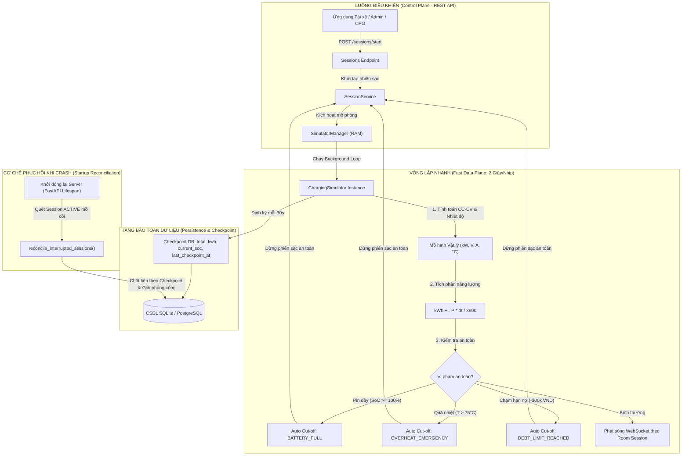

# THIẾT KẾ BỘ GIẢ LẬP TRẠM SẠC & TELEMETRY THỜI GIAN THỰC (MỐC KT2)

> **Mã tài liệu:** `KT2-DOC-03`  
> **Phiên bản:** 1.0.0  
> **Trạng thái:** Đã hiện thực hóa & Kiểm thử tự động (Passed 100%)  
> **Module liên quan:** `ChargingSimulator`, `SimulatorManager`, `ConnectionManager` (WebSocket), `SessionService`

---

## 1. Tổng quan bài toán mô phỏng phần cứng (Virtual Hardware Simulator)

Trong các hệ thống quản lý trạm sạc xe điện (EV CSMS), việc kiểm thử và chạy thử nghiệm hệ thống khi chưa có trạm sạc vật lý là bài toán then chốt. Module **Charging Simulator** đóng vai trò là một lớp giả lập phần cứng (Hardware Abstraction Layer) chuẩn OCPP-like:

1. **Sinh dữ liệu đo đếm chân thực (Realistic Telemetry Generation):** Mô phỏng chu trình nạp năng lượng của khối pin xe điện theo đường cong vật lý CC-CV, phát nhịp đo đếm định kỳ (SoC %, công suất kW, điện áp V, dòng điện A, nhiệt độ cổng sạc °C, tích phân kWh).
2. **Bảo vệ toàn vẹn tài chính & Giải quyết 2 nợ kỹ thuật từ Bước 07:**
   - **Giải quyết Nợ 1 (Client-reported kWh):** Số điện tiêu thụ không còn để client tự khai báo mà được tích phân chính xác từ công suất theo thời gian thực ($kWh = \int P(t) dt$).
   - **Giải quyết Nợ 2 (Giám sát & Ngắt sạc Realtime):** Hệ thống liên tục quét số dư ví và điều kiện an toàn sau mỗi nhịp 2 giây, chủ động kích hoạt ngắt sạc khi chạm ngưỡng nguy hiểm hoặc chạm hạn mức nợ.
3. **Phòng chống sập server (Server Crash Resilience):** Cơ chế Checkpoint định kỳ xuống CSDL kết hợp thuật toán Reconciliation lúc khởi động lại máy chủ, triệt tiêu hoàn toàn rủi ro "treo cổng sạc vĩnh viễn" và thất thoát doanh thu tiền điện.

---

## 2. Kiến trúc hai vòng lặp & Dòng chảy dữ liệu (Data Plane vs Control Plane)



---

## 3. Các quy chuẩn thiết kế kỹ thuật cốt lõi

### 3.1. Đường cong sạc pin CC-CV (Constant Current - Constant Voltage)

Mô hình toán học mô phỏng theo đặc tính nạp điện của tế bào pin Lithium-ion:

- **Giai đoạn sạc dòng không đổi (CC Phase, khi $SoC < 80\%$):** Xe nạp ở công suất tối đa của trụ sạc / trạm sạc ($P = P_{\text{target}}$).
- **Giai đoạn sạc áp không đổi (CV Phase, khi $80\% \le SoC < 100\%$):** Để bảo vệ cấu trúc hóa học của pin và giảm tải nhiệt, công suất sạc giảm dần đều tuyến tính từ $P_{\text{target}}$ về $10\text{ kW}$ tại $SoC = 100\%$:
  $$P(SoC) = \max\left(10.0, P_{\text{target}} - (P_{\text{target}} - 10.0) \times \frac{SoC - 80.0}{20.0}\right)$$
- **Khi pin đầy ($SoC \ge 100\%$):** $P = 0.0\text{ kW}$, tự động phát tín hiệu hoàn tất phiên sạc.

### 3.2. Đo đếm nhiệt độ và Rơ-le ảo ngắt sạc khẩn cấp

- Nhiệt độ cổng sạc ($T_{\text{connector}}$) tăng dần từ nhiệt độ phòng ($30^\circ\text{C}$) theo mức tải công suất và tiệm cận trạng thái cân bằng tản nhiệt ở $45 - 55^\circ\text{C}$.
- **Ngưỡng ngắt an toàn:** Nếu nhiệt độ vượt quá **$75^\circ\text{C}$** (hoặc do Admin/Tester kích hoạt sự cố quá nhiệt qua API), hệ thống ngay lập tức kích hoạt rơ-le ảo ngắt nguồn sạc với lý do **`OVERHEAT_EMERGENCY`**, mở khóa cổng sạc về `AVAILABLE` và quyết toán tiền điện đã nạp.

### 3.3. Checkpoint định kỳ & Khắc phục sự cố Server Crash (Crash Reconciliation)

- **Vấn đề đã giải quyết:** Trong kiến trúc In-Memory State Buffer, nếu tiến trình server bị restart hoặc sập nguồn giữa chừng, toàn bộ các task asyncio trong RAM sẽ biến mất, khiến phiên sạc bị kẹt ở trạng thái `ACTIVE` và cổng sạc bị khóa vĩnh viễn.
- **Giải pháp Checkpoint:** Cứ sau mỗi chu kỳ $30\text{ giây}$, Simulator ghi snapshot các chỉ số `total_kwh`, `current_soc` và `last_checkpoint_at` xuống CSDL.
- **Giải pháp Startup Reconciliation:** Trong hàm vòng đời `lifespan` lúc FastAPI khởi động ([`main.py`](file:///E:/AAA/backend/app/main.py)), hệ thống tự động chạy hàm `reconcile_interrupted_sessions()`:
  1. Quét toàn bộ phiên sạc đang ở trạng thái `ACTIVE` trong CSDL.
  2. Chuyển trạng thái sang `INTERRUPTED` với `stop_reason = "SERVER_CRASH_RECONCILED"`.
  3. Quyết toán tiền ví của tài xế theo đúng chỉ số `total_kwh` đã ghi nhận tại checkpoint gần nhất.
  4. Giải phóng `Connector` về `AVAILABLE`, ngăn chặn triệt để tình trạng treo trụ sạc.

### 3.4. WebSocket phân kênh độc quyền theo Session (Room-based Telemetry)

Để ngăn chặn hoàn toàn lỗ hổng rò rỉ thông tin cá nhân và dữ liệu cước sạc giữa các tài xế:

- `ConnectionManager` hỗ trợ phân kênh theo phòng: `session_subscriptions: Dict[int, Set[WebSocket]]`.
- Client gửi thông điệp JSON `{"action": "subscribe", "session_id": 123}` để chỉ lắng nghe duy nhất phiên sạc của mình.
- Hàm `broadcast_to_session(session_id, payload)` chỉ phát dữ liệu cho những người có quyền theo dõi phiên sạc đó.

#### Định dạng gói tin Telemetry JSON chuẩn:

```json
{
  "event": "TELEMETRY",
  "session_id": 1,
  "connector_id": 1,
  "soc": 65.4,
  "power_kw": 88.5,
  "voltage_v": 400.2,
  "current_a": 221.1,
  "temp_c": 49.3,
  "energy_kwh": 15.204,
  "cost_estimate": 45612,
  "status": "CHARGING",
  "timestamp": "2026-09-25T13:20:00Z"
}
```

> *Ghi chú:* Giá trị `cost_estimate` được làm tròn thành số nguyên VNĐ theo đúng quy ước tiền tệ Việt Nam.

### 3.5. Phân quyền RBAC & Chống IDOR trên API điều khiển Simulator

Các endpoint can thiệp phần cứng giả lập:

- `POST /api/v1/simulator/sessions/{id}/trigger-event` (kích hoạt sự cố `OVERHEAT`).
- `PUT /api/v1/simulator/sessions/{id}/set-power-limit` (điều tiết công suất trần $P_{\max}$).

**Chính sách kiểm soát truy cập:**

- Chỉ có tài khoản mang quyền **`ADMIN`** hoặc **`OPERATOR`** (sở hữu trạm sạc tương ứng) mới được phép gọi.
- Khách hàng lái xe (**`CUSTOMER`**) bị **từ chối tuyệt đối với `HTTP 403 Forbidden`**, loại bỏ nguy cơ tài xế gian lận cước hoặc thao túng công suất sạc.

---

## 4. Minh chứng kiểm thử thực tế (Test Verification)

Toàn bộ 9 kịch bản kiểm thử cho Bộ giả lập trạm sạc được hiện thực hóa trong [`backend/tests/test_simulator.py`](file:///E:/AAA/backend/tests/test_simulator.py), áp dụng kỹ thuật **Time Acceleration (bước nhảy thời gian qua hàm `step()`)** giúp suite test thực thi tức thì chỉ trong **6 giây**:

| STT | Tên Test Case | Mục đích kiểm thử | Kết quả |
| :---: | :--- | :--- | :---: |
| 1 | `test_simulator_initialization_and_random_soc` | SoC ban đầu tự sinh ngẫu nhiên an toàn trong 20-40%, không tin client | **PASSED** |
| 2 | `test_charging_curve_cc_cv_phases` | Đường cong CC-CV: SoC < 80% công suất đỉnh, SoC >= 80% giảm dần tuyến tính | **PASSED** |
| 3 | `test_auto_cutoff_on_battery_full` | Tự động ngắt khi pin chạm 100% với lý do `BATTERY_FULL`, chốt cước và mở cổng | **PASSED** |
| 4 | `test_auto_cutoff_on_overheat_emergency` | Rơ-le ảo ngắt sạc khẩn cấp khi cổng sạc quá nhiệt > 75°C (`OVERHEAT_EMERGENCY`) | **PASSED** |
| 5 | `test_auto_cutoff_on_debt_limit_exceeded` | Tự động ngắt sạc khi số dư ví chạm hạn mức nợ -300k VND (`DEBT_LIMIT_REACHED`) | **PASSED** |
| 6 | `test_checkpoint_saves_snapshot_to_db` | Checkpoint định kỳ ghi snapshot `total_kwh`, `current_soc` xuống CSDL | **PASSED** |
| 7 | `test_server_crash_reconciliation` | Cơ chế Reconciliation phục hồi session ACTIVE khi server crash, giải phóng cổng sạc | **PASSED** |
| 8 | `test_simulator_rbac_and_idor_protection` | Phân quyền RBAC & IDOR: Driver và Operator khác bị từ chối HTTP 403 Forbidden | **PASSED** |
| 9 | `test_session_stop_automatically_takes_simulator_kwh` | Giải quyết Nợ 1: Bấm dừng sạc tự động lấy chỉ số kWh từ Simulator, không cần nhập | **PASSED** |

Tổng số test tích hợp toàn diện của Backend hiện tại: **43/43 tests PASSED**.
