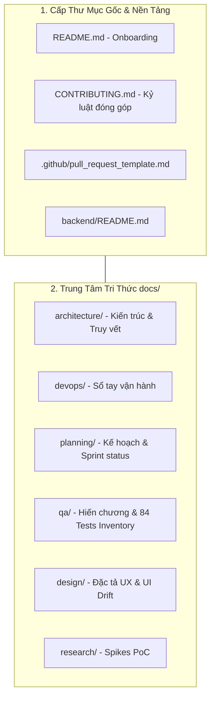

# BÁO CÁO PHÂN TÍCH TOÀN DIỆN CẤU TRÚC TÀI LIỆU VÀ HẠ TẦNG KỸ THUẬT CSMS

> **Loại tài liệu**: Báo cáo kiểm toán kiến trúc & hạ tầng kỹ thuật hệ thống  
> **Tham chiếu chuẩn mực**: `taicautruc.md` Mục 2.1 số 3  
> **Quy tắc tuân thủ**: Phản ánh trung thực tình trạng vật lý của mã nguồn và tài liệu; các mục chưa có thông tin được ghi nhận rõ ràng, không suy diễn.

---

## 1. SƠ ĐỒ PHÂN BỐ CẤU TRÚC DỰ ÁN VÀ PHÂN QUYỀN VAI TRÒ

> `[THIẾU: cần người cung cấp - Dự án hiện chưa có văn bản phân công trách nhiệm ma trận RACI chính thức; sơ đồ dưới đây dựa trên cấu trúc tham khảo đề xuất từ taicautruc.md Mục 4.2]`.

* **Tech Lead / Solution Architect**: Accountable (A) cho toàn bộ Kiến trúc hệ thống (`docs/architecture/`, `backend/app/main.py`).
* **DevOps Engineer**: Responsible (R) cho vận hành hạ tầng (`docs/devops/OPERATIONS.md`).
* **Scrum Master / PO**: Accountable (A) cho mục tiêu và tiến độ Sprint (`docs/planning/`).
* **QA Lead / Tester**: Accountable (A) & Responsible (R) cho toàn bộ tài sản kiểm định (`docs/qa/`, `backend/tests/`).
* **Frontend Lead**: Responsible (R) cho giao diện người dùng và nhật ký sai lệch thiết kế (`docs/design/`).

---

## 2. KHẢO SÁT KẾT CẤU CÁC MỤC CHÍNH ## CỦA CÁC FILE .md

Danh mục dưới đây mô tả các file Markdown chuyên biệt được khảo sát:

### 2.1. Nhóm tài liệu quy ước dự án và đóng góp (Root & .github)
* [`README.md`](../../README.md): Hướng dẫn khởi động nhanh 1 lệnh, danh sách tài khoản demo có sẵn, khắc phục sự cố và tài liệu liên quan.
* [`CONTRIBUTING.md`](../../CONTRIBUTING.md): Nguyên tắc đặt tên branch (`loai/mo-ta-ngan`), chuẩn commit tiếng Việt ngắn gọn, quy trình mở PR và tiêu chuẩn review tối thiểu 1 người.
* [`.github/pull_request_template.md`](../../.github/pull_request_template.md): Biểu mẫu kiểm định chất lượng bắt buộc khi mở PR.
* [`backend/README.md`](../../backend/README.md): Cẩm nang kỹ thuật backend FastAPI, migration CSDL SQLite và ma trận xác thực JWT.

### 2.2. Nhóm tài liệu vận hành và cấu trúc hệ thống (docs/)
* [`docs/README.md`](../README.md): Cổng điều hướng toàn hệ thống, giải đáp 18 câu hỏi FAQ Tester và ma trận routing theo cấp Epic/Story/Task.
* [`docs/codebase-map.md`](../codebase-map.md): Bản đồ vai trò các khu vực mã nguồn, gồm billing S-28, snapshot đoạn giá S-33 và API hóa đơn.
* [`docs/devops/OPERATIONS.md`](../devops/OPERATIONS.md): Sổ tay kỹ thuật chi tiết về cổng mạng, biến môi trường, CSDL và các lệnh kiểm thử.
* [`docs/architecture/PROJECT_STRUCTURE.md`](PROJECT_STRUCTURE.md): Cây thư mục đã xác minh và ma trận truy vết Requirement $\leftrightarrow$ Task $\leftrightarrow$ Code $\leftrightarrow$ Test.

### 2.3. Nhóm tài liệu kế hoạch & tình trạng Sprint (docs/)
* [`docs/planning/SPRINT_STATUS.md`](../planning/SPRINT_STATUS.md): Bảng điều khiển theo dõi tiến độ tổng thể, hiện trạng Sprint 1 (12 SP), Sprint 2 (20 SP), phân tích rủi ro và nhánh Git.
* [`docs/planning/SPRINT_PLAN.md`](../planning/SPRINT_PLAN.md): Kế hoạch hành động chi tiết Sprint 2 (S-06 đến S-16) phân rã 24 tasks kỹ thuật theo 4 làn làm việc.

### 2.4. Nhóm tài liệu quy chuẩn & thực thi kiểm thử (docs/testing/, docs/TESTER_STANDARD.md, docs/TEST_INVENTORY.md)
* [`docs/qa/STANDARD.md`](../qa/STANDARD.md): Hiến chương kiểm định chất lượng, 19 điều cấm, 11 enum chuẩn, luật bằng chứng thực tế.
* [`docs/qa/INVENTORY.md`](../qa/INVENTORY.md): Sổ cái kiểm kê suite; full backend lần gần nhất đạt 163 passed, 1 warning, gồm 43 ca OCPP.
* [`docs/qa/plans/TEST_PLAN.md`](../qa/plans/TEST_PLAN.md): Kế hoạch kiểm thử chiến lược kim tự tháp 5 tầng.
* [`docs/qa/reports/TEST_REPORT.md`](../qa/reports/TEST_REPORT.md): Báo cáo kết quả thực thi; full backend đạt 163 passed, 1 warning ngày 01/10/2026.
* [`docs/qa/reports/REGRESSION_REPORT.md`](../qa/reports/REGRESSION_REPORT.md): Báo cáo kết quả hồi quy lịch sử và kiểm thử chọn lọc.
* [`docs/qa/reports/BUG_REPORT.md`](../qa/reports/BUG_REPORT.md): Sổ ghi nhận 5 khuyết tật và rào cản môi trường.

### 2.5. Nhóm tài liệu đặc tả User Stories (docs/qa/stories/)
* [`docs/qa/stories/README.md`](../qa/stories/README.md): Danh mục hồ sơ nghiệm thu User Stories.
* [`S-01.md`](../qa/stories/S-01.md) đến [`S-05.md`](../qa/stories/S-05.md): Hồ sơ nghiệm thu chi tiết 5 Stories của Giai đoạn 1.
* [`S-07.md`](../qa/stories/S-07.md): Hồ sơ S-07 Sprint 2; T-14/T-15 hoàn thành trong phạm vi bộ đọc/ghi khung và test, các tiêu chí tầng kết nối còn lại chưa nghiệm thu.
* [`S-15.md`](../qa/stories/S-15.md): Hồ sơ nghiệm thu model `IdTag` và handler `Authorize` cho Story S-15.
* [`S-16.md`](../qa/stories/S-16.md): Hồ sơ nghiệm thu dispatcher gửi Reset từ CSMS và ghép phản hồi theo message ID.
* [`S-28.md`](../qa/stories/S-28.md): Hồ sơ phạm vi Backend SCRUM-188/189/190/192 về biểu giá và phí chiếm trụ.
* [`S-33.md`](../qa/stories/S-33.md): Hồ sơ Backend SCRUM-222/221/220/223/225 về snapshot đoạn giá và API hóa đơn.

### 2.6. Nhóm tài liệu Thiết kế UI & Nghiên cứu kỹ thuật (Design & Spikes)
* [`docs/design/OPERATOR_DASHBOARD_UX.md`](../design/OPERATOR_DASHBOARD_UX.md): 26 mục đặc tả UX Level 3 cho Dashboard Điều hành.
* [`docs/design/README.md`](../design/README.md): Nhật ký đối chiếu thiết kế và hiện thực UI Drift.
* [`docs/research/K-01-ocpp-simulator.md`](../research/K-01-ocpp-simulator.md): Báo cáo PoC thử nghiệm trụ ảo OCPP 1.6J.
* [`docs/research/S-05-AC3-ghi-nhan-cho-PO.md`](../research/S-05-AC3-ghi-nhan-cho-PO.md): Biên bản giải trình gửi PO về rào cản phần cứng AC3.

---

## 3. PHÂN TÍCH CHUYÊN SÂU & QUYẾT ĐỊNH ĐỐI VỚI CÁC FILE KỸ THUẬT & CẤU HÌNH GỐC

Bảng quyết định chính thức về các file kỹ thuật cấp root (đối chiếu giữa đề xuất của `taicautruc.md` và hiện trạng mã nguồn dự án):

| File | Quyết định | Lý do |
| :--- | :--- | :--- |
| `run.py` | **Không cần** | Việc khởi động đã được đề xuất bằng `start.bat` hoặc `run.ps1`. Hai thứ này trùng vai trò, chọn một. |
| `test.py` | **Không cần** | Đã có `pytest` và `pytest.ini`. Thêm script bọc bên ngoài chỉ tạo thêm chỗ để lệch. |
| `tools/test_run.py` | **Không cần** | Cùng lý do với `test.py`. |
| `render.yaml` | **Không cần, trừ khi bạn định deploy lên Render** | Chỉ có nghĩa với một nền tảng cụ thể. Bạn chưa nói dự án sẽ deploy ở đâu. |
| `docker-compose.yml` (kèm `Dockerfile`) | **Để sau, đã duyệt** | Chỉ đáng làm khi cần demo hoặc nộp trên máy khác. |
| `.github/workflows/ci.yml` | **Để sau, đã duyệt** | Hữu ích khi dự án lên GitHub và nhóm bắt đầu dùng PR. Bạn đã có `pull_request_template.md` nên khả năng cao là có. |

### 3.1. run.py — Bộ điều khiển tự động hóa trung tâm (CLI Orchestrator)
* **Quyết định**: **Không cần**.
* **Lý do**: Việc khởi động đã được đề xuất bằng `start.bat` hoặc `run.ps1`. Hai thứ này trùng vai trò, chọn một script shell hệ điều hành thay vì viết script Python phức tạp để spawn 2 tiến trình.

### 3.2. test.py — Lối tắt thực thi kiểm thử
* **Quyết định**: **Không cần**.
* **Lý do**: Đã có `pytest` và cấu hình chuẩn `backend/pytest.ini`. Thêm script bọc bên ngoài chỉ tạo thêm chỗ để lệch tham số và môi trường thực thi.

### 3.3. tools/test_run.py — Bộ kiểm thử cho chính công cụ điều hành
* **Quyết định**: **Không cần**.
* **Lý do**: Cùng lý do với `test.py`. Thư mục `tools/` không tồn tại trong repo và không cần tạo.

### 3.4. docker-compose.yml (kèm Dockerfile) — Khai báo dịch vụ Container môi trường cục bộ
* **Quyết định**: **Để sau, đã duyệt**.
* **Lý do**: Chỉ đáng làm khi cần demo hoặc nộp bài trên máy khác chưa cài môi trường. Hiện tại hệ thống đang vận hành ổn định trên máy host.

### 3.5. render.yaml — Cấu hình Staging Cloud (Render Blueprint IaC)
* **Quyết định**: **Không cần, trừ khi bạn định deploy lên Render**.
* **Lý do**: Chỉ có nghĩa với một nền tảng cụ thể (Render.com). Dự án chưa có yêu cầu hay quyết định chính thức về việc triển khai lên Render.

### 3.6. .github/workflows/ci.yml — Đường ống tích hợp liên tục (CI Pipeline)
* **Quyết định**: **Để sau, đã duyệt**.
* **Lý do**: Hữu ích khi dự án lên GitHub và nhóm bắt đầu dùng PR. Dự án đã có sẵn biểu mẫu `pull_request_template.md` và quy tắc `CONTRIBUTING.md`.

### 3.7. eslint.config.js — Tiêu chuẩn kiểm soát kiến trúc & bảo mật Frontend
* **Hiện trạng**: Phía frontend sử dụng Vite và cấu hình TailwindCSS (`frontend/vite.config.js`, `frontend/tailwind.config.js`), chưa cấu hình riêng file `eslint.config.js`. Quá trình kiểm tra lỗi cú pháp và đóng gói được thực thi qua script `npm run build`.

---

## 4. BẢNG TỔNG KẾT TƯƠNG QUAN HỆ THỐNG

| Thành phần kiến trúc | Trạng thái hiện tại | Bằng chứng xác thực | Đánh giá hiện trạng |
| :--- | :---: | :--- | :--- |
| **Backend REST API** | **HOẠT ĐỘNG** | 8 router modules, FastAPI docs Swagger | Đã hoàn thành 5/5 Stories Giai đoạn 1 |
| **Kênh WebSocket Telemetry** | **HOẠT ĐỘNG** | Endpoint `/ws/telemetry` gửi dữ liệu mỗi 2s | Phục vụ demo giám sát thời gian thực |
| **Gateway OCPP 1.6J** | **ĐÃ KIỂM THỬ** | `/ocpp/{charge_point_code}`, BootNotification, Authorize và dispatcher Reset; 43 test OCPP | Tầng kết nối trụ tách biệt với telemetry; chưa kiểm chứng bằng thiết bị vật lý |
| **CSDL & Giao dịch ACID** | **HOẠT ĐỘNG** | SQLite `ev_csms.db`, ràng buộc nợ `-500k` | Giao dịch ví bảo toàn toàn vẹn |
| **Bộ kiểm thử tự động** | **ĐÃ KIỂM THỬ** | 163 passed, 1 warning ngày 01/10/2026 | Full backend suite bao gồm 43 test OCPP |
| **Giao diện Client React** | **HOẠT ĐỘNG** | 6 màn hình nghiệp vụ, 16 file JSX trong `frontend/src/pages/` | Hoạt động đầy đủ (có UI drift có chủ đích) |
| **Kết nối Trạm thật qua OCPP** | **CHƯA ĐẠT** | Thiếu phần cứng, dùng simulator thay thế | Hoãn sang Sprint 2 (Đã báo cáo PO) |
| **Cấu hình Docker & CI/CD** | **ĐỂ SAU (ĐÃ DUYỆT)** | Đã có pull_request_template.md | Đóng gói khi cần demo trên máy khác hoặc đưa lên GitHub |
