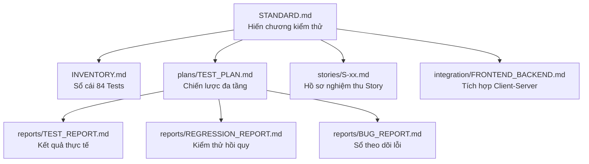

# Project Structure

> **Loại tài liệu**: Bản đồ cấu trúc & Ma trận truy vết hệ thống (Single Source of Architecture Truth)  
> **Tham chiếu chuẩn mực**: `taicautruc.md` Mục 2.2 số 8  
> **Nguồn đối chiếu**: Cây thư mục vật lý đã xác minh, mã nguồn `backend/` & `frontend/`, và `[nguồn tạm: nentangtramsac_bandaydu.md]` ([nentangtramsac_bandaydu.md](../../nentangtramsac_bandaydu.md))

---

## 0. Tiến trình cấu trúc (Theo khung 4 phần: Hiện trạng / Đã thay đổi / Sắp thay đổi / Cần thay đổi)

### 0.1. Hiện trạng
* **Hạn mức ví điện tử & Bảo mật xác thực**:
  * Tầng cơ sở dữ liệu: `backend/app/models/wallet.py` dòng 11 có ràng buộc cứng `CheckConstraint("balance >= -500000", name="check_min_balance")`. Bảng `users` trang bị 2 cột `failed_login_attempts` và `locked_until`.
  * Tầng ứng dụng: `backend/app/core/config.py` quy định `NEGATIVE_BALANCE_LIMIT = -300000` (ngưỡng khóa nợ), `MAX_SAFE_DEBT_LIMIT = -500000` (chặn thấu chi tối đa), `MAX_FAILED_LOGIN_ATTEMPTS = 5` và `LOCKOUT_DURATION_MINUTES = 15` (khóa tạm 15 phút khi sai mật khẩu 5 lần).
* **Cấu hình migration duy nhất**: `backend/alembic.ini` trỏ tới `backend/alembic/`; revision nền `a1b2c3d4e5f6` tạo các bảng lõi trước `03906fa596ea`, cây hiện quy về một head `f2c9a6d81b40`.
* **Số lượng kiểm thử tự động**: Đạt **89 ca kiểm thử** tự động được xác thực thực tế (toàn bộ 89/89 PASS khi chạy `pytest`).
* **Khung triển khai Staging & CI/CD**: Đóng gói container hóa qua `docker-compose.staging.yml`, `backend/Dockerfile`, `frontend/Dockerfile`, `frontend/nginx.conf` và quy trình kiểm thử tự động `.github/workflows/ci-staging.yml`.
* **Bộ chạy Local Dev**: `run.py` khởi chạy Backend FastAPI và Frontend Vite đồng thời trong một terminal; `Ctrl+C` dừng cả hai.
* **Cơ cấu tổ chức tài liệu**: Phân tách thành 6 phân khu chuyên trách trong `docs/` (`architecture/`, `devops/`, `planning/`, `qa/`, `design/`, `research/`) gồm 24 file chuẩn mực.

### 0.2. Đã thay đổi
* **Chuẩn hóa thư mục migration (01/10/2026 - chưa commit)**: Xóa cây revision cũ `backend/migrations/`; giữ `backend/alembic/` làm nguồn migration duy nhất theo cấu hình `backend/alembic.ini`.
* **Bộ chạy Local Dev ở thư mục gốc (30/09/2026 - chưa commit)**:
  * Thêm `run.py` để mở Uvicorn và Vite cùng lúc, kiểm tra dependencies cần thiết, và dừng cả hai tiến trình khi nhấn `Ctrl+C`.
* **Hợp nhất cây migration Alembic (30/09/2026, commit `d7acaf4`)**:
  * Thêm revision merge `795931a69149` để hợp nhất hai head `c2d3e4f5a6b7` và `d3a5e8b1c4f2`.
  * Sửa revision `f99adeda980d`: bỏ thao tác thêm lặp cột `wallets.is_debt_locked` và đặt mặc định `0` cho `charging_sessions.current_soc` khi nâng cấp dữ liệu hiện có.
* **Khôi phục migration nền PostgreSQL (30/09/2026, commit `d8c8ff6`)**:
  * Khôi phục revision `a1b2c3d4e5f6` để tạo các bảng lõi; nối `03906fa596ea` làm revision kế tiếp để các khóa ngoại như `tariffs.station_id` có bảng đích.
* **Gộp các head Alembic còn lại (30/09/2026, commit `3cdb675`)**:
  * Thêm revision merge `f2c9a6d81b40` nối `795931a69149` và `e4b6f9a2c1d3`; revision này chỉ hợp nhất lịch sử, không đổi schema.
* **Khung ứng dụng Staging và Khóa tạm mật khẩu (30/09/2026 - chưa commit)**:
  * Ngày thay đổi: **30/09/2026** (chưa commit).
  * Khung Staging & CI/CD: Đóng gói Docker đa tầng cho Backend/Frontend, thiết lập Nginx reverse proxy, file `docker-compose.staging.yml` và pipeline kiểm thử tự động `.github/workflows/ci-staging.yml` (hoàn thiện Story S-01).
  * Chống vét cạn mật khẩu: Bổ sung cột `failed_login_attempts` và `locked_until` vào bảng `users` qua migration Alembic `149038e71dc9`, cập nhật endpoint `auth.py` tự động khóa tạm 15 phút khi sai liên tiếp 5 lần (hoàn thiện Story S-02).
  * Số ca kiểm thử tự động (84 → 89 test cases): Bổ sung 5 ca kiểm thử mới trong `backend/tests/test_auth.py` xác thực việc đếm số lần sai, khóa tạm và tự động mở khóa.
* **Hạn mức ví điện tử (giá trị cũ → giá trị mới)**:
  * Ngày thay đổi: **29/09/2026** (ghi nhận từ Git log qua commit `cb9a5c8: tái tạo`).
  * Nội dung thay đổi: Giảm trần thấu chi DB từ `-1.000.000` VND xuống `-500.000` VND (`CheckConstraint("balance >= -500000")`), và thiết lập ngưỡng khóa nợ `-300.000` VND tại tầng ứng dụng (`config.py`).
  * Ghi chú: Thực hiện theo yêu cầu của người dùng.
* **Số ca kiểm thử tự động (83 → 84 test cases)**:
  * Ngày thay đổi: **29/09/2026**.
  * Ca kiểm thử mới bổ sung: `backend/tests/test_auth.py::test_login_debt_locked_shows_error`.
  * Lý do bổ sung: Bổ sung theo yêu cầu của người dùng nhằm xác thực tài khoản có `is_debt_locked == True` (âm quá 300.000 VND) khi đăng nhập sẽ nhận phản hồi lỗi HTTP 403 Forbidden kèm thông điệp `"tài khoản bị khóa vì - quá 300k"`.
* **Dọn dẹp thư mục gốc**:
  * Chuyển toàn bộ các file phác thảo ban đầu và tài liệu cũ sang thư mục `phacthaobandau/` để bảo toàn lịch sử và không làm nhiễu không gian làm việc chính.

### 0.3. Sắp thay đổi
* **Khởi tạo thư mục và handlers OCPP**: Chuẩn bị cấu trúc `backend/app/ocpp/handlers/` theo kế hoạch Sprint 2 (`S-06` đến `S-16`) theo `[nguồn tạm: nentangtramsac_bandaydu.md]`.
* **Kênh kết nối WebSocket chuẩn hóa**: Bổ sung endpoint `/ws/ocpp/{charger_id}` tiếp nhận kết nối trạm sạc thực tế.

### 0.4. Cần thay đổi
* **Kịch bản vận hành root**: Cần bổ sung các script tự động hóa khởi chạy ở thư mục gốc (`start.bat` / `run.ps1`) thay cho việc phải mở thủ công 2 terminal riêng biệt.
* **Thẩm định cấu hình phần cứng trạm sạc**: Cần hoàn thiện cơ chế kết nối với phần cứng sạc vật lý hoặc cổng giả lập độc lập.

---

## 1. Mục đích của tài liệu

Tài liệu này là **Nguồn sự thật kiến trúc duy nhất (Single Source of Architecture Truth)**, phục vụ:
* Cung cấp cây thư mục vật lý chuẩn xác theo mã nguồn thực tế của kho mã nguồn.
* Định danh các module thành phần cốt lõi và thẩm quyền sở hữu.
* Thiết lập ma trận truy vết đầy đủ giữa Yêu cầu (Requirement/AC) $\longleftrightarrow$ Công việc (Task) $\longleftrightarrow$ Mã nguồn (Source Code) $\longleftrightarrow$ Ca kiểm thử (Test Case).

---

## 2. Structure Authority (Thẩm quyền cấu trúc)

* **Quyền phê duyệt cấu trúc thư mục**: Solution Architect phối hợp cùng Tech Lead dự án.
* **Quy chuẩn bảo tồn**: Bất kỳ sự thay đổi nào về cấu trúc thư mục cấp 1 hoặc cấp 2 trong `docs/`, `backend/`, `frontend/` đều phải được phản ánh cập nhật vào tài liệu này trước khi gộp nhánh vào `main`.

---

## 3. Tester Ownership (Quyền sở hữu của Tester)

* **Vùng Tester có toàn quyền**: Toàn bộ thư mục `docs/qa/` và `backend/tests/`.
* **Vùng Tester chỉ đọc**: `backend/app/`, `frontend/src/`, `docs/planning/`, `docs/architecture/`.
* **Kỷ luật bất biến**: Tester tuyệt đối không tự ý sửa đổi mã nguồn ứng dụng; mọi khiếm khuyết phải được lập hồ sơ tại `docs/qa/reports/BUG_REPORT.md`.

---

## 4. Verified Project Tree (Cây thư mục đã xác minh)

Cây thư mục vật lý thực tế trên ổ đĩa tại thời điểm kiểm chứng ngày 29/09/2026:

```text
E:\Nền tảng vận hành trạm sạc xe điện\
├── .github/                           # Biểu mẫu PR & Quy trình CI/CD
│   ├── workflows/                     # GitHub Actions CI & Staging Validation
│   │   └── ci-staging.yml
│   └── pull_request_template.md
├── backend/                           # Phân hệ Dịch vụ Máy chủ (FastAPI)
│   ├── alembic/                       # Kịch bản di chuyển cơ sở dữ liệu
│   ├── alembic.ini                    # Cấu hình công cụ Alembic
│   ├── app/                           # Mã nguồn nghiệp vụ Backend
│   │   ├── api/                       # Định nghĩa router và dependency injection (RBAC)
│   │   ├── core/                      # Cấu hình ứng dụng, bảo mật và kết nối CSDL
│   │   ├── models/                    # Lớp thực thể SQLAlchemy (User, Station, Wallet...)
│   │   ├── schemas/                   # Lớp xác thực Pydantic (In/Out DTOs)
│   │   ├── services/                  # Xử lý nghiệp vụ lõi (Ví ACID, Tính cước TOU...)
│   │   ├── simulator/                 # Bộ mô phỏng sạc nội bộ CC/CV
│   │   └── main.py                    # Điểm khởi động ứng dụng FastAPI & WebSocket
│   ├── .dockerignore                  # Danh sách loại trừ đóng gói Docker backend
│   ├── Dockerfile                     # Đóng gói container hóa FastAPI (Python 3.12)
│   ├── ev_csms.db                     # Cơ sở dữ liệu SQLite chính
│   ├── pytest.ini                     # Cấu hình thực thi kiểm thử tự động
│   ├── README.md                      # Hướng dẫn kỹ thuật phân hệ Backend
│   ├── requirements.txt               # Danh mục thư viện Python phụ thuộc
│   ├── seed_data.py                   # Script nạp dữ liệu mẫu cho demo
│   └── tests/                         # Bộ kiểm thử tự động 90 test cases
├── docs/                              # TRUNG TÂM TRI THỨC VÀ TÀI LIỆU DỰ ÁN
│   ├── README.md                      # Cổng điều hướng toàn hệ thống & FAQ Tester
│   ├── architecture/                  # Phân khu Kiến trúc & Bản đồ hệ thống
│   │   ├── ANALYSIS_SUMMARY.md
│   │   └── PROJECT_STRUCTURE.md
│   ├── design/                        # Phân khu Thiết kế trải nghiệm UX/UI
│   │   ├── OPERATOR_DASHBOARD_UX.md
│   │   └── README.md (UI Drift Log)
│   ├── devops/                        # Phân khu Vận hành & Hạ tầng
│   │   └── OPERATIONS.md
│   ├── planning/                      # Phân khu Quản trị & Tiến độ Sprint
│   │   ├── SPRINT_PLAN.md
│   │   └── SPRINT_STATUS.md
│   ├── qa/                            # Phân khu Đảm bảo chất lượng & Kiểm định
│   │   ├── INVENTORY.md
│   │   ├── README.md
│   │   ├── STANDARD.md
│   │   ├── integration/FRONTEND_BACKEND.md
│   │   ├── plans/TEST_PLAN.md
│   │   ├── reports/ (TEST_REPORT, REGRESSION_REPORT, BUG_REPORT)
│   │   └── stories/ (S-01 đến S-05)
│   └── research/                      # Phân khu Nghiên cứu kỹ thuật (Spikes)
│       ├── K-01-ocpp-simulator.md
│       └── S-05-AC3-ghi-nhan-cho-PO.md
├── frontend/                          # Phân hệ Giao diện Người dùng (React Vite)
│   ├── src/                           # Mã nguồn client SPA (pages, components, config, context, data, services)
│   │   ├── components/                # Thành phần UI (StationsMapView, StationLocationPicker, MetricBox...)
│   │   ├── config/                    # Cấu hình bản đồ tập trung (mapConfig.js: OSM Dark & Esri)
│   │   ├── data/                      # Dữ liệu tĩnh (provinces.json 63 tỉnh thành)
│   │   ├── services/                  # Dịch vụ API & Geocoding OpenStreetMap
│   │   └── pages/                     # Màn hình giao diện SPA (Stations, Dashboard...)
│   ├── .dockerignore                  # Danh sách loại trừ đóng gói Docker frontend
│   ├── Dockerfile                     # Đóng gói container hóa đa tầng (Node build -> Nginx)
│   ├── nginx.conf                     # Cấu hình máy chủ Web Nginx phục vụ tĩnh & reverse proxy
│   ├── package.json                   # Cấu hình gói và thư viện Node.js (Leaflet, React)
│   ├── tailwind.config.js             # Cấu hình bảng màu và design tokens
│   └── vite.config.js                 # Cấu hình máy chủ Vite & Reverse Proxy
├── phacthaobandau/                    # Kho lưu trữ các tài liệu phác thảo cũ
├── docker-compose.staging.yml         # Điều phối cụm dịch vụ Staging Backend & Frontend
├── run.py                             # Khởi chạy Backend và Frontend cho Local Dev
├── CONTRIBUTING.md                    # Quy ước làm việc nhóm, Git flow & PR checklist
├── nentangtramsac_bandaydu.md         # Bảng tính chuẩn hóa yêu cầu và tiến độ Scrum
├── README.md                          # Cổng đón tiếp chung & Hướng dẫn khởi động nhanh
└── taicautruc.md                      # Bản thiết kế tái cấu trúc hệ thống tài liệu
```

---

## 5. Important Components (Các thành phần quan trọng)

1. **`backend/app/main.py`**: Trái tim điều phối ứng dụng, quản lý vòng đời khởi động/tắt máy, dọn dẹp phiên sạc mồ côi, và thiết lập kênh WebSocket Telemetry.
2. **`backend/app/core/config.py`**: Quản trị tập trung toàn bộ tham số môi trường, thời hạn JWT, ngưỡng nợ ví `-300.000` VND và giới hạn chống tràn CSDL `-500.000` VND.
3. **`backend/app/models/wallet.py`**: Thực thể ví tiền điện tử với ràng buộc CSDL cứng `CheckConstraint("balance >= -500000")`.
4. **`backend/app/simulator/charging_simulator.py`**: Tiến trình mô phỏng chu kỳ sạc pin xe điện theo đường cong CC/CV, bảo vệ quá nhiệt và ngắt sạc tự động.
5. **`frontend/src/context/AuthContext.jsx`**: Quản trị phiên làm việc và phân quyền RBAC phía client.

---

## 6. QA Documentation Map (Bản đồ tài liệu QA)



---

## 7. Requirement → Task → Source Mapping

Ma trận truy vết ánh xạ các Story của Giai đoạn 1:

| Story | Yêu cầu nghiệp vụ (AC) | Tasks kỹ thuật (T-xx) | Mã nguồn phụ trách | Ca kiểm thử xác minh |
| :---: | :--- | :--- | :--- | :--- |
| **S-01** | Khung ứng dụng chạy được trên máy | T-01, T-02, T-03, T-04 | `backend/app/main.py`, `frontend/vite.config.js` | `test_health.py` |
| **S-02** | Đăng nhập JWT, hash mật khẩu, khóa nợ | T-05 | `backend/app/api/v1/endpoints/auth.py` | `test_auth.py` (12 tests) |
| **S-03** | Phân quyền 3 vai trò (RBAC), chống IDOR | T-06, T-07 | `backend/app/core/security.py`, `deps.py` | `test_auth.py`, `test_stations.py` |
| **S-04** | CPO tạo, sửa, xóa mềm trạm sạc | T-08, T-09 | `backend/app/api/v1/endpoints/stations.py` | `test_stations.py` (8 tests) |
| **S-05** | Thêm trụ và đầu nối, mã trụ duy nhất | T-10, T-11 | `backend/app/api/v1/endpoints/chargers.py` | `test_stations.py` (4 tests) |

---

## 8. Dependency Map (Bản đồ phụ thuộc hệ thống)

### 8.1. Story → Story Dependency
Căn cứ theo Sheet: Backlog trong `[nguồn tạm: nentangtramsac_bandaydu.md]`:
* `S-01` $\longrightarrow$ `S-02` $\longrightarrow$ `S-03` $\longrightarrow$ `S-04` $\longrightarrow$ `S-05`.
* `S-05` + `K-01` $\longrightarrow$ `S-06` (Khởi đầu chuỗi Sprint 2).

### 8.2. Task → Task Dependency
* `T-01` (DB setup) $\longrightarrow$ `T-04` (Bảng users) $\longrightarrow$ `T-05` (Form login) $\longrightarrow$ `T-06` (Middleware vai trò) $\longrightarrow$ `T-08` (Bảng stations) $\longrightarrow$ `T-10` (Bảng chargers).

### 8.3. Test → Prerequisite Dependency
* CSDL kiểm thử phải được khởi tạo schema sạch sẽ trước khi thực thi các test suite có thao tác ghi dữ liệu (`test_auth.py`, `test_wallet_acid.py`).

### 8.4. Source → Dependent Component
* `backend/app/core/config.py` và `database.py` là các module nền tảng; mọi thay đổi tại đây đều ảnh hưởng trực tiếp tới toàn bộ hệ thống.

---

## 9. Source → Historical Test Mapping (Bản đồ ánh xạ lịch sử kiểm thử)

* **83 ca kiểm thử ban đầu**: Phủ kín các phân hệ Auth, Stations, Sessions, Simulator và AI Fallback.
* **Ca kiểm thử thứ 84 (`test_login_debt_locked_shows_error`)**: Bổ sung ngày 29/09/2026 tại `test_auth.py` để xác thực phản hồi lỗi HTTP 403 khi tài khoản nợ đăng nhập.

---

## 10. Project-Specific Hierarchy & Traceability Facts (Phân cấp nhiệm vụ & Thực tế truy vết dự án)

### 10.1. Project Hierarchy Facts
* Hệ thống được cấu trúc theo 11 Epics (E-01 đến E-11), phân rã thành 66 User Stories (S-01 đến S-66) và 58 Tasks kỹ thuật (T-01 đến T-58) theo `[nguồn tạm: nentangtramsac_bandaydu.md]`.

### 10.2. Project Traceability Facts
* Mọi thay đổi mã nguồn trên nhánh Git đều phải có liên kết với ít nhất một User Story hoặc Task ID trong phần mô tả Pull Request (theo biểu mẫu `.github/pull_request_template.md`).

---

## 11. Impact / Regression Map (Bản đồ phân tích tác động & hồi quy)

* Khi chỉnh sửa `app/models/wallet.py`: Bắt buộc chạy lại `test_wallet_acid.py`, `test_sessions_acid.py` và `test_auth.py`.
* Khi chỉnh sửa `app/models/station.py`: Bắt buộc chạy lại `test_stations.py` và `test_ai_fallback.py`.
* Khi chỉnh sửa `app/core/config.py`: Bắt buộc kích hoạt chạy lại toàn bộ **84 test cases**.

---

## 12. Current Structure Gaps (Các khoảng trống cấu trúc hiện tại)

1. **Thiếu module xử lý giao thức WebSocket OCPP chính thức**: Thư mục `backend/app/ocpp/` chưa được khởi tạo đầy đủ; hiện tại việc sinh dữ liệu đang dùng bộ mô phỏng nội tại `simulator/`.
2. **Thiếu thư mục chứa script DevOps ở root**: Chưa có file `docker-compose.yml`, `start.bat` hoặc `run.ps1` ở thư mục gốc.

---

## 13. Structure Verification Metadata (Thông tin kiểm chứng cấu trúc)

* **Ngày kiểm chứng**: 29/09/2026.
* **Người xác thực**: AI Assistant phối hợp cùng Lead Developer.
* **Trạng thái cấu trúc**: **ACTIVE & VERIFIED (84/84 tests passed)**.
