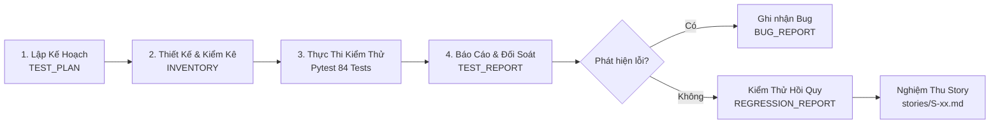

# QA SYSTEM & TESTING HUB

> **Loại tài liệu**: Trung tâm điều phối kiểm định chất lượng & Hướng dẫn quy trình QA  
> **Tham chiếu chuẩn mực**: `taicautruc.md` Mục 1.2 dòng 53  
> **Trạng thái**: ACTIVE (Nguồn sự thật điều hành phân khu QA)

---

## 1. Quy chuẩn kiến trúc tài liệu QA

To toàn bộ tài sản kiểm thử và đảm bảo chất lượng của dự án EV CSMS được quy tụ tập trung trong phân khu `docs/qa/` theo cấu trúc module hóa phân vai trò:
* [`STANDARD.md`](STANDARD.md): Hiến chương kiểm thử trung tâm, luật bằng chứng và danh mục Enum chuẩn.
* [`INVENTORY.md`](INVENTORY.md): Sổ cái kiểm kê toàn bộ 84 test cases (hiện có 84 tests passed), ma trận truy vết và độ phủ.
* [`plans/TEST_PLAN.md`](plans/TEST_PLAN.md): Kế hoạch kiểm thử chiến lược đa tầng của dự án.
* [`reports/`](reports/): Phân khu lưu trữ các báo cáo thực nghiệm:
  * [`TEST_REPORT.md`](reports/TEST_REPORT.md): Báo cáo thực thi kiểm thử hiện tại (84/84 tests passed, 0 failed).
  * [`REGRESSION_REPORT.md`](reports/REGRESSION_REPORT.md): Báo cáo kiểm soát hồi quy khi có điều chỉnh mã.
  * [`BUG_REPORT.md`](reports/BUG_REPORT.md): Sổ theo dõi lỗi hệ thống và rào cản môi trường.
* [`integration/FRONTEND_BACKEND.md`](integration/FRONTEND_BACKEND.md): Hồ sơ kiểm thử tích hợp giao diện client và API server.
* [`stories/`](stories/): Hồ sơ nghiệm thu chi tiết từng câu chuyện người dùng (S-01 đến S-05).

---

## 2. Quy trình kiểm định chất lượng (QA Lifecycle)

---

## 3. Bản đồ điều hướng tài liệu kiểm thử

| Khi bạn cần... | Hãy tra cứu tài liệu |
| :--- | :--- |
| Tìm hiểu quy tắc kiểm thử, 19 điều cấm, chuẩn enum | [`STANDARD.md`](STANDARD.md) |
| Tra cứu danh sách 84 test case, độ phủ, ma trận hồi quy | [`INVENTORY.md`](INVENTORY.md) |
| Xem chiến lược kiểm thử, điều kiện bắt đầu/kết thúc | [`plans/TEST_PLAN.md`](plans/TEST_PLAN.md) |
| Xem kết quả chạy test mới nhất, số test pass/fail | [`reports/TEST_REPORT.md`](reports/TEST_REPORT.md) |
| Kiểm tra xem sửa mã có gây tác dụng phụ hồi quy không | [`reports/REGRESSION_REPORT.md`](reports/REGRESSION_REPORT.md) |
| Theo dõi lỗi đang mở, rào cản phần cứng chưa đạt | [`reports/BUG_REPORT.md`](reports/BUG_REPORT.md) |
| Kiểm tra kết nối Client React ↔ Server FastAPI | [`integration/FRONTEND_BACKEND.md`](integration/FRONTEND_BACKEND.md) |
| Kiểm tra tiêu chí nghiệm thu Acceptance Criteria từng Story | [`stories/README.md`](stories/README.md) |

---

## 4. Ma trận phân quyền kiểm định (QA RACI)

> `[THIẾU: cần người cung cấp - Dự án hiện chưa có văn bản phân công trách nhiệm ma trận RACI chính thức; nội dung dưới đây dựa trên cấu trúc tham khảo đề xuất từ taicautruc.md Mục 4.2]`.

* **QA Lead / Senior Tester**: **Accountable (A) & Responsible (R)** cho toàn bộ phân khu `docs/qa/` và bộ test `backend/tests/`.
* **Developer**: **Consulted (C)** khi thiết kế ca kiểm thử và **Informed (I)** khi có báo cáo bug mới.
* **Product Owner**: **Accountable (A)** cho tiêu chí nghiệm thu của Story; **Informed (I)** về tiến độ pass/fail của các đợt kiểm thử.
* **Ranh giới bất di bất dịch**: Tester có toàn quyền trong `docs/qa/`, nhưng **không bao giờ được phép sửa đổi mã nguồn ứng dụng** trong `backend/app/` và `frontend/src/`.

---

## 5. Nguyên tắc kiểm thử dựa trên bằng chứng (Evidence-based Rule)

Mọi đánh giá trong phân khu QA bắt buộc tuân thủ 3 nguyên tắc bằng chứng:
1. **Không giả định**: Không chấp nhận trạng thái PASS nếu không có nhật ký thực thi thực tế từ terminal hoặc file log.
2. **Đối chiếu hai chiều**: Mọi khẳng định hoàn thành phải có liên kết truy vết ngược từ Story $\leftrightarrow$ Task $\leftrightarrow$ Code $\leftrightarrow$ Test.
3. **Trung thực kỹ thuật**: Báo cáo thẳng thắn các phần chưa hoàn thành (như kết nối trạm sạc thật, cổng thanh toán thật) thay vì che giấu bằng các kịch bản mock.