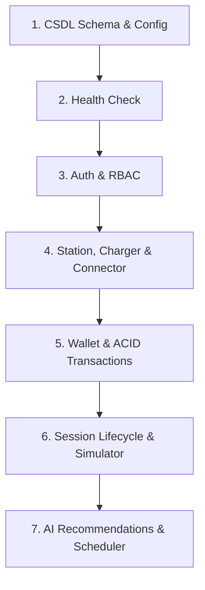

# KẾ HOẠCH KIỂM THỬ (TEST PLAN) — CSMS

> **Loại tài liệu**: Kế hoạch kiểm thử chiến lược (Master Test Strategy & Plan)  
> **Tham chiếu chuẩn mực**: `taicautruc.md` Mục 2.3 số 13  
> **Quy tắc tuân thủ**: Xác lập chiến lược và ranh giới kiểm thử dựa trên năng lực và kiến trúc thực tế của hệ thống.

---

## 1. Scope (Phạm vi kiểm thử)

### Trong phạm vi (In-Scope) cho Giai đoạn 1:
1. **Xác thực và phân quyền (Auth & RBAC)**: Đăng ký, đăng nhập JWT, hash mật khẩu bcrypt, ma trận 3 vai trò (`ADMIN`, `OPERATOR`, `CUSTOMER`), kiểm soát IDOR giữa các CPO.
2. **Quản lý tài sản trạm sạc**: CRUD thông tin trạm sạc, trụ sạc, đầu nối, kiểm tra tính duy nhất của mã trụ (`charger_code`), tính toán công suất vượt tải (`oversubscription`).
3. **Ví tiền điện tử và giao dịch ACID**: Nạp tiền, trừ tiền phiên sạc nguyên tử, ngưỡng thấu chi (-300.000 VND), giới hạn an toàn CSDL (-500.000 VND), mở khóa nợ khi số dư dương.
4. **Vòng đời phiên sạc & Tính cước**: Bắt đầu sạc, khóa độc quyền đầu nối, áp dụng biểu giá TOU, kết thúc sạc, quyết toán và hoàn trả trạng thái đầu nối.
5. **Mô phỏng sạc (Simulator) & Telemetry**: Mô phỏng đường cong sạc CC/CV, ngắt khi pin 100%, ngắt khi quá nhiệt, ngắt khi vượt hạn mức nợ, khôi phục phiên sạc mồ côi sau sự cố sập nguồn.
6. **Hạ tầng AI dự phòng**: Cơ chế Heuristic Fallback khi không có API Key hoặc mất kết nối Google Gemini.

### Ngoài phạm vi (Out-of-Scope) Giai đoạn 1:
1. Kết nối với thiết bị phần cứng trụ sạc thật qua giao thức cáp mạng/WebSocket OCPP 1.6J/2.0.1 (dời sang giai đoạn sau).
2. Tích hợp cổng thanh toán trực tuyến ngân hàng thật có chữ ký số và Webhook IPN (chấp nhận mô phỏng nạp tiền nội bộ).
3. Đa người thuê hoàn toàn độc lập (Multi-tenancy White-labeling).

---

## 2. Test Objectives (Mục tiêu kiểm thử)

* **Toàn vẹn tài chính (Financial Integrity)**: Đảm bảo không xảy ra hiện tượng thất thoát tiền, không trừ tiền 2 lần (idempotency) và tuyệt đối không để số dư âm vượt quá hạn mức -500.000 VND.
* **Bảo mật và cách ly quyền (Security & Isolation)**: CPO không thể xem/sửa trạm của CPO khác; tài xế không thể can thiệp phiên sạc của người khác.
* **Độ ổn định vận hành (Operational Stability)**: 100% test cases tự động phải PASS trước khi phát hành phiên bản mới; không có lỗi hồi quy (Zero Regression Defects).

---

## 3. Test Strategy (Chiến lược kiểm thử)

Áp dụng mô hình Kim tự tháp kiểm thử đa tầng (5-Layers Testing Pyramid):
1. **Tầng 1 - Unit & Model Tests**: Kiểm tra tính hợp lệ của schema Pydantic, constraints của SQLAlchemy models và các hàm tiện ích thuật toán (Haversine, công suất).
2. **Tầng 2 - Service & Business Logic Tests**: Kiểm tra logic dịch vụ ví tiền ACID, tính cước TOU, thuật toán ngắt sạc mô phỏng.
3. **Tầng 3 - API & Route Integration Tests**: Sử dụng `fastapi.testclient.TestClient` kiểm tra luồng HTTP request/response, mã trạng thái và phân quyền RBAC.
4. **Tầng 4 - Mock & Fault Tolerance Tests**: Giả lập lỗi timeout mạng, sập máy chủ đột ngột và ngắt kết nối bên thứ ba.
5. **Tầng 5 - Client Build Verification**: Kiểm tra biên dịch frontend Vite đảm bảo không có lỗi cú pháp hoặc gãy import.

---

## 4. Test Environment Requirements (Yêu cầu môi trường kiểm thử)

* **Hệ điều hành**: Windows, Linux hoặc macOS.
* **Môi trường Backend**: Python 3.10+, công cụ `pytest`, `httpx`, thư viện `sqlalchemy`, `pydantic`.
* **Cơ sở dữ liệu kiểm thử**: SQLite file chuyên dụng (`test_ev_csms.db`) hoặc SQLite `:memory:` có cơ chế teardown dọn dẹp sau mỗi test session.
* **Môi trường Frontend**: Node.js 18+, công cụ `npm run build`.

---

## 5. Test Types (Phân loại kiểm thử)

* **Functional Testing**: Kiểm thử các tính năng nghiệp vụ theo từng User Story.
* **Security & RBAC Testing**: Kiểm thử bảo mật ma trận phân quyền và chống tấn công leo quyền ngang (IDOR).
* **ACID Concurrency Testing**: Kiểm thử tính nhất quán của dữ liệu ví và trạng thái đầu nối.
* **Regression Testing**: Kiểm thử hồi quy chọn lọc toàn bộ hệ thống sau mỗi lần điều chỉnh mã.

---

## 6. Dependency Order (Thứ tự thực thi phụ thuộc)

Thứ tự chạy kiểm thử được sắp xếp theo đồ thị phụ thuộc kiến trúc:

---

## 7. Entry Criteria (Tiêu chí bắt đầu kiểm thử)

* Mã nguồn đã được commit sạch sẽ vào kho Git, không có lỗi xung đột merge.
* Môi trường ảo Python đã cài đặt đầy đủ các gói phụ thuộc từ `requirements.txt`.
* Schema CSDL có thể khởi tạo tự động mà không phát sinh lỗi cú pháp SQL.

---

## 8. Exit Criteria (Tiêu chí kết thúc kiểm thử)

* **100% test cases** trong bộ kiểm kê (hiện tại là 84 tests) đạt trạng thái **PASS**.
* Không có lỗi nghiêm trọng cấp độ 1 (P0/Critical Blocker) hoặc cấp độ 2 (P1/Major Defect) còn mở.
* Lệnh biên dịch frontend `npm run build` kết thúc thành công với mã thoát 0.
* Tất cả các thay đổi đều có nhật ký hồi quy chứng minh không gây tác dụng phụ.

---

## 9. PASS / FAIL / BLOCKED Rules (Quy tắc đánh giá trạng thái chuẩn 8 giá trị)

Tuân thủ nghiêm ngặt 8 trạng thái thẩm định theo Hiến chương QA:
1. **PASS**: Ca kiểm thử chạy thành công, toàn bộ assertions thỏa mãn với kết quả mong đợi.
2. **FAIL**: Ca kiểm thử chạy nhưng có ít nhất một assertion không thỏa mãn (sai khác logic).
3. **BLOCKED**: Không thể thực thi ca kiểm thử do lỗi môi trường hoặc tính năng phụ thuộc bị lỗi sập.
4. **SKIPPED**: Ca kiểm thử được tạm thời bỏ qua có chủ đích và có lý do kỹ thuật rõ ràng.
5. **UNVERIFIED**: Chưa có bằng chứng chạy thực tế trên môi trường chuẩn.
6. **DEFERRED**: Tính năng đã được thống nhất dời sang giai đoạn sau.
7. **FIXED**: Khuyết tật đã được sửa đổi và đang chờ kiểm chứng hồi quy.
8. **CLOSED**: Khuyết tật đã được kiểm chứng hồi quy thành công và đóng hồ sơ.

---

## 10. Tester Restrictions (Quy tắc bắt buộc đối với Tester/QA)

* **Quy tắc bất biến 1**: Tester và AI Testing Agent **tuyệt đối không được phép chỉnh sửa mã nguồn ứng dụng** trong thư mục `backend/app/` và `frontend/src/` để làm cho test pass.
* **Quy tắc bất biến 2**: Mọi phát hiện lỗi phải được ghi nhận trung thực vào [`docs/qa/reports/BUG_REPORT.md`](../reports/BUG_REPORT.md).
* **Quy tắc bất biến 3**: Mọi kết luận nghiệm thu bắt buộc phải dẫn chứng số liệu thực tế từ kết quả chạy lệnh (`pytest`), không chấp nhận giả định.