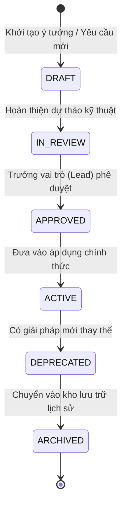

# KẾ HOẠCH TÁI CẤU TRÚC HỆ THỐNG TÀI LIỆU DỰ ÁN PHẦN MỀM (DOCUMENTATION RESTRUCTURING BLUEPRINT)

> **Loại tài liệu**: Thiết kế kiến trúc tài liệu & Khung quản trị thông tin chuẩn hóa  
> **Thời điểm lập**: 29/09/2026  
> **Tham chiếu chuẩn mực**: Tương thích định dạng báo cáo phân tích toàn diện [`PROJECT_ANALYSIS_SUMMARY.md`](file:///E:/erro/Charging-Station-Management-System-CSMS--main%20%281%29/Charging-Station-Management-System-CSMS--main/PROJECT_ANALYSIS_SUMMARY.md)  
> **Trạng thái phê duyệt**: **BẢN THIẾT KẾ ĐỀ XUẤT — CHƯA THI HÀNH (DRAFT / PENDING REVIEW)**  
> *(Toàn bộ file vật lý trên ổ đĩa được giữ nguyên 100%, không đổi tên hoặc di chuyển cho đến khi kế hoạch được phê duyệt chính thức).*

---

## 1. NỘI DUNG PHƯƠNG ÁN 2 — TÁI CẤU TRÚC TOÀN DIỆN THEO VAI TRÒ (ROLE-BASED PACKAGING)

### 1.1. Triết lý kiến trúc & Mục tiêu cốt lõi
Hệ thống tài liệu của một dự án công nghệ không chỉ phục vụ việc đọc hiểu mà còn là **hạ tầng dữ liệu tri thức** cho các bên liên quan: Nhà phát triển (Developer), Vận hành hệ thống (DevOps/SRE), Quản lý sản phẩm (PO/Scrum Master), Chuyên viên kiểm thử (QA/Tester), Thiết kế giao diện (UI/UX Designer) và Tác tử AI (AI Agents).

Phương án 2 giải quyết triệt để các tồn tại của cấu trúc tài liệu hiện nay:
1. **Chấm dứt quá tải ở cấp thư mục cha (`docs/`)**: Di chuyển các file đơn lẻ nằm rải rác ngoài cấp 1 của `docs/` vào các phân khu chức năng chuyên biệt.
2. **Khắc phục triệt để "Nghịch lý sở hữu" (Ownership Paradox)**: Tách bạch rõ ràng quyền quản trị. Thư mục `docs/` không còn bị gắn nhãn độc quyền của Tester khi mà bên trong nó chứa cả tài liệu hạ tầng DevOps và quản lý tiến độ Sprint.
3. **Quy tụ toàn bộ tài sản QA về một nguồn duy nhất**: Gom nhóm các file quy chuẩn (`TESTER_STANDARD.md`), chỉ mục (`TEST_INVENTORY.md`), kế hoạch/báo cáo (`testing/`) và kịch bản nghiệm thu (`stories/`, `integration/`) thành một hệ sinh thái QA thống nhất, liền mạch.
4. **Giữ gìn sự sạch sẽ cho thư mục gốc (`root`)**: Thư mục gốc chỉ lưu trữ các tệp chuẩn hóa của kho mã nguồn (`README.md`, `CONTRIBUTING.md`, cấu hình CI/CD), các báo cáo phân tích tổng quan sẽ được gom vào phân khu kiến trúc hệ thống.

---

### 1.2. Sơ đồ cây thư mục mục tiêu đề xuất (Mô hình đóng gói vai trò)

Dưới đây là cây cấu trúc đích sau khi tái cấu trúc:

```text
<PROJECT_ROOT>/
├── README.md                          # Entry point cấp cao: Khởi động nhanh, tổng quan hệ thống, demo
├── CONTRIBUTING.md                    # Quy ước đóng góp: Git branch, commit standard, PR checklist, DoD
├── .github/                           # Quy trình tự động hóa và biểu mẫu kho mã nguồn
│   ├── workflows/ci.yml               # Đường ống tích hợp liên tục (CI/CD Pipeline)
│   └── pull_request_template.md       # Biểu mẫu kiểm soát chất lượng khi mở Pull Request
├── backend/                           # Module dịch vụ máy chủ (hoặc các package con)
│   └── README.md                      # Tài liệu kỹ thuật chi tiết dành riêng cho Backend/API
│
└── docs/                              # TRUNG TÂM TRI THỨC VÀ TÀI LIỆU DỰ ÁN
    ├── README.md                      # Cổng điều hướng tài liệu toàn hệ thống (Global Documentation Hub)
    │
    ├── architecture/                  # [NHÓM 1: KIẾN TRÚC & PHÂN TÍCH HỆ THỐNG]
    │   ├── PROJECT_STRUCTURE.md       # Bản đồ cấu trúc thư mục thực tế & ma trận truy vết hệ thống
    │   └── PROJECT_ANALYSIS_SUMMARY.md # Báo cáo phân tích chuyên sâu hạ tầng & mã nguồn
    │
    ├── devops/                        # [NHÓM 2: VẬN HÀNH & HẠ TẦNG KỸ THUẬT]
    │   └── OPERATIONS.md              # Sổ tay vận hành (Runbook), lệnh Docker, DB, Staging, Env
    │
    ├── planning/                      # [NHÓM 3: QUẢN TRỊ DỰ ÁN & TIẾN ĐỘ SPRINT]
    │   ├── SPRINT_STATUS.md           # Bảng theo dõi tiến độ tổng thể, hiện trạng Sprint & rủi ro
    │   └── SPRINT_PLAN.md             # Kế hoạch chi tiết từng Sprint (vd: SPRINT_2_PLAN.md)
    │
    ├── qa/                            # [NHÓM 4: ĐẢM BẢO CHẤT LƯỢNG & KIỂM ĐỊNH (QA/TESTER)]
    │   ├── README.md                  # Hướng dẫn quy trình kiểm thử & luồng định tuyến AI Tester
    │   ├── STANDARD.md                # Hiến chương kiểm thử, quy chuẩn enum, luật bằng chứng
    │   ├── INVENTORY.md               # Sổ cái kiểm kê toàn bộ Test Case, trạng thái và độ phủ
    │   ├── plans/                     # Chiến lược và kế hoạch kiểm thử chính thức
    │   │   └── TEST_PLAN.md           # Kế hoạch kiểm thử chiến lược đa tầng
    │   ├── reports/                   # Báo cáo kết quả kiểm định & theo dõi khuyết tật
    │   │   ├── TEST_REPORT.md         # Báo cáo tổng hợp kết quả kiểm thử hiện tại
    │   │   ├── REGRESSION_REPORT.md   # Nhật ký kiểm thử hồi quy hành vi hệ thống
    │   │   └── BUG_REPORT.md          # Sổ theo dõi lỗi hệ thống & rào cản môi trường
    │   ├── stories/                   # Đặc tả nghiệm thu chi tiết từng câu chuyện người dùng
    │   │   ├── S-01.md đến S-xx.md   # Hồ sơ Acceptance Criteria & Evidence theo Story
    │   └── integration/               # Hồ sơ kiểm thử tích hợp liên thành phần
    │       └── FRONTEND_BACKEND.md    # Kiểm thử tích hợp giao diện người dùng ↔ API máy chủ
    │
    ├── design/                        # [NHÓM 5: THIẾT KẾ TRẢI NGHIỆM & GIAO DIỆN (UI/UX)]
    │   ├── README.md                  # Trạng thái hiện thực giao diện, nhật ký điều chỉnh thiết kế
    │   └── CSMS_UX_Redesign_Level_3_Operator_Dashboard.md # Đặc tả UX/UI Dashboard điều hành
    │
    └── research/                      # [NHÓM 6: NGHIÊN CỨU & THỬ NGHIỆM KỸ THUẬT (R&D / SPIKES)]
        ├── K-01-ocpp-simulator.md     # Báo cáo kỹ thuật thử nghiệm (Spike/PoC) mô phỏng thiết bị
        └── S-05-AC3-ghi-nhan-cho-PO.md# Báo cáo giải trình kỹ thuật gửi Product Owner
```

---

## 2. PHÂN TÍCH VAI TRÒ CỦA TỪNG FILE DỰA TRÊN TIÊU ĐỀ (# ĐẾN ####)

Dưới đây là kết quả khảo sát toàn bộ các cấp tiêu đề từ `#` đến `####` của 26 tài liệu Markdown trong dự án, từ đó xác định chính xác công năng, đối tượng độc giả và trách nhiệm sở hữu:

### 2.1. Cấp thư mục gốc (`root`) và Tiện ích nền tảng (`.github/`, `backend/`)

#### 1. [`README.md`](file:///E:/erro/Charging-Station-Management-System-CSMS--main%20%281%29/Charging-Station-Management-System-CSMS--main/README.md)
* **Các cấp tiêu đề trích xuất**:
  * `# CSMS — Charging Station Management System`
  * `## Trạng thái nhanh (28/9/2026)`
  * `## 1. Chạy dự án (một lệnh)`
  * `## 2. Dùng thử hệ thống`
    * `### Tài khoản có sẵn (tạo tự động)`
    * `# 3. Đăng ký công khai — luôn ra tài khoản Tài xế, không gửi "role"`
    * `### Thử bằng dòng lệnh (không cần giao diện)`
    * `# Chủ trạm đăng nhập rồi tạo trạm`
    * `# Xem danh sách trạm của mình`
    * `### Dữ liệu demo (GYM-14) — để cả nhóm thử giao diện`
  * `## 3. Kiểm thử`
  * `## Staging (môi trường chạy thật, tự cập nhật khi merge)`
  * `## 4. Gặp lỗi thường gặp`
  * `## 5. Tổng quan hệ thống`
    * `### Kiến trúc`
    * `### Sprint 1 — đã xong (12 SP)`
    * `### Giao diện — bạn thao tác được ở đâu`
    * `### API hiện có (chi tiết ở backend/README.md)`
    * `### Đang làm / sắp tới`
  * `## 6. Cấu trúc thư mục`
  * `## 7. Tài liệu liên quan`
* **Vai trò**: **Cổng đón tiếp chung (Onboarding Hub & Executive Entrypoint)**. Cung cấp hướng dẫn khởi động nhanh 1 lệnh, các tài khoản mẫu thử nghiệm, khắc phục sự cố tức thì và liên kết tổng quan cho toàn bộ dự án.
* **Đối tượng sử dụng**: Tất cả thành viên mới, Đánh giá viên, Khách hàng, Quản lý cấp cao.
* **Quyền sở hữu**: Nhóm phát triển lõi (Lead Developer / Tech Lead).

#### 2. [`CONTRIBUTING.md`](file:///E:/erro/Charging-Station-Management-System-CSMS--main%20%281%29/Charging-Station-Management-System-CSMS--main/CONTRIBUTING.md)
* **Các cấp tiêu đề trích xuất**:
  * `# CONTRIBUTING — Quy ước làm việc nhóm CSMS`
  * `## 1. Nguyên tắc chung`
  * `## 2. Đặt tên nhánh`
  * `## 3. Viết commit`
  * `## 4. Quy trình làm một việc và mở Pull Request`
  * `## 5. Ai review và review thế nào`
  * `## 6. Việc phải đạt trước khi coi là xong`
* **Vai trò**: **Quy chuẩn kỷ luật kỹ thuật (Development Governance & Contribution Guidelines)**. Thiết lập văn hóa kỹ thuật, quy tắc đặt tên branch Git, chuẩn thông điệp commit, chu trình xét duyệt Pull Request và Định nghĩa hoàn thành (Definition of Done - DoD).
* **Đối tượng sử dụng**: Lập trình viên, Kỹ sư kiểm thử, Reviewer.
* **Quyền sở hữu**: Scrum Master phối hợp cùng Tech Lead.

#### 3. [`PROJECT_ANALYSIS_SUMMARY.md`](file:///E:/erro/Charging-Station-Management-System-CSMS--main%20%281%29/Charging-Station-Management-System-CSMS--main/PROJECT_ANALYSIS_SUMMARY.md)
* **Các cấp tiêu đề trích xuất**:
  * `# BÁO CÁO PHÂN TÍCH TOÀN DIỆN CẤU TRÚC TÀI LIỆU VÀ HẠ TẦNG KỸ THUẬT CSMS`
  * `## 1. SƠ ĐỒ PHÂN BỐ CẤU TRÚC DỰ ÁN VÀ PHÂN QUYỀN VAI TRÒ`
  * `## 2. KHẢO SÁT KẾT CẤU CÁC MỤC CHÍNH ## CỦA CÁC FILE .md`
    * `### 2.1. Nhóm tài liệu quy ước dự án và đóng góp (Root & .github)`
    * `### 2.2. Nhóm tài liệu vận hành và cấu trúc hệ thống (docs/)`
    * `### 2.3. Nhóm tài liệu kế hoạch & tình trạng Sprint (docs/)`
    * `### 2.4. Nhóm tài liệu quy chuẩn & thực thi kiểm thử (docs/testing/, docs/TESTER_STANDARD.md, docs/TEST_INVENTORY.md)`
    * `### 2.5. Nhóm tài liệu đặc tả User Stories (docs/stories/)`
    * `### 2.6. Nhóm tài liệu Thiết kế UI & Nghiên cứu kỹ thuật (Design & Spikes)`
  * `## 3. PHÂN TÍCH CHUYÊN SÂU CÁC FILE KỸ THUẬT & CẤU HÌNH GỐC`
    * `### 3.1. run.py — Bộ điều khiển tự động hóa trung tâm (CLI Orchestrator)`
    * `### 3.2. test.py — Lối tắt thực thi kiểm thử`
    * `### 3.3. tools/test_run.py — Bộ kiểm thử cho chính công cụ điều hành`
    * `### 3.4. docker-compose.yml — Khai báo dịch vụ Container môi trường cục bộ`
    * `### 3.5. render.yaml — Cấu hình Staging Cloud (Render Blueprint IaC)`
    * `### 3.6. .github/workflows/ci.yml — Đường ống tích hợp liên tục (CI Pipeline)`
    * `### 3.7. eslint.config.js — Tiêu chuẩn kiểm soát kiến trúc & bảo mật`
  * `## 4. BẢNG TỔNG KẾT TƯƠNG QUAN HỆ THỐNG`
* **Vai trò**: **Báo cáo kiểm toán kiến trúc & hạ tầng (Technical Architecture Audit & System Baseline)**. Cung cấp góc nhìn 360 độ về mã nguồn, công cụ tự động hóa, cấu hình hạ tầng container, CI/CD và toàn bộ hệ thống tài liệu.
* **Đối tượng sử dụng**: Kiến trúc sư giải pháp (Solution Architect), Lead Engineer, Chuyên viên đánh giá an toàn.
* **Quyền sở hữu**: Solution Architect / Tech Lead.

#### 4. [`.github/pull_request_template.md`](file:///E:/erro/Charging-Station-Management-System-CSMS--main%20%281%29/Charging-Station-Management-System-CSMS--main/.github/pull_request_template.md)
* **Các cấp tiêu đề trích xuất**:
  * `## Mô tả`
  * `## Việc Jira`
  * `## Cách kiểm tra`
  * `## Ảnh chụp hoặc kết quả`
  * `## Checklist`
* **Vai trò**: **Biểu mẫu kiểm soát chất lượng bàn giao (Quality Gate & Handover Template)**. Đảm bảo mọi dòng mã khi đưa vào nhánh chính đều có liên kết mã nhiệm vụ, hướng dẫn xác minh và bằng chứng kiểm thử trực quan.
* **Đối tượng sử dụng**: Tác giả PR, Người duyệt PR (Approvers).
* **Quyền sở hữu**: QA Lead & Tech Lead.

#### 5. [`backend/README.md`](file:///E:/erro/Charging-Station-Management-System-CSMS--main%20%281%29/Charging-Station-Management-System-CSMS--main/backend/README.md)
* **Các cấp tiêu đề trích xuất**:
  * `# CSMS Backend`
  * `## Lệnh npm (trong backend/)`
  * `## Lưu ý khi migrate trên DB dev đã có dữ liệu cũ`
  * `## Đăng nhập và khoá tạm`
  * `## API chính`
  * `## Phân quyền và bảo mật request`
  * `## Kiểm thử`
* **Vai trò**: **Tài liệu kỹ thuật thành phần con (Component-level Technical Manual)**. Hướng dẫn sâu về vận hành API máy chủ, xử lý lỗi di chuyển cơ sở dữ liệu (migration), ma trận xác thực và bảo mật cơ chế RBAC.
* **Đối tượng sử dụng**: Backend Developers, API Consumers, System Integrators.
* **Quyền sở hữu**: Backend Lead Engineer.

---

### 2.2. Nhóm Vận hành, Kiến trúc và Kế hoạch (docs/)

#### 6. [`docs/README.md`](file:///E:/erro/Charging-Station-Management-System-CSMS--main%20%281%29/Charging-Station-Management-System-CSMS--main/docs/README.md)
* **Các cấp tiêu đề trích xuất**:
  * `# AI TESTER ENTRY POINT & ROUTER`
  * `## 1. TỔNG QUAN HỆ THỐNG TÀI LIỆU TESTER (DOCUMENT ARCHITECTURE)`
  * `## 2. 17 CÂU HỎI CỐT LÕI DÀNH CHO AI TESTER (TESTER FAQ)`
    * `### Q1: AI Tester là gì?` ... `### Q18: Khi bộ test tự động của Developer bị FAIL thì Tester xử lý thế nào?`
  * `## 3. ĐIỀU HƯỚNG THEO LỆNH KIỂM THỬ (ROUTING LOGIC)`
    * `### 3.1. Routing khi nhận nhiệm vụ cấp Epic (E-xx)`
    * `### 3.2. Routing khi nhận nhiệm vụ cấp Story (S-xx)`
    * `### 3.3. Routing khi nhận nhiệm vụ cấp Task (T-xx)`
    * `### 3.4. Routing cho các lệnh chuyên biệt khác`
    * `### 3.5. Routing khi nhận nhiệm vụ General Review / Code Review`
  * `## 4. BẢNG TRA CỨU ĐIỀU HƯỚNG NHANH (QUICK NAVIGATION MATRIX)`
* **Vai trò**: **Bộ điều hướng kiểm thử & FAQ nghiệp vụ (QA Navigation Router & Agent Protocol)**. Điểm khởi đầu định tuyến mọi luồng kiểm thử chất lượng cho nhân sự QA và tác tử AI.
* **Đối tượng sử dụng**: QA Analysts, AI Testing Agents, Technical Auditors.
* **Quyền sở hữu**: QA Lead.

#### 7. [`docs/OPERATIONS.md`](file:///E:/erro/Charging-Station-Management-System-CSMS--main%20%281%29/Charging-Station-Management-System-CSMS--main/docs/OPERATIONS.md)
* **Các cấp tiêu đề trích xuất**:
  * `# Vận hành CSMS — build, chạy, dừng, khởi động lại, dữ liệu, staging`
  * `## 1. Thành phần và cổng`
  * `## 2. Yêu cầu`
  * `## 3. Chạy: một lệnh, tự build`
    * `### Tài khoản trên máy cá nhân`
  * `## 4. Dừng, khởi động lại`
  * `## 5. Lệnh Docker tương đương (khi cần làm tay)`
  * `## 6. Xem log và kiểm tra sức khoẻ`
  * `## 7. Cơ sở dữ liệu`
  * `## 8. Kiểm thử`
  * `## 9. Staging (Render)`
  * `## 10. Biến môi trường`
  * `## 11. Chạy lại spike K-01 (mã thử vứt đi)`
  * `## 12. Chạy thủ công không qua script (nâng cao)`
* **Vai trò**: **Sổ tay kỹ thuật vận hành hệ thống (DevOps & Infrastructure Runbook)**. Chi tiết cổng mạng, lifecycle container Docker, giám sát log, backup database và triển khai staging đám mây.
* **Đối tượng sử dụng**: DevOps Engineers, SRE, SysAdmins, Developers lúc trực sự cố.
* **Quyền sở hữu**: DevOps Engineer / Infrastructure Lead.

#### 8. [`docs/PROJECT_STRUCTURE.md`](file:///E:/erro/Charging-Station-Management-System-CSMS--main%20%281%29/Charging-Station-Management-System-CSMS--main/docs/PROJECT_STRUCTURE.md)
* **Các cấp tiêu đề trích xuất**:
  * `# Project Structure`
  * `## 0. Cập nhật cấu trúc 28/09/2026 (frontend thiết kế lại, staging, demo, K-01)`
  * `## 1. Mục đích của tài liệu`
  * `## 2. Structure Authority (Thẩm quyền cấu trúc)`
  * `## 3. Tester Ownership (Quyền sở hữu của Tester)`
  * `## 4. Verified Project Tree (Cây thư mục đã xác minh)`
  * `## 5. Important Components (Các thành phần quan trọng)`
  * `## 6. QA Documentation Map (Bản đồ tài liệu QA)`
  * `## 7. Requirement → Task → Source Mapping`
  * `## 8. Dependency Map (Bản đồ phụ thuộc hệ thống)`
    * `### 8.1. Story → Story Dependency`
    * `### 8.2. Task → Task Dependency`
    * `### 8.3. Test → Prerequisite Dependency`
    * `### 8.4. Source → Dependent Component`
  * `## 9. Source → Historical Test Mapping (Bản đồ ánh xạ lịch sử kiểm thử)`
  * `## 10. Project-Specific Hierarchy & Traceability Facts (Phân cấp nhiệm vụ & Thực tế truy vết dự án)`
    * `### 10.1. Project Hierarchy Facts`
    * `### 10.2. Project Traceability Facts`
  * `## 11. Impact / Regression Map (Bản đồ phân tích tác động & hồi quy)`
  * `## 12. Current Structure Gaps (Các khoảng trống cấu trúc hiện tại)`
  * `## 13. Structure Verification Metadata (Thông tin kiểm chứng cấu trúc)`
* **Vai trò**: **Nguồn sự thật kiến trúc & Ma trận truy vết (Single Source of Architecture Truth & Traceability Matrix)**. Bản đồ định danh 100% tài nguyên dự án, ma trận quan hệ Requirement ↔ Code ↔ Test.
* **Đối tượng sử dụng**: Solution Architects, Lead Developers, QA Leads, Project Managers.
* **Quyền sở hữu**: Software Architect / QA Lead.

#### 9. [`docs/SPRINT_STATUS.md`](file:///E:/erro/Charging-Station-Management-System-CSMS--main%20%281%29/Charging-Station-Management-System-CSMS--main/docs/SPRINT_STATUS.md)
* **Các cấp tiêu đề trích xuất**:
  * `# Tình trạng dự án và sprint — CSMS`
  * `## 1. Tóm tắt một trang`
  * `## 2. Sprint 1 — “Chủ trạm khai báo được trạm, trụ và đầu nối; cả nhóm chạy được dự án”`
    * `### Việc làm thêm ngoài backlog Sprint 1 (28/9)`
  * `## 3. Hệ thống hiện có gì`
  * `## 4. Sprint 2 — “Trụ ảo nối vào hệ thống được xác thực; vận hành viên thấy đúng trạng thái mọi trụ” (28/9 – 5/10, 20 SP)`
    * `### Phân tích`
    * `### S-11 còn lại gì (3 SP)`
    * `### Ba phương án cam kết (cần PO chọn)`
    * `### Cách rút ngắn chuỗi (không đổi phạm vi)`
  * `## 5. Lộ trình các sprint sau (theo backlog)`
  * `## 6. Rủi ro — trạng thái hiện tại`
  * `## 7. Definition of Done — đã đạt / chưa`
  * `## 8. Nhánh Git hiện có (chưa merge vào main)`
* **Vai trò**: **Bảng điều khiển tiến độ quản trị (Project Health & Sprint Status Dashboard)**. Đánh giá kết quả sprint cũ, mục tiêu sprint mới, quản trị rủi ro kỹ thuật và theo dõi nhánh phát triển.
* **Đối tượng sử dụng**: Product Owner (PO), Scrum Master, Stakeholders, Dev Team.
* **Quyền sở hữu**: Scrum Master / Project Manager.

#### 10. [`docs/SPRINT_2_PLAN.md`](file:///E:/erro/Charging-Station-Management-System-CSMS--main%20%281%29/Charging-Station-Management-System-CSMS--main/docs/SPRINT_2_PLAN.md)
* **Các cấp tiêu đề trích xuất**:
  * `# Kế hoạch chi tiết Sprint 2 (S-06 → S-16) — 20 SP`
  * `## 0. Thực tế về thời gian — đọc trước`
  * `## 1. Quy ước kỹ thuật chốt cùng lúc (họp 30 phút sáng 29/9)`
  * `## 2. Các làn làm việc (cần khoảng 7–8 người; Phúc là điều phối + demo)`
  * `## 3. Lịch tổng (theo nửa ngày)`
  * `## 4. Chi tiết từng story`
    * `### 4.0 Nền dùng chung (L2, làm trước, không tính SP riêng)`
    * `### S-06 · GYM-32 · 2 SP` đến `### S-16 · GYM-42 · 1 SP`
  * `## 5. Mốc kiểm tra và thứ tự cắt (PO đã chọn 20 SP; đây là cơ chế cảnh báo sớm)`
  * `## 6. Câu hỏi cần trả lời ngay (chặn việc nếu không có đáp án)`
  * `## 7. Kiểm tra Definition of Done cuối sprint (mỗi story)`
* **Vai trò**: **Kế hoạch hành động chi tiết Sprint (Operational Sprint Execution Plan)**. Phân bổ công việc theo luồng song song, thời khóa biểu thực thi nửa ngày, kịch bản dự phòng khi trễ hạn.
* **Đối tượng sử dụng**: Scrum Master, Developers, Testers thực chiến trong Sprint.
* **Quyền sở hữu**: Scrum Master.

---

### 2.3. Nhóm Tiêu chuẩn, Kiểm kê & Báo cáo Kiểm định Chất lượng (QA/Testing)

#### 11. [`docs/TESTER_STANDARD.md`](file:///E:/erro/Charging-Station-Management-System-CSMS--main%20%281%29/Charging-Station-Management-System-CSMS--main/docs/TESTER_STANDARD.md)
* **Các cấp tiêu đề trích xuất**:
  * `# AI TESTER STANDARD (BỘ QUY CHUẨN TESTER TRUNG TÂM)`
  * `## 1. MỤC ĐÍCH VÀ ĐỊA VỊ PHÁP LÝ CỦA TÀI LIỆU`
  * `## 2. VAI TRÒ VÀ RANH GIỚI TRÁCH NHIỆM (TESTER ROLE & BOUNDARIES)`
    * `### 2.1. Bản chất vai trò`
    * `### 2.2. Trách nhiệm chính của Tester`
    * `### 2.3. Tư duy kiểm thử cốt lõi (Evidence-based Testing)`
    * `### 2.4. Ranh giới tuyệt đối giữa Developer và Tester`
    * `### 2.5. Bộ 4 Nguyên Tắc An Toàn Cho AI Tester (AI Guardrails)`
  * `## 3. PHẠM VI QUYỀN HẠN TÀI NGUYÊN (OWNERSHIP & PERMISSIONS)`
    * `### 3.1. Phân vùng quyền thao tác`
    * `### 3.2. Danh mục 19 điều cấm tuyệt đối (Strictly Forbidden Actions)`
  * `## 4. HỆ THỐNG CÁC NGUỒN SỰ THẬT (SOURCES OF TRUTH)`
  * `## 5. MÔ HÌNH NHIỆM VỤ PHÂN CẤP: E → S → T (HIERARCHY MODEL)`
  * `## 6. QUY TẮC PHÂN TÍCH PHỤ THUỘC (DEPENDENCY RULES)`
  * `### 7. MÔ HÌNH TRUY VẾT CHUẨN VÀ HAI LUỒNG PHÂN TÍCH ĐỘC LẬP (CANONICAL TRACEABILITY & DUAL-STREAM MODEL)`
  * `## 8. HỆ THỐNG GIÁ TRỊ CHUẨN (CANONICAL ENUMS & QUY TẮC BẢO TOÀN)`
    * `### 8.1. Impact Type` ... `### 8.11. General Review 5-Dimension Impact`
  * `## 9. QUY CHUẨN ĐÁNH GIÁ TỔNG QUÁT (GENERAL REVIEW STANDARD & OPERATING RULES)`
  * `## 10. QUY TẮC THIẾT KẾ VÀ THỰC THI KIỂM THỬ (TEST EXECUTION 5-LAYERS)`
  * `## 11. QUY TẮC BẰNG CHỨNG THỰC TẾ (EVIDENCE RULES)`
  * `## 12. QUY TẮC PHÂN TÍCH TÁC ĐỘNG VÀ HỒI QUY CHỌN LỌC (SELECTIVE REGRESSION)`
  * `## 13. QUY CHUẨN ĐỊNH DẠNG TÀI LIỆU ĐẦU RA (OUTPUT DOCUMENT SCHEMAS)`
  * `## 14. DANH MỤC KIỂM TRA AN TOÀN TRƯỚC KHI KẾT THÚC (FINAL SAFETY CHECK)`
* **Vai trò**: **Hiến chương kiểm định chất lượng (QA Central Standard & Rulebook)**. Văn bản pháp lý cao nhất của hoạt động kiểm thử: nguyên tắc cấm sửa mã, 8 tập enum bất biến, mô hình kiểm thử 5 tầng và quy chuẩn an toàn.
* **Đối tượng sử dụng**: Toàn bộ QA Engineers, AI Tester Agents, Đơn vị kiểm toán chất lượng.
* **Quyền sở hữu**: QA Lead / Head of Quality.

#### 12. [`docs/TEST_INVENTORY.md`](file:///E:/erro/Charging-Station-Management-System-CSMS--main%20%281%29/Charging-Station-Management-System-CSMS--main/docs/TEST_INVENTORY.md)
* **Các cấp tiêu đề trích xuất**:
  * `# TEST INVENTORY`
  * `## 1. Purpose`
  * `## 2. Test Inventory Alignment & Traceability Standards`
  * `## 3. Test Coverage Summary`
  * `## 4. Test Case Inventory`
  * `## 5. Historical Tests`
  * `## 6. Unverified Mappings`
  * `## 7. Coverage Gaps`
  * `## 8. Regression Reference`
    * `### 8.1. Bảng ma trận ánh xạ kiểm thử hồi quy`
    * `### 8.2. Danh mục ứng viên kiểm thử theo thành phần dùng chung`
  * `## 9. Inventory Verification Metadata`
* **Vai trò**: **Sổ cái kiểm kê tài sản kiểm thử (Test Asset Master Register)**. Danh mục tập trung của 100% test case trong dự án, liên kết trạng thái PASS/FAIL, căn cứ bằng chứng và độ phủ kiểm thử.
* **Đối tượng sử dụng**: QA Engineers, Automation Engineers, Release Managers.
* **Quyền sở hữu**: QA Lead.

#### 13. [`docs/testing/TEST_PLAN.md`](file:///E:/erro/Charging-Station-Management-System-CSMS--main%20%281%29/Charging-Station-Management-System-CSMS--main/docs/testing/TEST_PLAN.md)
* **Các cấp tiêu đề trích xuất**:
  * `# KẾ HOẠCH KIỂM THỬ (TEST PLAN) — CSMS`
  * `## 1. Scope (Phạm vi kiểm thử)`
  * `## 2. Test Objectives (Mục tiêu kiểm thử)`
  * `## 3. Test Strategy (Chiến lược kiểm thử)`
  * `## 4. Test Environment Requirements (Yêu cầu môi trường kiểm thử)`
  * `## 5. Test Types (Phân loại kiểm thử)`
  * `## 6. Dependency Order (Thứ tự thực thi phụ thuộc)`
  * `## 7. Entry Criteria (Tiêu chí bắt đầu kiểm thử)`
  * `## 8. Exit Criteria (Tiêu chí kết thúc kiểm thử)`
  * `## 9. PASS / FAIL / BLOCKED Rules (Quy tắc đánh giá trạng thái chuẩn 8 giá trị)`
  * `## 10. Tester Restrictions (Quy tắc bắt buộc đối với Tester/QA)`
* **Vai trò**: **Kế hoạch kiểm thử chiến lược (Master Test Strategy & Plan)**. Xác định phạm vi kiểm thử, tiêu chí nghiệm thu (Entry/Exit criteria) và thứ tự thực thi theo đồ thị phụ thuộc.
* **Đối tượng sử dụng**: QA Team, Project Manager, Lead Developer.
* **Quyền sở hữu**: QA Lead.

#### 14. [`docs/testing/TEST_REPORT.md`](file:///E:/erro/Charging-Station-Management-System-CSMS--main%20%281%29/Charging-Station-Management-System-CSMS--main/docs/testing/TEST_REPORT.md)
* **Các cấp tiêu đề trích xuất**:
  * `# Current Test Report`
  * `## Overall Summary`
  * `## Test Statistics`
  * `## Current Blockers`
  * `## Current Defects`
  * `## Integration Status`
  * `## Detailed Results`
* **Vai trò**: **Báo cáo kết quả kiểm thử hiện tại (Test Execution Summary Report)**. Thống kê tỷ lệ pass/fail, liệt kê lỗi nghiêm trọng và tình trạng tích hợp tại thời điểm đo lường.
* **Đối tượng sử dụng**: Project Manager, PO, Tech Lead, Release Manager.
* **Quyền sở hữu**: QA Lead / Senior Tester.

#### 15. [`docs/testing/REGRESSION_REPORT.md`](file:///E:/erro/Charging-Station-Management-System-CSMS--main%20%281%29/Charging-Station-Management-System-CSMS--main/docs/testing/REGRESSION_REPORT.md)
* **Các cấp tiêu đề trích xuất**:
  * `# BÁO CÁO KIỂM THỬ HỒI QUY (REGRESSION REPORT) — CSMS`
  * `## 1. Danh sách Kiểm thử Hồi quy Hiện tại (Current Regression Tests)`
  * `## 2. Kết quả Thực thi Kiểm thử Cũ (Test cũ chạy lại có còn PASS không)`
  * `## 3. So sánh Hành vi Trước vs Hiện tại (Behavior Comparison)`
  * `## 4. Lỗi Hồi quy (Regression Defects)`
  * `## 5. Trạng thái Hồi quy Tổng thể (Regression Status)`
* **Vai trò**: **Báo cáo kiểm soát hồi quy (Regression Verification Report)**. Giám sát các tính năng cũ khi ghép nối tính năng mới để phát hiện tác dụng phụ ngoài mong muốn.
* **Đối tượng sử dụng**: QA Engineers, Release Managers.
* **Quyền sở hữu**: QA Engineer.

#### 16. [`docs/testing/BUG_REPORT.md`](file:///E:/erro/Charging-Station-Management-System-CSMS--main%20%281%29/Charging-Station-Management-System-CSMS--main/docs/testing/BUG_REPORT.md)
* **Các cấp tiêu đề trích xuất**:
  * `# BÁO CÁO LỖI VÀ RÀO CẢN MÔI TRƯỜNG (BUG REPORT) — CSMS`
  * `### BUG-01` đến `### BUG-05`
* **Vai trò**: **Nhật ký theo dõi khuyết tật & rào cản (Defect & Blocker Tracking Log)**. Ghi chép chi tiết từng bug phát hiện được kèm các bước tái hiện, phân loại mức độ nghiêm trọng và bằng chứng giải quyết.
* **Đối tượng sử dụng**: Developers, QA Engineers, Scrum Master.
* **Quyền sở hữu**: QA Team.

#### 17. [`docs/integration/FRONTEND_BACKEND.md`](file:///E:/erro/Charging-Station-Management-System-CSMS--main%20%281%29/Charging-Station-Management-System-CSMS--main/docs/integration/FRONTEND_BACKEND.md)
* **Các cấp tiêu đề trích xuất**:
  * `# Frontend ↔ Backend Integration Testing`
  * `## Scope`
  * `## Test Environment`
  * `## TC-FB-01` đến `## TC-FB-11`
  * `## Current Summary`
    * `### Đánh giá mức độ tích hợp Frontend ↔ Backend`
  * `## Current Defects`
  * `## Current Blockers`
* **Vai trò**: **Hồ sơ kiểm thử tích hợp liên phân hệ (Inter-module Integration Test Dossier)**. Xác nhận tính tương thích dữ liệu và giao tiếp qua API giữa Client giao diện và Server nghiệp vụ.
* **Đối tượng sử dụng**: Fullstack Developers, QA Engineers, Integration Testers.
* **Quyền sở hữu**: Integration Tester / QA Lead.

---

### 2.4. Nhóm Đặc tả Nghiệm thu Story (`docs/stories/`)

Gồm 5 hồ sơ nghiệm thu chức năng:
* **18. [`docs/stories/S-01.md`](file:///E:/erro/Charging-Station-Management-System-CSMS--main%20%281%29/Charging-Station-Management-System-CSMS--main/docs/stories/S-01.md)**: Khung ứng dụng chạy được trên máy cá nhân
* **19. [`docs/stories/S-02.md`](file:///E:/erro/Charging-Station-Management-System-CSMS--main%20%281%29/Charging-Station-Management-System-CSMS--main/docs/stories/S-02.md)**: Đăng nhập bằng email và mật khẩu, khoá tạm khi sai nhiều lần
* **20. [`docs/stories/S-03.md`](file:///E:/erro/Charging-Station-Management-System-CSMS--main%20%281%29/Charging-Station-Management-System-CSMS--main/docs/stories/S-03.md)**: Mỗi vai trò chỉ thấy và thao tác được phần việc của mình (RBAC)
* **21. [`docs/stories/S-04.md`](file:///E:/erro/Charging-Station-Management-System-CSMS--main%20%281%29/Charging-Station-Management-System-CSMS--main/docs/stories/S-04.md)**: Chủ trạm tạo và sửa thông tin trạm sạc
* **22. [`docs/stories/S-05.md`](file:///E:/erro/Charging-Station-Management-System-CSMS--main%20%281%29/Charging-Station-Management-System-CSMS--main/docs/stories/S-05.md)**: Chủ trạm thêm trụ và đầu nối vào trạm, mã trụ là duy nhất

* **Cấu trúc tiêu đề chung**:
  * `# S-xx — [Tiêu đề Story]`
  * `## 1. Requirement & Acceptance Criteria` (`Acceptance Criteria`, `Non-functional Requirements`)
  * `## 2. Tasks Liên Kết / Task Scope (T-xx)`
  * `## 3. Test Execution & Evidence (TC-Sxx-xx, TC-Txx-xx)`
  * `## 4. Current Status Summary (Overall Story & Task Status, Current Blockers)`
  * `## 5. Luồng Độc Lập: General Review Findings` (nếu có đánh giá kỹ thuật)
* **Vai trò**: **Hồ sơ nghiệm thu chức năng phân rã (Story Acceptance Dossier & Traceability Link)**. Bản ghi chứng minh tính hợp lệ của từng yêu cầu trước khi nghiệm thu hoàn thành công việc.
* **Đối tượng sử dụng**: PO khi nghiệm thu, Developers khi nhận task, QA khi kiểm chứng.
* **Quyền sở hữu**: QA Engineer phối hợp cùng Product Owner.

---

### 2.5. Nhóm Thiết kế UI & Nghiên cứu Kỹ thuật (Design & Spikes)

#### 23. [`docs/design/CSMS_UX_Redesign_Level_3_Operator_Dashboard.md`](file:///E:/erro/Charging-Station-Management-System-CSMS--main%20%281%29/Charging-Station-Management-System-CSMS--main/docs/design/CSMS_UX_Redesign_Level_3_Operator_Dashboard.md)
* **Các cấp tiêu đề trích xuất**:
  * `# CSMS --- UX Redesign Level 3`
  * `## Operator Workspace --- Dashboard / Operations Center`
  * `## 1. Mục tiêu` đến `## 18. Driver` (App Shell, Topbar, KPI, OCPP Status, Map, Alerts, Realtime, Remote Control,...)
  * `## 19. Desktop / Mobile`
  * `## 20. Visual Direction`
  * `## 21. Design Tokens`
  * `## 22. Frontend Architecture`
  * `## 23. Implementation Priority`
  * `## 24. Không làm ở bước đầu`
  * `## 25. Definition of Done`
  * `## 26. Visual Baseline đã duyệt`
* **Vai trò**: **Đặc tả thiết kế trải nghiệm người dùng (UX/UI Design System Specification)**. Cung cấp bộ quy chuẩn về giao diện, bảng màu, token CSS, kiến trúc component giao diện.
* **Đối tượng sử dụng**: UI/UX Designers, Frontend Developers, PO.
* **Quyền sở hữu**: Lead Product Designer / Frontend Lead.

#### 24. [`docs/design/README.md`](file:///E:/erro/Charging-Station-Management-System-CSMS--main%20%281%29/Charging-Station-Management-System-CSMS--main/docs/design/README.md)
* **Các cấp tiêu đề trích xuất**:
  * `# Thiết kế giao diện (UX Redesign Level 3)`
  * `## Trạng thái triển khai (28/9/2026)`
  * `## Quyết định lệch so với đặc tả (có lý do)`
  * `## Việc còn lại`
  * `## Ảnh chụp giao diện hiện có`
* **Vai trò**: **Nhật ký đối chiếu thiết kế và hiện thực (Design Implementation Drift Log)**. Theo dõi sự sai lệch giữa bản vẽ thiết kế lý tưởng và sản phẩm thực tế kèm lý giải kỹ thuật.
* **Đối tượng sử dụng**: Frontend Developers, UI Designers, PO.
* **Quyền sở hữu**: Frontend Lead.

#### 25. [`docs/spikes/K-01-ocpp-simulator.md`](file:///E:/erro/Charging-Station-Management-System-CSMS--main%20%281%29/Charging-Station-Management-System-CSMS--main/docs/spikes/K-01-ocpp-simulator.md)
* **Các cấp tiêu đề trích xuất**:
  * `# K-01 — Spike: trụ sạc ảo nối vào máy chủ WebSocket OCPP 1.6J (bản hoàn thiện)`
  * `## 0. Vì sao phải làm lại`
  * `## 1. Simulator đã chọn và lý do`
  * `## 2. Cách chạy lại`
  * `## 3. Phiên sạc trọn vẹn đã ghi (trụ K01-SIM-01, 22 kW)`
  * `## 4. Kết quả các kịch bản (findings.json)`
  * `## 5. Trường dữ liệu phải lưu (theo schema OCPP 1.6 đã kiểm bằng khung thật)`
  * `## 6. Điều spike này KHÔNG chứng minh (đừng coi là đã xong)`
  * `## 7. Khuyến nghị cho Sprint 2 (cần trưởng nhóm kỹ thuật quyết)`
* **Vai trò**: **Báo cáo chứng minh tính khả thi kỹ thuật (Proof of Concept / Technical Spike Report)**. Nghiên cứu thử nghiệm giải pháp kết nối phần cứng/giao thức trước khi bắt tay vào triển khai sản phẩm chính thức.
* **Đối tượng sử dụng**: Tech Lead, Core Engineers, Solution Architect.
* **Quyền sở hữu**: Kỹ sư phụ trách Nghiên cứu R&D / Lead Developer.

#### 26. [`docs/spikes/S-05-AC3-ghi-nhan-cho-PO.md`](file:///E:/erro/Charging-Station-Management-System-CSMS--main%20%281%29/Charging-Station-Management-System-CSMS--main/docs/spikes/S-05-AC3-ghi-nhan-cho-PO.md)
* **Các cấp tiêu đề trích xuất**:
  * `# Ghi nhận gửi PO — S-05 AC3 chưa đạt được trong Sprint 1`
  * `## AC3 yêu cầu gì`
  * `## Vì sao chưa đạt`
  * `## Đề xuất`
  * `## Cần PO xác nhận`
* **Vai trò**: **Biên bản tham vấn kỹ thuật cho Product Owner (Technical Advisory & Scope Adjustment Note)**. Báo cáo các rào cản kỹ thuật khiến tiêu chí nghiệm thu chưa thể đạt được và đề xuất điều chỉnh kế hoạch.
* **Đối tượng sử dụng**: Product Owner, Tech Lead, Scrum Master.
* **Quyền sở hữu**: Lead Developer / QA Lead.

---

## 3. BẢN ĐỒ ÁNH XẠ CHUYỂN ĐỔI CHI TIẾT (MAPPING MATRIX)

Bảng ma trận dưới đây xác định chính xác lộ trình di chuyển và chuẩn hóa tên file khi áp dụng Phương án 2:

| STT | Vị trí hiện tại | Vị trí đề xuất mới | Vai trò chuẩn hóa | Chủ quản lý (Owner) |
| :---: | :--- | :--- | :--- | :---: |
| 1 | `README.md` | `README.md` *(Giữ nguyên)* | Cổng chào đón & Khởi động nhanh dự án | Tech Lead |
| 2 | `CONTRIBUTING.md` | `CONTRIBUTING.md` *(Giữ nguyên)* | Quy ước đóng góp & Tiêu chuẩn phát triển | Scrum Master |
| 3 | `PROJECT_ANALYSIS_SUMMARY.md` | `docs/architecture/ANALYSIS_SUMMARY.md` | Báo cáo kiểm toán kiến trúc & hạ tầng | Solution Architect |
| 4 | `.github/pull_request_template.md` | `.github/pull_request_template.md` *(Giữ nguyên)* | Mẫu kiểm định chất lượng Pull Request | QA Lead |
| 5 | `backend/README.md` | `backend/README.md` *(Giữ nguyên)* | Hướng dẫn kỹ thuật riêng phân hệ Backend | Backend Lead |
| 6 | `docs/README.md` | `docs/README.md` *(Giữ nguyên vị trí, cập nhật nội dung router)* | Trung tâm điều hướng tài liệu toàn dự án | QA Lead & Tech Lead |
| 7 | `docs/PROJECT_STRUCTURE.md` | `docs/architecture/PROJECT_STRUCTURE.md` | Bản đồ cấu trúc & Ma trận truy vết hệ thống | Solution Architect |
| 8 | `docs/OPERATIONS.md` | `docs/devops/OPERATIONS.md` | Sổ tay vận hành, Docker, DB, Cloud Staging | DevOps Engineer |
| 9 | `docs/SPRINT_STATUS.md` | `docs/planning/SPRINT_STATUS.md` | Bảng theo dõi tiến độ tổng quan & rủi ro | Scrum Master |
| 10 | `docs/SPRINT_2_PLAN.md` | `docs/planning/SPRINT_2_PLAN.md` | Kế hoạch hành động chi tiết Sprint 2 | Scrum Master |
| 11 | `docs/TESTER_STANDARD.md` | `docs/qa/STANDARD.md` | Hiến chương & Bộ quy chuẩn kiểm thử trung tâm | QA Lead |
| 12 | `docs/TEST_INVENTORY.md` | `docs/qa/INVENTORY.md` | Sổ cái kiểm kê test case & ma trận độ phủ | QA Lead |
| 13 | `docs/testing/TEST_PLAN.md` | `docs/qa/plans/TEST_PLAN.md` | Kế hoạch chiến lược kiểm thử chính thức | QA Lead |
| 14 | `docs/testing/TEST_REPORT.md` | `docs/qa/reports/TEST_REPORT.md` | Báo cáo tổng hợp kết quả kiểm thử hiện tại | QA Engineer |
| 15 | `docs/testing/REGRESSION_REPORT.md` | `docs/qa/reports/REGRESSION_REPORT.md` | Báo cáo kiểm thử hồi quy chọn lọc | QA Engineer |
| 16 | `docs/testing/BUG_REPORT.md` | `docs/qa/reports/BUG_REPORT.md` | Sổ ghi nhận lỗi & rào cản môi trường | QA Team |
| 17 | `docs/integration/FRONTEND_BACKEND.md` | `docs/qa/integration/FRONTEND_BACKEND.md` | Hồ sơ kiểm thử tích hợp Client ↔ Server | Integration Tester |
| 18 | `docs/stories/S-01.md` | `docs/qa/stories/S-01.md` | Hồ sơ nghiệm thu & kiểm chứng Story S-01 | QA Engineer |
| 19 | `docs/stories/S-02.md` | `docs/qa/stories/S-02.md` | Hồ sơ nghiệm thu & kiểm chứng Story S-02 | QA Engineer |
| 20 | `docs/stories/S-03.md` | `docs/qa/stories/S-03.md` | Hồ sơ nghiệm thu & kiểm chứng Story S-03 | QA Engineer |
| 21 | `docs/stories/S-04.md` | `docs/qa/stories/S-04.md` | Hồ sơ nghiệm thu & kiểm chứng Story S-04 | QA Engineer |
| 22 | `docs/stories/S-05.md` | `docs/qa/stories/S-05.md` | Hồ sơ nghiệm thu & kiểm chứng Story S-05 | QA Engineer |
| 23 | `docs/design/README.md` | `docs/design/README.md` *(Giữ nguyên)* | Báo cáo đối chiếu tiến độ UI thực tế | Frontend Lead |
| 24 | `docs/design/CSMS_UX_Redesign...` | `docs/design/OPERATOR_DASHBOARD_UX.md` | Đặc tả thiết kế trải nghiệm người dùng | UI/UX Lead |
| 25 | `docs/spikes/K-01-ocpp-simulator.md` | `docs/research/K-01-ocpp-simulator.md` | Báo cáo kỹ thuật thử nghiệm PoC giao thức | R&D Engineer |
| 26 | `docs/spikes/S-05-AC3-ghi-nhan-cho-PO.md` | `docs/research/S-05-AC3-PO-NOTE.md` | Biên bản tham vấn kỹ thuật gửi PO | Tech Lead |

---

## 4. BỘ QUY ƯỚC ĐẶT TÊN VÀ QUẢN TRỊ TỔNG QUÁT (GENERALIZED FRAMEWORK)

*(Phần này được thiết kế theo hướng **khung kiến trúc tổng quát**, cho phép tái sử dụng cho bất kỳ dự án công nghệ phần mềm nào khác mà không bị phụ thuộc vào tên riêng của dự án hiện tại).*

### 4.1. Quy ước đặt tên thư mục & tệp tin (Naming Taxonomy)

1. **Quy chuẩn tên thư mục (Directories)**:
   * 100% sử dụng chữ thường viết liền hoặc phân tách bằng dấu gạch ngang (`lowercase` hoặc `kebab-case`). Ví dụ: `architecture/`, `devops/`, `qa/`, `plans/`, `reports/`, `stories/`.
   * Tuyệt đối không dùng chữ hoa, khoảng trắng hoặc ký tự đặc biệt trong tên thư mục.

2. **Quy chuẩn tên tệp tin (Files)**:
   * **Nhóm tài liệu quy chuẩn / Hiến chương / Trọng yếu (Foundational / Standards)**: Sử dụng chữ hoa nối bằng dấu gạch dưới (`SCREAMING_SNAKE_CASE.md`) nhằm nhấn mạnh địa vị pháp lý cao nhất trong dự án.  
     *Ví dụ*: `README.md`, `CONTRIBUTING.md`, `STANDARD.md`, `INVENTORY.md`, `OPERATIONS.md`.
   * **Nhóm tài liệu định danh theo mã thực thể (Entity-bound Documents)**: Đặt tên theo tiền tố mã loại đối tượng + số thứ tự.  
     * *Story*: `S-01.md`, `S-02.md`,...
     * *Epic*: `E-01.md`, `E-02.md`,...
     * *Task*: `T-01.md`, `T-02.md`,...
     * *Spike / Nghiên cứu*: `SPIKE-01-topic.md` hoặc `K-01-topic.md`.
   * **Nhóm tài liệu mô tả chi tiết chức năng / nghiệp vụ**: Sử dụng chữ thường phân cách bằng dấu gạch ngang (`kebab-case.md`) hoặc `SCREAMING_SNAKE_CASE.md` nếu là tài liệu tiêu chuẩn chính của phân khu.

---

### 4.2. Ma trận phân quyền quản trị tài liệu (Document Governance RACI Matrix)

Nhằm bảo đảm tài liệu phản ánh đúng thực tế và không bị sửa đổi sai thẩm quyền, dự án áp dụng mô hình phân quyền **RACI** chuẩn hóa:
* **R (Responsible)**: Người trực tiếp biên soạn và duy trì nội dung.
* **A (Accountable)**: Người chịu trách nhiệm phê duyệt cuối cùng về tính chính xác.
* **C (Consulted)**: Bên được tham vấn ý kiến trước khi có thay đổi lớn.
* **I (Informed)**: Bên được thông báo khi tài liệu có phiên bản cập nhật.

| Phân vùng tài liệu | Tech Lead | Developer | DevOps | QA / Tester | Scrum Master / PO | Designer |
| :--- | :---: | :---: | :---: | :---: | :---: | :---: |
| **`README.md`, `CONTRIBUTING.md`** | **A / R** | I | C | C | **R** | I |
| **`docs/architecture/`** | **A / R** | C | C | C | I | I |
| **`docs/devops/`** | A | C | **R** | I | I | I |
| **`docs/planning/`** | C | I | I | C | **A / R** | I |
| **`docs/qa/STANDARD.md`, `INVENTORY.md`** | C | I | I | **A / R** | C | I |
| **`docs/qa/plans/`, `reports/`** | I | C | I | **A / R** | I | I |
| **`docs/qa/stories/`** | C | C | I | **R** | **A** | I |
| **`docs/design/`** | C | C | I | I | C | **A / R** |
| **`docs/research/` (Spikes)** | **A** | **R** | C | C | I | I |

> [!IMPORTANT]
> **Nguyên tắc bảo vệ ranh giới kiểm thử**: Tester có toàn quyền quản trị phân khu `docs/qa/` nhưng **tuyệt đối không được phép chỉnh sửa mã nguồn ứng dụng** hoặc tự tiện thay đổi tiêu chí nghiệm thu do Product Owner đã duyệt trong `docs/planning/`.

---

### 4.3. Quy tắc bảo toàn tính liên kết dữ liệu (Link Integrity & Traceability Rules)

Khi sắp xếp lại vị trí tệp tin, nguy cơ lớn nhất là xảy ra hiện tượng **"gãy liên kết chéo" (Broken Markdown Links)**. Toàn bộ tài liệu phải tuân thủ nghiêm ngặt 4 nguyên tắc liên kết:
1. **Sử dụng đường dẫn tương đối chuẩn mực (POSIX Relative Path)**:
   * Luôn sử dụng dấu gạch chéo xuôi `/` (không dùng gạch chéo ngược `\` của hệ điều hành Windows).
   * Ví dụ: từ `docs/qa/stories/S-01.md` liên kết đến `STANDARD.md` phải dùng đường dẫn tương đối: `[STANDARD.md](../STANDARD.md)`.
2. **Nguyên tắc xác thực liên kết trước khi commit (Pre-commit Verification)**:
   * Bất kỳ thao tác di chuyển tệp tin nào cũng phải đi kèm bước rà soát toàn bộ chuỗi tìm kiếm văn bản (`grep` hoặc `Select-String`) để cập nhật đồng bộ các file trỏ đến nó.
3. **Liên kết hai chiều (Bidirectional Traceability Chain)**:
   * Tài liệu kiểm thử bắt buộc phải tạo liên kết ngược về mã nguồn:
     $$\text{Requirement (AC)} \longleftrightarrow \text{Technical Task (T)} \longleftrightarrow \text{Source Code} \longleftrightarrow \text{Test Case (TC)}$$
4. **Bảo tồn Anchor Heading**: Khi dịch chuyển tệp, cần giữ nguyên cấu trúc các thẻ tiêu đề cấp 2 (`##`) để các liên kết neo theo định dạng `#tieu-de-muc` không bị mất tác dụng.

---

### 4.4. Quy trình vòng đời tài liệu (Document Lifecycle Management)

Mọi tài liệu kỹ thuật trong kho lưu trữ đều phải trải qua 4 trạng thái vòng đời được ghi rõ ở phần Metadata đầu file:



1. **DRAFT (Dự thảo)**: Tài liệu đang trong quá trình biên soạn, chưa mang tính ràng buộc thực thi.
2. **APPROVED (Đã duyệt)**: Đã qua đánh giá kỹ thuật và thống nhất giữa các vai trò liên quan.
3. **ACTIVE (Hiệu lực)**: Là nguồn sự thật hiện hành đang được đội ngũ tuân thủ.
4. **DEPRECATED / ARCHIVED (Lưu trữ lịch sử)**: Tài liệu thuộc về các sprint cũ hoặc công nghệ thử nghiệm đã hủy bỏ, chuyển vào thư mục lưu trữ để làm bằng chứng lịch sử (Audit trail).

---

## 5. KẾ HOẠCH HÀNH ĐỘNG VÀ DANH MỤC KIỂM TRA (CHECKLIST TRIỂN KHAI)

Khi kế hoạch này được phê duyệt chính thức, việc tái cấu trúc vật lý sẽ diễn ra theo 4 bước an toàn:

- [ ] **Bước 1**: Tạo nhánh Git riêng biệt `chore/doc-restructuring-phase2` để cô lập thay đổi, không làm ảnh hưởng nhánh `main`.
- [ ] **Bước 2**: Tạo cấu trúc các thư mục mới (`docs/architecture/`, `docs/devops/`, `docs/planning/`, `docs/qa/`, `docs/research/`).
- [ ] **Bước 3**: Di chuyển tệp tin vật lý theo đúng bảng ma trận ở [Mục 3](#3-bản-đồ-ánh-xạ-chuyển-đổi-chi-tiết-mapping-matrix).
- [ ] **Bước 4**: Chạy script tự động cập nhật toàn bộ đường dẫn tương đối (relative links) trong 26 file `.md`.
- [ ] **Bước 5**: Kiểm chứng tính nguyên vẹn: Chạy lệnh kiểm tra không còn broken link nào và đường ống CI chạy thành công trước khi mở Pull Request gộp vào nhánh chính.
