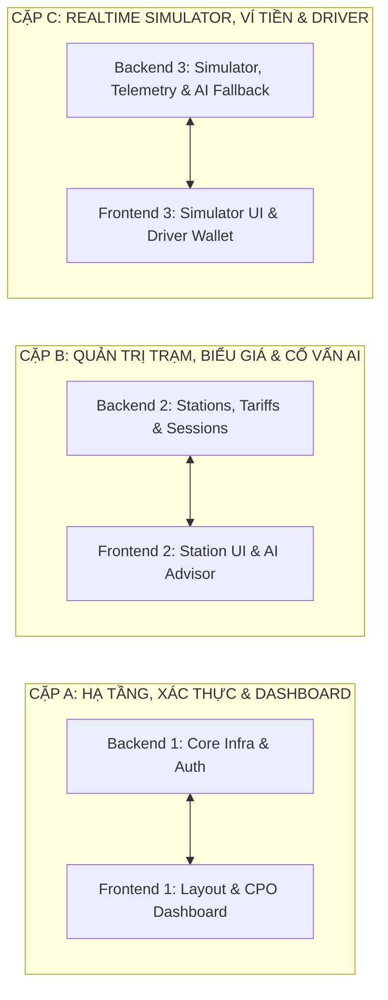

# BẢNG PHÂN CÔNG NHIỆM VỤ DỰ ÁN EV CSMS
## Nền tảng vận hành trạm sạc xe điện tích hợp AI
> **Quy mô đội ngũ:** 6 Thành viên (3 Backend Developers + 3 Frontend Developers)  
> **Căn cứ tài liệu:** [`sodo.md`](sodo.md), [`Prompt.md`](Prompt.md), [`GEMINI.md`](GEMINI.md), và danh mục kế hoạch [`docs/plans/`](docs/plans/).

---

## I. NGUYÊN TẮC PHỐI HỢP & MA TRẬN GHÉP CẶP (PAIRING MATRIX)

Để đảm bảo hệ thống không bị phân mảnh và tích hợp mượt mà giữa REST/WebSocket với giao diện, 6 thành viên được chia thành **3 cặp phối hợp trực tiếp (Cross-functional Pairs)**:

---

## II. PHÂN CÔNG CHI TIẾT ĐỘI NGŨ BACKEND (3 THÀNH VIÊN)

### 1. Backend 1 (Lead Backend): Hạ tầng nền tảng, Xác thực RBAC, WebSocket Hub & Event Bus
* **Vai trò:** Chịu trách nhiệm kiến trúc khung ứng dụng, phân quyền bảo mật, kênh truyền thời gian thực và điều phối sự kiện bất đồng bộ.
* **Nhiệm vụ cụ thể:**
  1. **Scaffold Backend & Cấu hình CSDL** (Bước 03 & 04):
     - Khởi tạo FastAPI app, cấu hình CORS, biến môi trường Pydantic Settings (`backend/app/core/config.py`).
     - Thiết lập SQLAlchemy engine, SessionLocal, dependency `get_db()`, hỗ trợ SQLite (dev) và PostgreSQL (prod).
  2. **Xác thực & Phân quyền RBAC** (Bước 05):
     - Xây dựng model `User`, schema auth, mã hóa mật khẩu bcrypt, phát hành & giải mã JWT Bearer.
     - Phân quyền 3 vai trò: `admin`, `operator`, `customer`.
     - Hiện thực hóa **CPO Ownership Check** (Dependency kiểm tra `station.operator_id == current_user.id`, đảm bảo CPO A không thể xem/sửa trạm của CPO B).
  3. **Kênh truyền WebSocket Hub & Bảo mật Ticket** (Bước 04, 08):
     - Xây dựng WebSocket connection manager tại `backend/app/core/websocket.py`.
     - Hiện thực hóa cơ chế **Ticket-based Handshake**: REST endpoint cấp vé ngắn hạn (TTL 30s) $\rightarrow$ Client bắt tay WS bằng ticket, tránh lộ JWT trên URL.
  4. **Internal Event Bus** (Kiến trúc `sodo.md`):
     - Xây dựng Event Bus bất đồng bộ (`asyncio.Queue`) điều phối các sự kiện ngắt sạc khẩn cấp (`EmergencyStop`), hết tiền ví (`OutOfBalance`), pin đầy (`BatteryFull`).
* **Files/Modules phụ trách:**
  - `backend/app/main.py`
  - `backend/app/core/` (`config.py`, `database.py`, `security.py`, `websocket.py`, `event_bus.py`)
  - `backend/app/api/v1/endpoints/auth.py`
  - `backend/app/models/user.py`, `backend/app/schemas/user.py`
* **Mốc nộp sản phẩm chính:** KT1 (API Contract & ERD), KT2 (Auth & WebSocket Core).

---

### 2. Backend 2: Quản lý Hạ tầng trạm sạc, Biểu giá TOU, Ví tiền & Phiên sạc (ACID)
* **Vai trò:** Hiện thực hóa toàn bộ logic nghiệp vụ cốt lõi của trạm sạc, biểu giá điện linh hoạt và các giao dịch tài chính yêu cầu bảo toàn dữ liệu nghiêm ngặt.
* **Nhiệm vụ cụ thể:**
  1. **Quản lý Hạ tầng trạm sạc** (Bước 06):
     - Xây dựng Models & CRUD APIs cho Trạm sạc (`Station`), Trụ sạc (`ChargingPoint / EVSE`), Cổng sạc (`Connector`: CCS2, Type 2, CHAdeMO).
     - Ràng buộc trạng thái độc quyền cổng sạc (Chặn 2 session đồng thời trên 1 cổng sạc bằng Atomic update).
     - Cấu hình tổng công suất nguồn trạm (`total_grid_capacity_kw`).
  2. **Quản lý Biểu giá linh hoạt (TOU Tariff)** (Bước 07):
     - Xây dựng model & API cho `Tariff`: Giá giờ bình thường, giờ cao điểm, giờ thấp điểm.
     - Cấu hình phí chiếm chỗ (`idle_fee_per_minute`) sau thời gian ân hạn 15 phút.
  3. **Ví điện tử & Giao dịch ACID** (Bước 07 ⭐ Trọng tâm kỹ thuật):
     - Xây dựng model `Wallet` và `WalletTransaction`.
     - Hiện thực hóa logic trừ tiền với Database Transaction và khóa dòng bi quan (`with_for_update()`).
     - Đặt ràng buộc CSDL `CHECK (balance >= 0)`, cam kết tuyệt đối không bao giờ âm ví.
     - Cung cấp API **Sandbox Top-up** (nạp tiền thử nghiệm 100k, 200k, 500k phục vụ demo).
  4. **Vòng đời phiên sạc (Charging Sessions)** (Bước 07):
     - Quản lý trạng thái phiên sạc: `Starting` $\rightarrow$ `Charging` $\rightarrow$ `SuspendedEV` $\rightarrow$ `Completed`.
     - Giữ chỗ số dư tối thiểu (Hold 50.000đ) trước khi sạc, quyết toán hóa đơn điện tử khi hoàn tất.
* **Files/Modules phụ trách:**
  - `backend/app/models/` (`station.py`, `tariff.py`, `wallet.py`, `session.py`)
  - `backend/app/schemas/` (`station.py`, `tariff.py`, `wallet.py`, `session.py`)
  - `backend/app/services/` (`station_service.py`, `wallet_service.py`, `session_service.py`)
  - `backend/app/api/v1/endpoints/` (`stations.py`, `chargers.py`, `tariffs.py`, `wallet.py`, `sessions.py`)
* **Mốc nộp sản phẩm chính:** KT1 (Thiết kế ERD), KT2 (Hoàn thành CRUD & ACID Ví tiền).

---

### 3. Backend 3: Hardware Simulator, In-Memory Buffer, AI Engine & Kiểm thử Tự động
* **Vai trò:** Xây dựng bộ giả lập phần cứng trạm sạc, quản lý nhịp telemetry thời gian thực, tích hợp AI đa tầng và bộ kiểm thử tự động toàn diện.
* **Nhiệm vụ cụ thể:**
  1. **Charging Simulator & Rơ-le an toàn** (Bước 08):
     - Xây dựng `charging_simulator.py` mô phỏng đường cong sạc pin CC-CV: SoC tăng từ 20% $\rightarrow$ 80% (công suất max), từ 80% $\rightarrow$ 100% (giảm dần công suất).
     - Mô phỏng các biến đo đếm: Công suất (kW), Điện áp (V), Dòng điện (A), Nhiệt độ súng sạc (°C), Điện năng tích lũy (kWh).
     - Tích hợp **Hardware Safety Cut-off**: Rơ-le ảo tự động ngắt sạc khẩn cấp khi nhiệt độ súng sạc $T > 85^\circ\text{C}$.
  2. **In-Memory State Buffer & Telemetry Loop** (Kiến trúc `sodo.md`):
     - Lưu trữ trạng thái hoạt động tức thời của các trụ sạc trên RAM (Dictionary / Cache buffer).
     - Định kỳ phát telemetry 2–5 giây/lần qua WebSocket; chỉ ghi checkpoint xuống CSDL mỗi 30–60 giây để tránh nghẽn I/O đĩa.
  3. **Phân hệ Trí tuệ Nhân tạo & 2 Vòng lặp** (Bước 09):
     - **Fast Loop (Heuristic)**: Thuật toán chia sẻ công suất theo tỷ lệ (Proportional Fair Sharing) chạy mỗi tick, đảm bảo $\sum P_i \le P_{\text{grid\_max}}$.
     - **Slow Loop (Google Gemini API)**: Gọi định kỳ 1–5 phút một lần để phân tích chuỗi dữ liệu (trend), tạo báo cáo Smart Charging và bảo trì dự đoán (Predictive Maintenance).
     - **Fallback Engine**: Tự động chuyển 100% sang Heuristic khi mất mạng hoặc dính lỗi 429 Rate Limit.
  4. **Bộ kiểm thử tự động (Pytest) & Seed Data** (Bước 11):
     - Viết test ACID ví tiền (chạy luồng đồng thời không bị âm ví).
     - Viết test trạng thái độc quyền cổng sạc và ngắt sạc an toàn.
     - Viết script `seed_data.py` nạp dữ liệu mẫu: 3 trạm sạc GPS thật, 8 trụ sạc, 15 ví tài xế và 50 phiên sạc lịch sử.
* **Files/Modules phụ trách:**
  - `backend/app/simulator/` (`charging_simulator.py`, `telemetry_generator.py`)
  - `backend/app/services/` (`ai_service.py`, `fallback_service.py`, `smart_charging_service.py`)
  - `backend/app/api/v1/endpoints/` (`simulator.py`, `ai.py`)
  - `backend/tests/` (`test_wallet_acid.py`, `test_sessions.py`, `test_ai_fallback.py`)
  - `backend/seed_data.py`
* **Mốc nộp sản phẩm chính:** KT2 (Simulator & Telemetry), KT3 (AI & Fallback), Final (Pytest & Seed Data).

---

## III. PHÂN CÔNG CHI TIẾT ĐỘI NGŨ FRONTEND (3 THÀNH VIÊN)

### 1. Frontend 1 (Lead Frontend): Kiến trúc Ứng dụng, Auth Flow, Layout & CPO Dashboard
* **Vai trò:** Thiết lập kiến trúc giao diện người dùng, hệ thống design system, quản lý trạng thái đăng nhập và bảng điều khiển tổng quan cho CPO.
* **Nhiệm vụ cụ thể:**
  1. **Khởi tạo & Cấu hình Project** (Bước 10):
     - Cấu hình React 18 + Vite + Tailwind CSS, PostCSS, tích hợp thư viện icon `lucide-react` và Axios client.
     - Cấu hình Vite Proxy chuyển tiếp `/api` và `/ws` tới Backend.
  2. **Hệ thống Layout & Auth Context** (Bước 10):
     - Xây dựng `AuthContext`: Lưu trữ token, giải mã role, hàm login/logout, bảo vệ route (`ProtectedRoute`).
     - Xây dựng khung giao diện chính: Sidebar định vị theo vai trò (Admin, CPO, Driver), Top Navbar hiển thị thông tin người dùng và số dư nhanh.
     - Thiết kế giao diện Đăng nhập / Đăng ký hiện đại.
  3. **CPO Dashboard (`Dashboard.jsx`)** (Bước 10):
     - Các thẻ chỉ số thống kê (StatCards): Tổng doanh thu hôm nay, tổng điện năng tiêu thụ (kWh), số trụ đang sạc / rảnh / lỗi.
     - Biểu đồ phụ tải trạm theo thời gian thực (Recharts AreaChart / BarChart).
     - Bản đồ vị trí trạm sạc tổng quan và danh sách cảnh báo vận hành gần nhất.
* **Files/Components phụ trách:**
  - `frontend/src/App.jsx`, `frontend/src/main.jsx`
  - `frontend/src/context/AuthContext.jsx`
  - `frontend/src/components/layout/` (`Sidebar.jsx`, `Navbar.jsx`, `ProtectedRoute.jsx`)
  - `frontend/src/components/common/` (`StatCard.jsx`, `Badge.jsx`, `Button.jsx`, `Modal.jsx`)
  - `frontend/src/pages/` (`Login.jsx`, `Register.jsx`, `Dashboard.jsx`)
  - `frontend/src/services/api.js` (Cấu hình Axios base instance và interceptor token)
* **Mốc nộp sản phẩm chính:** KT1 (Wireframes), KT3 (Khung giao diện & Dashboard CPO).

---

### 2. Frontend 2: Quản lý Trạm, Trụ, Cổng sạc, Biểu giá TOU & Màn hình AI Advisor
* **Vai trò:** Xây dựng toàn bộ giao diện quản trị tài sản vật lý cho đơn vị vận hành (CPO), cấu hình bảng giá và trực quan hóa các khuyến nghị thông minh từ AI.
* **Nhiệm vụ cụ thể:**
  1. **Quản lý Mạng lưới Trạm sạc (`Stations.jsx`)** (Bước 10):
     - Màn hình danh sách trạm sạc: Bộ lọc theo thành phố, công suất trạm, trạng thái hoạt động.
     - Modal thêm mới / sửa đổi thông tin trạm sạc (kiểm tra quyền CPO).
     - Chi tiết trạm sạc: Hiển thị danh sách các trụ sạc (`ChargingPoint`) và cổng sạc (`Connector`) con, trạng thái trực quan bằng màu sắc (`Available` - Xanh, `Charging` - Vàng, `Faulted` - Đỏ).
  2. **Quản lý Biểu giá (`Tariffs.jsx`)** (Bước 10):
     - Giao diện thiết lập biểu giá theo khung giờ (Normal, Peak, Off-Peak).
     - Cấu hình thời gian ân hạn và mức phí phạt chiếm chỗ súng sạc (`idle_fee_per_minute`).
  3. **Màn hình Cố vấn AI (`AIAdvisor.jsx`)** (Bước 10):
     - **Smart Charging Tab**: Trực quan hóa biểu đồ phân bổ công suất giữa các trụ sạc; hiển thị lý do điều phối của AI (hoặc cảnh báo của Fallback Heuristic).
     - **Predictive Maintenance Tab**: Danh sách thẻ cảnh báo sức khỏe trụ sạc, phân loại mức độ rủi ro (Low/Medium/High/Critical), đề xuất hành động kỹ thuật.
     - **Pricing Advisor Tab**: Gợi ý điều chỉnh giá TOU để tối ưu doanh thu và dàn đều phụ tải.
* **Files/Components phụ trách:**
  - `frontend/src/pages/Stations.jsx`, `frontend/src/pages/StationDetail.jsx`
  - `frontend/src/pages/Tariffs.jsx`
  - `frontend/src/pages/AIAdvisor.jsx`
  - `frontend/src/components/stations/` (`StationCard.jsx`, `ChargerGrid.jsx`, `ConnectorBadge.jsx`)
  - `frontend/src/components/ai/` (`LoadBalancingChart.jsx`, `MaintenanceAlertCard.jsx`)
* **Mốc nộp sản phẩm chính:** KT1 (Wireframes nghiệp vụ), KT3 (Giao diện Quản trị & AI Advisor).

---

### 3. Frontend 3: Giao diện Mô phỏng (Simulator UI), WebSocket Client & Driver Portal
* **Vai trò:** Xây dựng màn hình tương tác thực nghiệm (Simulator) phục vụ demo hội đồng, kết nối WebSocket realtime và cổng thông tin dành cho tài xế xe điện.
* **Nhiệm vụ cụ thể:**
  1. **Màn hình Mô phỏng Cắm sạc (`Simulator.jsx`)** (Bước 10 ⭐ Trọng tâm Demo):
     - Bảng điều khiển giả lập: Chọn trạm $\rightarrow$ Chọn trụ $\rightarrow$ Chọn loại xe/dung lượng pin.
     - Nút bấm mô phỏng hành vi: "Cắm súng sạc", "Bắt đầu sạc", "Rút súng sạc", "Kích hoạt sự cố quá nhiệt ($> 85^\circ\text{C}$)".
     - Đồng hồ công tơ điện tử (Live Gauge): Kim hiển thị công suất tức thời (kW), điện áp (V), dòng điện (A), nhiệt độ (°C).
     - Đồ thị sạc thời gian thực (Recharts Dynamic LineChart) cập nhật mượt mà theo nhịp 2 giây: Đường cong SoC %, công suất nạp và chi phí tạm tính.
  2. **WebSocket Client Service** (Bước 10):
     - Hiện thực hóa `services/websocket.js`: Gọi API lấy ticket ngắn hạn $\rightarrow$ Mở kết nối WebSocket $\rightarrow$ Bắn tín hiệu heartbeat $\rightarrow$ Tự động reconnect khi đứt cáp.
     - Phân luồng dữ liệu telemetry tới các component hiển thị.
  3. **Cổng Thông tin Tài xế (`Driver Portal`)** (Bước 10):
     - **Quản lý Ví tiền (`Wallet.jsx`)**: Xem số dư khả dụng, giao diện nạp tiền Sandbox (bấm nạp 100k, 200k, 500k cập nhật số dư tức thì), lịch sử giao dịch trừ cước.
     - **Phiên sạc của tôi (`Sessions.jsx`)**: Theo dõi tiến trình phiên sạc cá nhân đang chạy, xem lịch sử các phiên sạc cũ kèm hóa đơn điện tử chi tiết.
* **Files/Components phụ trách:**
  - `frontend/src/pages/Simulator.jsx`
  - `frontend/src/pages/Wallet.jsx`, `frontend/src/pages/Sessions.jsx`
  - `frontend/src/services/websocket.js`
  - `frontend/src/components/simulator/` (`LiveGauge.jsx`, `ChargingChart.jsx`, `ControlPanel.jsx`)
  - `frontend/src/components/driver/` (`WalletCard.jsx`, `TopupModal.jsx`, `InvoiceModal.jsx`)
* **Mốc nộp sản phẩm chính:** KT2 (Giao diện Simulator cơ bản), KT3 (Hoàn thiện Simulator + Driver Portal + WebSocket).

---

## IV. MA TRẬN TIẾN ĐỘ THEO 4 MỐC ĐÁNH GIÁ (SDLC CHECKPOINTS)

| Mốc SDLC | Nhiệm vụ Backend (BE1, BE2, BE3) | Nhiệm vụ Frontend (FE1, FE2, FE3) | Sản phẩm bàn giao chung |
|:---:|---|---|---|
| **KT1** | - BE1: Thiết kế API Contracts, kiến trúc WebSocket & RBAC. - BE2: Thiết kế sơ đồ ERD & Data Dictionary chi tiết. - BE3: Thiết kế kiến trúc AI 2 vòng lặp & Fallback spec. | - FE1: Thiết kế Wireframe cấu trúc Dashboard & Layout. - FE2: Wireframe quản lý Trạm sạc & AI Advisor. - FE3: Wireframe Simulator UI & Driver Portal. | Bộ tài liệu mốc KT1 tại `docs/SDLC/KT1/` (`01_SRS`, `02_ERD`, `03_AI_Arch`, `04_Wireframes`). |
| **KT2** | - BE1: Scaffold FastAPI, Auth JWT, WebSocket Ticket Hub. - BE2: CRUD Trạm/Trụ/Cổng, TOU Tariff, Ví ACID Transaction. - BE3: Core Charging Simulator (đường cong CC-CV, an toàn $T > 85^\circ\text{C}$). | - FE1: Dựng khung React Vite, Tailwind, AuthContext. - FE2: Mockup màn hình quản lý trạm sạc. - FE3: Khung màn hình Simulator kết nối thử nghiệm WebSocket. | Hoàn thành Core Backend, Simulator chạy được và giao dịch ví tiền ACID không âm. |
| **KT3** | - BE1: Ownership check đa CPO, Event Bus bất đồng bộ. - BE2: Logic quyết toán phiên sạc, chốt số kWh & hóa đơn. - BE3: Tích hợp Google Gemini API + Heuristic Fallback. | - FE1: Hoàn thiện CPO Dashboard với Recharts. - FE2: Hoàn thiện CRUD Trạm, Biểu giá & AI Advisor UI. - FE3: Hoàn thiện Simulator UI tương tác cao & Ví tài xế. | Ứng dụng Web hoàn chỉnh kết nối 100% giữa Frontend, Backend, WebSocket và Gemini AI. |
| **FINAL** | - BE1 + BE2 + BE3: Chạy toàn bộ test suite Pytest (100% pass), script `seed_data.py` nạp dữ liệu sinh động, tối ưu hiệu năng. | - FE1 + FE2 + FE3: Rà soát UX/UI, hiệu ứng chuyển cảnh, kiểm thử Responsive, đóng gói kịch bản demo và tài liệu thuyết trình. | Bộ mã nguồn hoàn chỉnh, thư mục `docs/SDLC/final/`, video/kịch bản demo bảo vệ trước hội đồng. |

---

## V. CHECKLIST TRƯỚC KHI TÍCH HỢP (DEFINITION OF DONE - DoD)

Mỗi thành viên trước khi bàn giao module phải tự kiểm tra 5 tiêu chí sau:
1. **Không vi phạm ranh giới kiến trúc**: Tầng API không chứa logic tính toán; tầng Service không phụ thuộc trực tiếp vào HTTP Request.
2. **Bảo toàn dữ liệu tuyệt đối**: Mọi thao tác thay đổi số dư ví bắt buộc phải có Database Transaction và khóa dòng `with_for_update`.
3. **An toàn kết nối Realtime**: WebSocket không truyền token trên query URL; phải có cơ chế ngắt kết nối an toàn và dọn dẹp bộ nhớ đệm In-Memory.
4. **Không phụ thuộc đơn lẻ vào AI**: Mọi tính năng AI bắt buộc phải có Heuristic Fallback hoạt động trơn tru khi không có internet.
5. **Giao tiếp API đồng bộ**: Tên trường JSON request/response phải khớp 100% giữa Pydantic Schema và Axios Service.
