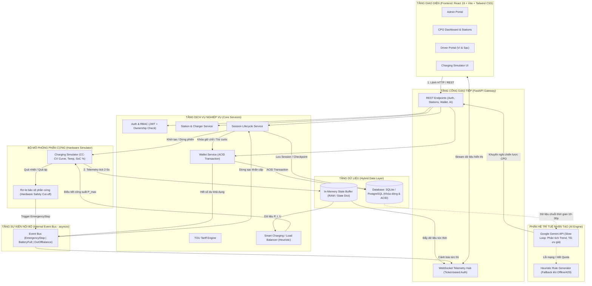
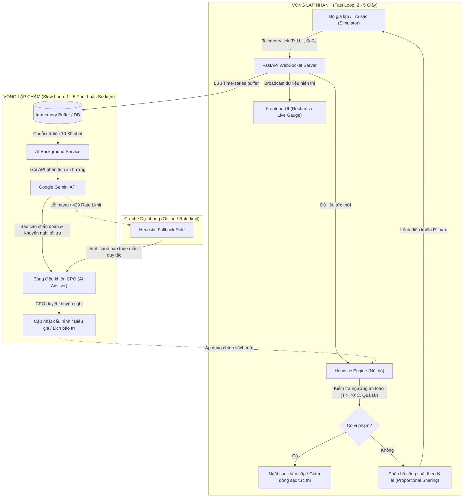
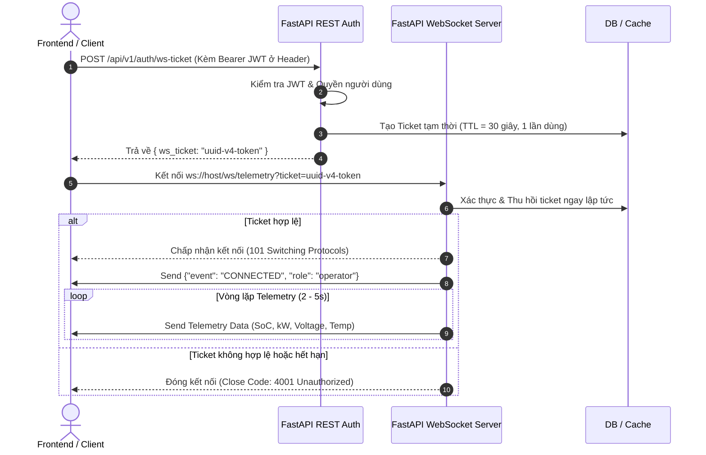
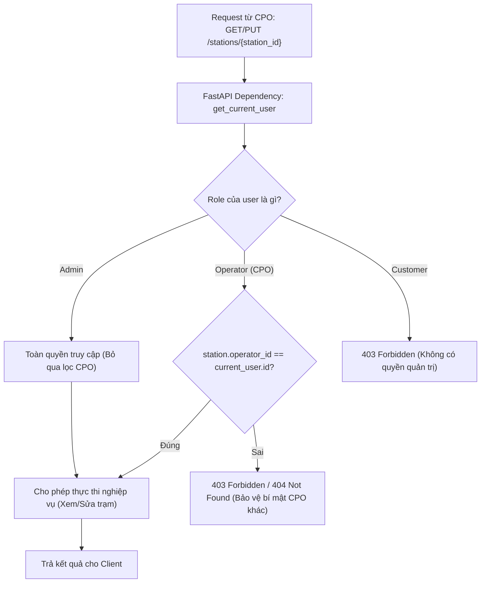
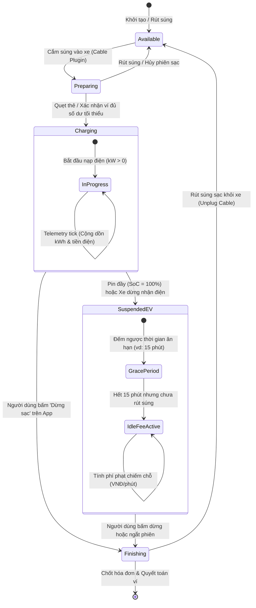
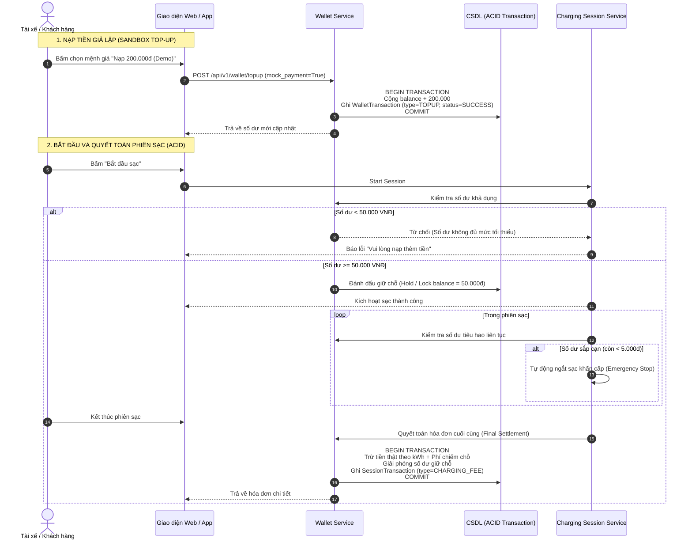
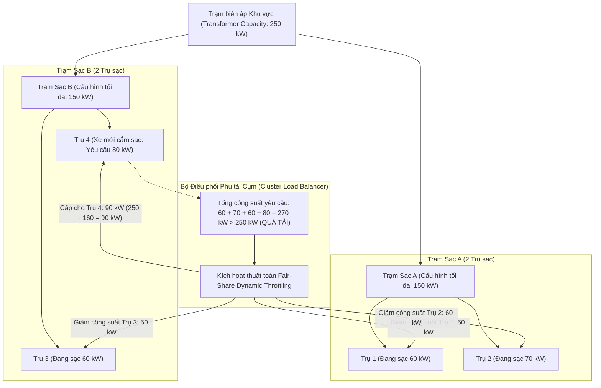

# SƠ ĐỒ KIẾN TRÚC VÀ LUỒNG VẬN HÀNH HỆ THỐNG EV CSMS
> **Tài liệu tổng hợp, trực quan hóa toàn diện bức tranh kiến trúc và giải pháp kỹ thuật giải quyết các rủi ro từ `yêu cầu.md`**

---

## 1. Bức tranh Kiến trúc Tổng thể Hệ thống (Overall System Architecture)

Hệ thống được thiết kế theo mô hình phân tầng chặt chẽ, tách bạch giữa **Luồng điều khiển (Control Plane)**, **Luồng dữ liệu thời gian thực (Data Plane)** và **Hàng đợi sự kiện nội bộ (Internal Event Bus)**.

### Các thành phần then chốt giải quyết rủi ro kiến trúc:
* **`In-Memory State Buffer`**: Giảm tải áp lực I/O lên Database. Telemetry tick (2–5s) chỉ cập nhật RAM; DB chỉ ghi dữ liệu theo chu kỳ chốt số (checkpoint 30–60s) hoặc khi kết thúc phiên.
* **`Internal Event Bus (asyncio)`**: Khớp nối lỏng (Decoupling) giữa các module. Các sự kiện ngắt sạc khẩn cấp (`EmergencyStop`), hết tiền ví (`OutOfBalance`), hoặc pin đầy (`BatteryFull`) được xử lý bất đồng bộ, không gây nghẽn luồng chính.
* **`Hardware Safety Cut-off`**: Rơ-le ảo ngắt điện tức thì khi phát hiện nhiệt độ vượt ngưỡng an toàn ($T > 85^\circ\text{C}$), độc lập hoàn toàn với phản hồi từ AI hay CSDL.
* **Tách biệt Control Plane & Data Plane**: Lệnh điều khiển đi qua REST $\rightarrow$ `SessionSvc` $\rightarrow$ `Sim`; dữ liệu đo đếm đi từ `Sim` $\rightarrow$ `MemBuffer` $\rightarrow$ `WSHub` $\rightarrow$ Frontend.

---

## 2. Kiến trúc 2 Vòng lặp: Fast Heuristic Loop vs Slow AI Loop (Điểm 1 & 2)

Hệ thống phân tách rạch ròi giữa **vòng lặp thời gian thực (Fast Loop)** để duy trì nhịp telemetry/điều phối tải và **vòng lặp chiến lược (Slow Loop)** phục vụ phân tích ngôn ngữ tự nhiên từ Gemini API.

---

## 3. Ma trận & Ranh giới AI thật vs Heuristic / Rule-based (Điểm 2)

| Nghiệp vụ | Tầng Heuristic / Rule-based (Tức thời, Cố định) | Tầng Gemini AI (Định kỳ, Phân tích sâu) | Rủi ro nếu gán nhãn sai |
|---|---|---|---|
| **Smart Charging (Điều phối tải)** | Chia tỷ lệ công suất dựa trên $\sum P_{i} \le P_{\text{grid\_max}}$. Cắt giảm ngay lập tức khi lưới điện sụt áp. | Dự báo nhu cầu phụ tải theo thời gian, tối ưu hóa biểu giá TOU, đề xuất giờ sạc chi phí thấp cho khách hàng. | Bị bắt bẻ nếu gọi thuật toán chia tỷ lệ toán học là "AI". |
| **Predictive Maintenance (Bảo trì dự đoán)** | Cảnh báo ngưỡng cứng: $T > 70^\circ\text{C}$ $\implies$ Warning; $T > 85^\circ\text{C}$ $\implies$ Emergency Stop. | Phân tích biến thiên $\Delta T / \Delta t$ kết hợp dòng điện $I(t)$ để phát hiện suy hao tiếp xúc cáp sạc trước khi nóng quá mức. | Ngưỡng cố định là Rule-based thuần túy; AI phải phân tích chuỗi thời gian (trend). |
| **Tariff & Revenue Optimization** | Áp dụng đúng giá theo khung giờ cao điểm/thấp điểm (TOU cố định). Tính đúng phụ phí phạt. | Phân tích thói quen sạc của tài xế, đề xuất điều chỉnh biểu giá động để kéo giãn phụ tải sang giờ thấp điểm. | Tránh nhầm lẫn giữa tính cước theo công thức với tối ưu hóa doanh thu bằng mô hình học. |

---

## 4. Luồng Kết nối & Xác thực WebSocket An toàn (Điểm 3)

Không truyền JWT trực tiếp trên URL Query String (`?token=...`) để tránh lộ trong log server/proxy. Áp dụng cơ chế **Ticket Handshake** (Vé ngắn hạn 30s, 1 lần dùng).

---

## 5. Phân quyền & Cô lập Dữ liệu Đa CPO (Multi-tenancy Isolation) (Điểm 4)

Đảm bảo CPO A không thể truy cập, sửa đổi hoặc theo dõi trạm sạc của CPO B thông qua việc kiểm tra quyền sở hữu (`ownership check`) ở tầng Service/Dependency.

---

## 6. Máy trạng thái Cổng sạc & Tính Phí chiếm chỗ (Idle Fee) (Điểm 7 & 8)

Mô phỏng trạng thái **lấy cảm hứng từ máy trạng thái OCPP (OCPP-like State Machine)**, kết hợp cơ chế kích hoạt thời gian ân hạn (`grace period`) và tính phí phạt chiếm chỗ súng sạc sau khi sạc đầy.

---

## 7. Luồng Giao dịch Ví tiền & Nạp tiền Giả lập (Sandbox Top-up) (Điểm 6)

Làm rõ cơ chế **Nạp tiền mô phỏng (Demo Top-up)** và quy trình trừ tiền đảm bảo tính toàn vẹn **ACID (Không âm ví)**.

---

## 8. Điều phối Quá tải Lưới điện Đa Trạm (Multi-Station Grid Overload) (Đề nghị bổ sung 3)

Xử lý kịch bản nhiều trạm sạc thuộc cùng một CPO chia sẻ chung một trạm biến áp / công suất lưới điện khu vực.

---

## 9. Tóm tắt Kỹ thuật Dành cho Buổi Bảo vệ Đồ án

| Vấn đề phản biện | Câu trả lời chuẩn mực kỹ thuật |
|---|---|
| **"Tại sao không dùng AI điều khiển từng giây?"** | Mô hình LLM có độ trễ 1-3s và giới hạn rate-limit nên không phù hợp với vòng lặp realtime. Hệ thống dùng **Heuristic toán học nội bộ chạy mỗi tick (2-5s)** để bảo vệ an toàn tức thời, và dùng **Gemini AI định kỳ (mỗi vài phút)** để phân tích xu hướng và cố vấn chiến lược. |
| **"Cảnh báo nhiệt độ có phải AI không?"** | Không. Ngưỡng cứng $T > 70^\circ\text{C}$ là **Rule-based Fallback** đảm bảo an toàn vật lý. AI đóng vai trò phân tích **chuỗi dữ liệu đa biến** (tốc độ tăng nhiệt kết hợp công suất sạc) để dự báo hỏng hóc trước khi chạm ngưỡng báo động. |
| **"Hệ thống có chuẩn OCPP 1.6J không?"** | Hệ thống xây dựng **mô hình máy trạng thái lấy cảm hứng từ chuẩn OCPP (OCPP-like)** để quản lý vòng đời cổng sạc, không đóng vai trò là một máy chủ OCPP 1.6J hoàn chỉnh do giới hạn phạm vi mô phỏng web. |
| **"Tiền trong ví nạp từ đâu?"** | Để phục vụ thử nghiệm và đánh giá đồ án, hệ thống cung cấp module **Sandbox/Mock Top-up**. Toàn bộ giao dịch trừ cước phiên sạc được xử lý qua **DB ACID Transaction**, cam kết số dư không âm. |

---

## 10. Đặc tả Công nghệ & Quy chuẩn Kiểm soát Chất lượng (Modernized Tech Stack & QA)

| Hạng mục | Công nghệ chấp nhận | Vai trò & Giải pháp kiểm soát chất lượng |
|---|---|---|
| **Core Frontend** | **React 19 + Vite** | Khung giao diện hiệu năng cao, tối ưu HMR, nạp module ESM tức thì. Kiểm soát tương thích với các thư viện `recharts`, `lucide-react`, `axios`. |
| **CSS & Styling** | **Tailwind CSS + PostCSS** | Thiết kế giao diện Dashboard, Simulator, Driver Portal trực quan, responsive theo chuẩn Design System. |
| **Linting Song song** | **Oxlint + ESLint** | • **Oxlint**: Lint tốc độ cao (Rust-based), phát hiện nhanh lỗi cú pháp. • **ESLint (`eslint-plugin-oxlint`)**: Bổ trợ kiểm tra toàn diện rules Tailwind CSS, React Hooks và tiêu chuẩn Accessibility (a11y). |
| **Giao tiếp & Proxy** | **Vite Proxy (`/api`, `/ws`)** | Chuyển tiếp request `/api` và kết nối `/ws` về FastAPI (port 8000), kết hợp cơ chế Ticket-based Handshake ngăn chặn lộ JWT trên URL. |
| **Điều phối Staging** | **Docker Compose (Postgres 16 + Backend + Frontend)** | Đóng gói môi trường đồng nhất 3 tầng, bảo mật hoàn toàn qua file `.env` (không hardcode secret), CSDL chuẩn `ev_csms_db`. |
| **CI/CD Pipeline** | **GitHub Actions** | Tự động hóa kiểm tra: Linting Frontend (`oxlint` + `eslint`), build Vite, test Backend (`pytest` ACID ví) và kiểm tra hợp lệ `docker-compose.yml`. |

